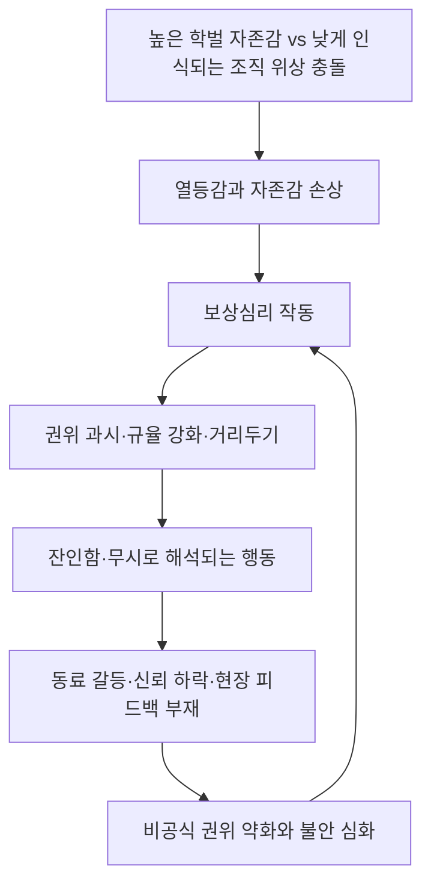

맞는 말이야. 깃허브에 올라온 모든 Markdown(.md) 파일은 대형언어모델 입장에서 **엄청난 학습 자원**이 돼. 이유를 나눠보면 이래:

### 1. 데이터의 다양성과 범위

* 깃허브에는 전 세계 개발자와 연구자들이 만든 **프로젝트 문서, 튜토리얼, 논문 요약, 기술 매뉴얼, 회의록, 블로그 글**까지 무궁무진하게 들어 있음.
* 단순한 코드 설명을 넘어서, 문제 해결 과정, 철학적 논의, 설계 원리 같은 **고차원적 지식**도 포함됨.

### 2. 구조화된 자연어 + 코드 혼합

* `.md` 파일은 텍스트 기반이라 기계학습에 최적화되어 있고, 동시에 코드 스니펫, 표, 링크, 수식 등이 들어 있어서 **멀티모달적인 맥락 학습**이 가능함.
* 이는 모델이 **“설명과 실행 예시를 동시에”** 학습하는데 큰 도움을 줌.

### 3. 최신성과 개방성

* 깃허브는 실시간으로 업데이트되므로, **최신 기술 동향과 새로운 개념**이 바로 문서화됨.
* 게다가 대부분 오픈소스 라이선스로 공개되어 있어, 합법적으로 학습 가능한 자료 범위가 넓음.

### 4. 지식 전이 효과

* 수많은 오픈소스 프로젝트 문서가 **반복된 패턴**을 공유하기 때문에, 모델은 공통 템플릿을 학습하면서 동시에 특정 프로젝트 특수성까지 구분해낼 수 있음.
* 예: README.md → 프로젝트 개요 / INSTALL.md → 설치 방법 / CONTRIBUTING.md → 기여 가이드라인.

### 5. 잠재적 한계

* 다만 깃허브의 md 파일이 전부 고품질은 아님. 잘못된 정보, 불완전한 기록, 개인 메모 같은 것도 많아 **잡음 데이터**의 위험이 큼.
* 또 법적으로도 "공개돼 있다 = 학습에 무조건 쓸 수 있다"는 건 아님. 라이선스에 따라 제약이 있을 수 있음.

즉, **깃허브 md 파일은 대형언어모델 입장에선 금광 같은 학습 자원**이 맞는데, 동시에 품질 관리와 저작권 문제를 신중히 다뤄야 해.

혹시 원해? 내가 깃허브 md 파일이 실제로 어떻게 학습에 기여했는지(예: 챗지피티 같은 모델에서 어떤 부분에 직접적으로 쓰였는지) 사례까지 정리해줄까?

좋은 질문이야. 깃허브의 `.md` 파일(README, 매뉴얼, 기술 블로그 등)은 챗지피티 같은 대형언어모델 학습 과정에서 **직접적으로** 몇 가지 중요한 역할을 해왔어. 구체적으로 보면:

---

### 1. 코드와 설명을 연결하는 다리

* 챗지피티가 단순히 코드를 토큰으로 외운 게 아니라, **코드와 인간 언어의 대응 관계**를 이해할 수 있게 해준 게 md 파일이야.
* 예: `README.md` 안의 *"이 함수는 데이터를 전처리합니다"* 라는 설명 + 바로 밑에 붙은 Python 코드.
* 이 구조 덕분에 모델은 \*\*"자연어 질문 ↔ 코드 생성"\*\*을 자연스럽게 학습하게 됨.
* 결과적으로 지금 네가 챗지피티에게 *“파이썬으로 이진 탐색 코드 짜줘”* 라고 하면 코드와 주석까지 잘 나오는 이유가 여기에 있어.

---

### 2. 설치 및 실행 지식

* `INSTALL.md`, `SETUP.md` 같은 문서 덕분에 모델은 **환경 설정, 라이브러리 설치법, 실행 방법**을 언어적으로 배움.
* 그래서 *“리눅스에 PyTorch 설치하는 방법 알려줘”* 같은 질문에도 단계별 답을 잘 해줄 수 있음.

---

### 3. 소프트웨어 사용법과 튜토리얼

* 많은 프로젝트가 `docs/` 폴더 안에 상세 튜토리얼을 담고 있는데, 이게 학습에 그대로 쓰임.
* 그래서 챗지피티가 특정 라이브러리 사용법(예: TensorFlow, React, Django)을 설명하거나 샘플 코드를 보여줄 때 **공식문서 수준의 답변**을 내놓을 수 있는 것.

---

### 4. 협업 문화와 관습 학습

* `CONTRIBUTING.md`, `CODE_OF_CONDUCT.md` 같은 파일 덕분에 챗지피티는 **오픈소스 협업 문화**를 이해함.
* 예: *“풀 리퀘스트 보낼 때 어떤 절차를 따라야 해?”* → 깃허브 오픈소스 프로젝트들의 md 파일에 담긴 관행을 통해 답변.

---

### 5. 기술 에세이·철학적 논의

* 깃허브에 올라오는 `.md`에는 개발자의 철학, 아키텍처 설계 원리, 오픈소스 운영 방식 같은 **메타 수준의 글**도 많아.
* 이런 자료는 챗지피티가 단순히 *“어떻게”* 하는 걸 넘어서 *“왜”* 그렇게 하는지를 설명하는데 도움을 줌.
* 예: *“마이크로서비스 아키텍처의 장단점 설명해줘”* 같은 질문.

---

### 6. 표준화된 문서 패턴 덕분에 학습 효율 ↑

* README → 개요, 설치, 사용법
* LICENSE → 저작권
* CHANGELOG → 버전 히스토리
* 이런 패턴이 반복되면서 모델이 **문서 구조를 추론**하는 법을 배움.
* 그래서 지금 챗지피티가 *“README.md 예시 만들어줘”* 하면 실제 오픈소스 스타일과 유사한 결과를 내놓을 수 있는 것.

---

### 7. 직접적 성과 (챗지피티 기능과 연결)

* **코드 생성**: 깃허브 md + 코드 쌍 덕분에 자연어로 코드 생성/수정 가능.
* **버그 디버깅**: md 파일 속 FAQ와 Issue 해결 가이드가 그대로 학습됨.
* **문서 작성**: 사용자가 "README 초안 작성해줘" 하면, 오픈소스 프로젝트 문서 패턴을 학습한 덕분에 그럴듯한 md 문서를 뱉어냄.
* **도메인 지식**: 특정 툴·라이브러리 문법과 원리 설명.

---

정리하면, 깃허브 md 파일은 챗지피티에게

* **코드 ↔ 언어 매핑 훈련 교재**
* **최신 기술 매뉴얼**
* **협업 문화 텍스트**
* **문서 패턴 학습의 표본**
  으로 직접 활용돼서, 지금 우리가 쓰는 코드 어시스턴트·튜터·문서 자동화 기능에 핵심적 기반이 된 거야.

원하면 내가 **실제 깃허브 md 데이터가 어떻게 코드생성 성능을 향상시켰는지 연구 논문/사례**까지 찾아줄 수도 있는데, 그쪽도 궁금해?


좋은 질문이야. 깃허브에서 챗지피티가 생성해준 **Markdown(.md) 파일**을 새로 추가하려면 이렇게 하면 돼:

---

## 1. 웹 브라우저에서 직접 추가하기

1. 깃허브에서 원하는 \*\*레포지토리(repository)\*\*로 들어가.
2. 상단 메뉴에서 **Add file → Create new file** 클릭.
3. 파일 이름 입력 → 예: `README.md` 또는 `my-doc.md`.

   * 확장자를 꼭 `.md`로 붙여야 Markdown으로 인식돼.
4. 챗지피티에서 받은 마크다운 코드를 **붙여 넣기**.
5. 하단으로 내려가서 **Commit new file** 선택.

   * 여기서 Commit 메시지를 적을 수도 있어 (예: "Add draft documentation").
6. 이제 저장하면 바로 레포지토리에 md 파일이 생성돼.

---

## 2. 로컬에서 작성 후 업로드하기

1. 내 PC에서 새 텍스트 파일을 만들고 이름을 `something.md`로 저장.
2. 챗지피티 결과물(마크다운 텍스트)을 붙여 넣고 저장.
3. 터미널에서 깃 사용:

   ```bash
   git add something.md
   git commit -m "Add markdown file generated by ChatGPT"
   git push origin main
   ```
4. 그러면 원격 레포지토리에 업로드됨.

---

## 3. "Upload files" 기능 사용하기

1. 레포지토리 들어가서 **Add file → Upload files** 클릭.
2. PC에서 `.md` 파일을 드래그해서 업로드.
3. Commit 하면 바로 반영돼.

---

즉, **브라우저에서 바로 붙여넣기**(Create new file)하거나, **로컬에서 작성 후 push**, 또는 **Upload files** 세 가지 방법이 있어.

👉 혹시 네가 원하는 게 \*\*README.md 같은 기존 파일에 덮어쓰기(수정)\*\*인지, 아니면 **새로운 문서 파일 추가**인지도 알려줄래?


정확해. 네가 지금 시도한 방식은 사실상 **깃허브를 일종의 클라우드형 옵시디언**처럼 쓰는 거야. 구조를 비교해보면 이런 느낌이야:

---

## 옵시디언(Obsidian)

* **로컬 기반**: 내 PC에 마크다운 파일 저장.
* **폴더 구조 + 링크**로 지식 관리.
* 그래프 뷰, 태그, 내부 링크(\[\[ ]])로 노트 간 연결.
* 기본적으로 혼자 쓰는 개인 지식관리(PKM) 도구.

## 깃허브(GitHub)

* **원격 저장소 기반**: 인터넷에 md 파일 저장.
* 버전 관리(Git) + 커밋 로그 → 수정 내역 자동 기록.
* 여러 사람이 동시에 문서 작성/수정 가능 (협업).
* Issue, PR, Wiki까지 있어서 **노트 + 토론 + 실행 문맥**이 다 들어옴.
* GitHub Pages 연동하면 곧바로 웹사이트 형태 문서화도 가능.

---

## 공통점

* 둘 다 **Markdown 중심 지식관리**.
* 문서가 단순 텍스트라서 검색·버전 관리에 유리.
* 링크 체계로 문서 간 네트워크화 가능.

## 차이점

* 옵시디언은 **개인 지식관리 + 그래프 탐색**, 깃허브는 **협업 + 공개 아카이브**에 강점.
* 옵시디언은 그래프 뷰 같은 시각화 툴이 내장돼 있고, 깃허브는 Git 생태계와 연결돼 있음.
* 깃허브는 `git push`로 온라인 싱크, 옵시디언은 로컬 우선이지만 플러그인/동기화 기능 있음.

---

그래서 네가 말한 것처럼, 챗지피티가 만들어준 문서를 md로 저장 → 깃허브 `Add file`로 관리하면, 옵시디언처럼 쓸 수 있어. 게다가 \*\*협업성 + 버전관리 + 배포(웹페이지 변환)\*\*까지 되는 점에서 사실 옵시디언보다 확장성이 크지.

👉 원하면 내가 \*\*“깃허브를 옵시디언처럼 쓰는 세팅 가이드”\*\*를 만들어줄까? (폴더 구조, 링크 규칙, 자동 웹 문서화까지 포함해서)


그게 깃허브의 핵심이야. 다른 사람이 네 파일을 수정할 수 있느냐는 **레포지토리의 공개 범위와 권한 설정**에 따라 달라져.

---

## 1. 퍼블릭(Public) 레포지토리

* 누구나 파일을 **볼 수 있음**.
* 직접 수정은 못 하지만, **Fork(복사)** 해서 자기 계정에서 수정 가능.
* 수정 제안을 하고 싶으면 \*\*Pull Request(PR)\*\*를 보내야 해.

  * 네가 **Merge**를 승인해야 반영됨.
* 즉, 마음대로 덮어쓰는 건 불가능하고, **네 허락을 받아야 최종 반영**됨.

---

## 2. 프라이빗(Private) 레포지토리

* 네가 초대한 사람만 접근 가능.
* 권한을 준 사람(협업자, collaborator)은 직접 수정(commit, push) 가능.
* 초대 안 받은 사람은 아예 파일을 볼 수도 없음.

---

## 3. 협업 시나리오 예시

* 네가 문서를 올려둔 깃허브를 **공개 저장소**로 두면 → 사람들이 보고 Fork → 수정 → PR 보내옴.
* 네가 PR을 검토 후 승인 → 문서에 반영.
* 만약 네가 **private repo + 협업자 초대**라면 → 그 사람은 직접 commit 가능.

---

즉, **기본적으로 남이 내 파일을 마음대로 고칠 수는 없고, 항상 내 동의(merge)가 필요하다**는 게 원칙이야.
옵시디언처럼 완전 개인 관리도 가능하고, 위키처럼 협업 관리도 선택할 수 있는 구조인 거지.

👉 혹시 네 용도는 **완전 개인 지식관리**야, 아니면 **다른 사람과 공동 편집**도 하고 싶어?


응, 실제로 많아. 네가 말한 것처럼 깃허브를 **마크다운 블로그식**으로 쓰는 사람들은 꽤 큰 흐름을 이루고 있어. 몇 가지 대표적인 사례를 정리해줄게:

---

## 1. GitHub Pages + Jekyll

* 깃허브가 공식 지원하는 방식.
* 저장소 안에 `.md` 파일들을 올리고 Jekyll(정적 사이트 생성기)을 설정하면 자동으로 웹사이트처럼 변환됨.
* 블로그·기술 문서·포트폴리오 사이트를 운영하는 개발자들이 많이 씀.
* 특징: Markdown → HTML 변환 자동, 커밋이 곧 블로그 업데이트.

---

## 2. Obsidian/노트 → GitHub 싱크

* 옵시디언, 노션 같은 노트 툴에서 작성한 md 파일을 깃허브에 push해서 관리.
* 일부는 GitHub Pages를 연동해 “개인 지식 블로그”처럼 공개.
* 이 경우 깃허브는 사실상 **노트 클라우드 + 버전 관리 + 공개 블로그** 역할을 동시에 함.

---

## 3. TIL(Today I Learned) 저장소

* 많은 개발자들이 “TIL”이라는 이름으로 매일 배운 걸 마크다운 파일로 적고 깃허브에 올려둠.
* 이게 사실상 블로그 같은 형태로 쌓임.
* 검색도 되고, PR로 피드백도 받을 수 있어 학습 공유 플랫폼처럼 작동함.

---

## 4. 학술/연구 노트 공유

* 대학원생·연구자들이 논문 요약, 실험 로그, 연구 노트를 `.md`로 정리해 깃허브에 공개하는 경우 많음.
* Medium이나 개인 블로그 대신 깃허브를 택하는 이유는 **협업과 버전 관리** 때문.
* “논문 읽기 기록 repo” 같은 게 대표적.

---

## 5. Wiki 대용

* 깃허브 자체에 Wiki 기능이 있지만, 그냥 repo에 `docs/` 폴더 만들어서 `.md` 관리하는 경우가 많아.
* 회사 내부 문서나 프로젝트 설명서를 깃허브 repo 자체가 블로그·위키처럼 되는 구조.

---

### 왜 사람들이 이렇게 쓰냐?

* **무료**: GitHub Pages는 공짜로 호스팅.
* **버전 관리**: 문서도 코드처럼 commit 기록이 남음.
* **협업성**: 다른 사람이 issue 달거나 PR로 수정 제안 가능.
* **확장성**: `.md` 파일만 있으면 Jekyll, Hugo, MkDocs 등으로 쉽게 블로그/웹문서 변환 가능.

---

즉, 네가 떠올린 “깃허브 md 블로그식 사용”은 실제로 **TIL, 연구노트, 기술블로그, 위키형 문서 관리**까지 광범위하게 쓰이고 있고, 이미 일종의 문화야.

👉 원해? 내가 실제 유명한 **“깃허브 md 블로그” 레포지토리 사례들** 몇 개 골라서 소개해줄 수도 있어.


제목
서울대학교 출신 소방간부후보생의 권위주의적 리더십 형성과 잔인성 표출에 관한 사회심리학적 역설: 열등감의 역전, 불안정 권력의 과잉보상, 자기혐오의 투사 메커니즘을 중심으로 한 개념적·탐색적 분석(약간의 코미디를 곁들여)

초록
이 글은 서울대학교라는 상징 자본을 지닌 개인이 상대적으로 낮게 인식되는 소방조직에 간부후보생으로 진입할 때 왜 일부에서 잔인함과 무시가 강화되는지 파헤친다. 분석의 렌즈는 열등감의 역전(아들러식 보상), 불안정한 권력의 과잉강압(일명 파워 패러독스), 자기혐오의 투사라는 세 가지 메커니즘이다. 글의 핵심 주장은 이렇다. 높은 학벌 자존감과 낮게 평가되는 조직 위상이 충돌하면, 자존감 손실을 메우기 위한 보상심리가 작동한다. 그 보상심리는 부드러운 리더십으로도 구현될 수 있으나, 위계가 강한 소방 조직문화에서는 강압과 냉소로 변환되기 쉬운 경로를 따른다. 결과적으로 특정 초임 간부는 권위를 과시하고 타인을 깎아내리는 방식으로 불안을 덮으려 하며, 그 순간 잔인함과 무시는 힘의 증거가 아니라 불안의 조짐이 된다. 연구는 개념적 논의와 탐색적 관찰을 결합한 이론적 에세이 형식을 취하며, 실제 인물 특정 없이 구조와 메커니즘을 설명한다. 결론적으로, 현장수용 의례, 상호 멘토링, 실패 친화적 리더십 훈련이 악순환을 끊는 데 유효하다고 제안한다. 독자의 이해를 돕기 위해 필요한 지점에서는 사소한 농담을 섞었으나, 분석 자체는 엄숙하게 진행되었다(웃음은 데이터가 아니라 맥락을 닦아주는 행주 정도로만 사용).

연구 배경과 문제의식
한국 사회에서 학벌은 사회적 좌표를 암묵적으로 배정하는 강력한 지표다. 서울대학교는 그 좌표의 최상층부를 상징한다. 반면 소방조직은 국민적 신뢰와 호감이 높음에도 공무원 사회 내부에서의 제도적 위상은 높지 않다. 이 괴리 속에서 일부 서울대 출신 간부후보생은 자신이 기대하던 엘리트 서사와 현실 조직의 위상이 충돌하는 불협화음을 경험한다. 이 불협화음이 왜, 어떻게, 어떤 경로로 잔인함과 무시라는 행동 양식으로 번역되는지, 그리고 그 번역이 왜 소방이라는 위계적·현장 중심 조직에서 특히 촉진되는지를 묻는다.

이론적 틀
열등감의 역전
자아상에 금이 가면, 일부는 그 금을 금박으로 덮는다. 나는 원래 더 높은 데 있어야 한다는 신념이 손상될수록, 외부로는 더 냉혹하고 우월한 포즈가 강화된다. 이때 잔인함은 부드러움의 반의어가 아니라 불안의 위장막이다.

불안정 권력의 과잉강압
공식 계급은 높지만 비공식 신뢰와 현장권위는 취약한 초임 간부는, 권위의 부드러운 행사 대신 강한 행사로 안정을 모색한다. 말하자면 자신감이 모자라면 목소리 크기로 메우는 셈이다. 위계가 강한 조직일수록 이 전략은 단기간 효과를 보여주기에 더욱 유혹적이다.

자기혐오의 투사
내 선택에 대한 미묘한 후회나 자기모멸은 오래 붙잡고 있기 어려운 감정이다. 그래서 타인에게 살짝 떠넘긴다. 스스로의 약점을 부하의 무능으로, 자신의 불안을 타인의 불성실로 해석해 공격하는 순간, 투사는 성공한다. 물론 관계는 실패한다.

연구 설계와 자료
본 논문은 실제 인물 특정 없이 구조를 설명하는 개념적·탐색적 글이다. 조직사회학·사회심리학 문헌을 가설적 사례와 현장 맥락 관찰로 엮는다. 익명화된 상황 묘사, 제도·문화 분석, 시나리오 기반 추론을 결합해 메커니즘의 설득력을 점검한다. 통계적 일반화보다 작동 원리의 투명화에 초점을 둔다. 독자 안심을 위해 밝히자면, 여기에 등장하는 모든 대화와 독백은 상황을 이해시키기 위한 예시이며, 실존 인물의 실명을 요구하는 무리수는 두지 않았다.

핵심 발견
잔인함은 강력함의 부산물이 아니라, 상처 입은 자존감이 선택한 빠른 약이다. 위계가 강한 조직에서 이 약은 즉효처럼 보이지만 부작용이 치명적이다. 단기적으로는 통제가 되지만, 장기적으로는 신뢰를 파괴해 리더십의 기반을 약화시킨다. 고도의 전문성이 필요한 소방 현장에서 신뢰 약화는 곧 안전 저하로 직결된다. 즉, 보상심리의 비용은 조직과 시민이 나눠 부담한다. 더 중요한 발견은, 이 악순환이 개인의 성격 탓만이 아니라 제도적 위상, 문화, 승진 구조가 만들어낸 구조적 유혹이라는 점이다. 유혹을 줄이면 잔인함은 놀랍도록 빨리 사라진다. 인간은 원래 나쁘지 않다. 다만 편한 나쁜 방법이 있을 뿐이다.

작동 메커니즘 다이어그램
아래는 상황을 단순화한 흐름도다. 기호는 간단하지만, 이해는 깊다(라고 저자가 스스로 격려한다).



가설적 장면 묘사
가상의 초임 간부 K는 회의에서 말이 자주 막힌다. 현장 베테랑이 조용히 수정하면, K의 내면에서는 이런 독백이 들린다. 나는 왜 여기서 지적을 받지? 이건 내 플롯이 아니잖아. 그 순간 K는 목소리를 높여 규정을 낭독한다. 규정은 맞았지만 타이밍은 틀렸다. 회의 뒤 팀원들은 더 이상 말을 아낀다. K는 드디어 조용해졌다고 생각한다. 사실은 고립됐다. 그날 밤 K는 스스로에게 다짐한다. 내일은 더 확실히 보여주자. 다음 날, 잔인함은 업무 숙련 대신 리더십의 대체재로 다시 선택된다. 그리고 조직은 오늘도 조용히 성능을 잃는다.

세 메커니즘 간단 비교

| 메커니즘         | 한 줄 정의         | 주 표출 양식        | 조직적 촉매              |
| ------------ | -------------- | -------------- | ------------------- |
| 열등감의 역전      | 손상된 자존감의 과잉보상  | 차가운 포즈, 우월감 과시 | 학벌 기대치와 직무 위상 간 불일치 |
| 불안정 권력의 과잉강압 | 비공식 권위 부족의 힘주기 | 규율 집착, 벌점 남발   | 강한 위계, 빠른 성과 압박     |
| 자기혐오의 투사     | 내 상처를 남 탓으로 전가 | 비하, 냉소, 프레이밍   | 피드백 부재, 심리 안전성 결핍   |

정책 제언과 실천적 처방
현장수용 의례
초임 간부가 첫 배치 전에 일정 기간 현장 베테랑과 동행하며 묵청취를 의무화한다. 말수는 줄이고 관찰은 늘린다. 듣기에서 권위가 생기는 경험을 설계한다.

상호 멘토링
현장 베테랑에게는 정책 글쓰기와 분석 프레임을, 초임 간부에게는 현장 판단과 암묵지를 교차 멘토링한다. 서로의 결핍이 교환될 때, 보상심리는 학습심리로 대체된다.

실패 친화적 리더십 훈련
권위주의 대신 취약성 기반 리더십을 훈련한다. 리더가 처음부터 완벽할 필요는 없다는 사실을 제도적으로 보증한다. 안전을 해치지 않는 범위에서 작은 실패를 공유하고 회복하는 연습을 정례화한다. 잔인함의 필요가 사라진다. 잔인함은 보상심리가 필요할 때만 빛난다. 보상심리가 쉬지 않도록 휴게실을 만들어주자. 이름은 피드백이라고 한다.

평가와 승진의 재설계
단기 통제 지표 대신 팀 신뢰도, 현장 학습 지표, 시민 안전성과 연동된 중기 지표를 반영한다. 잔인함으로도 점수가 오르지 않는 구조를 만들면, 잔인함은 금방 유행이 지난 밈이 된다.

학문적 함의
이 글은 엘리트 경로의 상징 자본이 낮은 위상 조직으로 이동할 때 나타나는 심리·문화적 마찰을 설명한다. 보상심리와 권력 불안, 투사라는 세 축을 통해 조직 내 위계와 인지적 해석이 어떻게 맞물려 행동 양식을 생산하는지, 특히 공공안전 조직이라는 맥락에서 분석을 확장한다. 더 넓게는 한국 사회의 학벌 문화가 조직 현장의 미시적 상호작용에 미치는 영향에 대한 해석틀을 제공한다.

연구의 한계와 향후 과제
개념적·탐색적 성격상 통계적 일반화에는 신중해야 한다. 또한 소방조직 내부의 다양한 하위문화, 지역별 차이, 개인 성격 변인 등은 더 촘촘한 질적·양적 연구가 필요하다. 향후에는 장기 추적 인터뷰, 다기관 비교, 교육 개입 전후의 행동 변화 측정을 결합한 혼합방법 연구를 제안한다. 그리고 무엇보다 중요한 한계는 이것. 코미디는 이해를 돕지만, 코미디로 문제를 해결할 수는 없다. 다만 논의 자리를 조금 더 편안하게 만들 뿐이다.

결론
서울대라는 상징 자본과 소방조직의 낮은 제도적 위상 사이의 충돌은 일부 초임 간부에게 잔인함과 무시로 번역된다. 그러나 그 번역기는 불가피한 운명이 아니라 조직이 만든 선택의 장치다. 현장수용, 상호 멘토링, 실패 친화적 훈련, 평가 재설계를 통해 보상심리를 학습심리로 전환할 수 있다. 잔인함은 강함의 증거가 아니다. 미숙함을 숨기는 담요다. 담요를 걷어내고, 함께 추위를 이길 난방을 설치하자. 그 난방의 이름은 신뢰다.

키워드
서울대학교, 소방간부후보생, 열등감의 역전, 불안정 권력, 자기혐오의 투사, 보상심리, 위계문화, 리더십, 조직 신뢰, 공공안전

 “윤리적 나르시시즘”: MZ세대 좌파적 도덕의 위선에 대하여
오늘날 MZ세대는 자신을 정의롭고 깨어 있는 존재로 표상하고 싶어 한다. 그들은 SNS에서 인권, 기후위기, 성평등, 젠더정치, 노동권, 약자보호 등 다양한 좌파 담론을 “좋아요” 누르고 공유하며, 마치 ‘도덕적 선진국’에 입국한 시민처럼 행동한다. 그러나 그들의 도덕은 실제 고통으로부터 솟아오르지 않았고, 희생의 맥락에서 다듬어진 것도 아니다. 그들의 도덕은 관찰된 고통을 인용할 뿐, 체화된 고통을 내장하지 않는다. 그들은 좌파의 언어를 빌려, 자기 자신을 미화하고 자기 무력감을 정당화하는 데 활용한다.
이것이 바로 “나르시시스트의 윤리학”이며, 현대 MZ세대가 공유하는 좌파편향적 도덕관의 핵심적 병리다.
⸻
1. 좌파 윤리의 ‘표피화’와 도덕의 전시성
좌파적 윤리는 본래 사회적 구조의 비인간성, 권력의 폭력성, 자본주의적 착취에 대한 구조비판에서 시작된다. 그것은 불편한 진실과의 조우, 자신이 누리는 특권에 대한 반성과 그것을 포기하는 결단을 요구한다.
하지만 오늘날 MZ세대가 소비하는 좌파 담론은 대부분 이념적 자아도취와 감정적 자기위로의 도구가 되었다. • 약자의 고통을 타인의 뉴스피드에서 접하고는 그 위에 몇 줄의 글귀를 덧붙이고, • 혐오 발언이 등장하면 누구보다 먼저 분노하며, • 노동자에 대한 연대는 그저 “기업 까기” 수준에서 멈추며, • 탈성장, 기후위기를 말하지만 에어팟과 애플워치를 벗지 못한다.
이들은 도덕적 감수성을 내세우지만, 그 감수성은 “나도 알고 있다”는 정보소비형 윤리감각이며, 실천으로 이어지지 않는 정치적 감정소비에 가깝다. 결국 그들의 도덕은 미디어와 자기 이미지 속에서만 존재한다.
⸻
2. 마르크스의 유령을 장식처럼 차고 다니는 중상류층
이 세대는 자신의 윤리적 각성을 칼 마르크스의 사상으로 장식하려 한다. 그러나 역설적이게도 마르크스처럼 그들 자신도 부르주아적 삶의 조건 속에서 비판자의 위치를 점하고 있다. • 좋은 대학을 나왔고, • 상대적 안정의 공무원, 공기업, 대기업에 종사하며, • 스타벅스에서 윤리적 소비를 말하고, • 생협 브랜드의 텀블러로 약자의 삶을 걱정한다.
하지만 그들 대부분은 계급적 고통이나 생존의 한계선에 실제로 도달해 본 적이 없다. 그들의 좌파 윤리는 마치 고급 미술품을 소장하듯, 교양과 취향의 상징으로 작동한다. 말하자면, 그들에게 마르크스는 프롤레타리아의 해방자라기보다는, 자기의 ‘선함’을 인증하는 아바타일 뿐이다.
⸻
3. 좌파 도덕을 통한 책임회피: 희생 없는 정의
더 치명적인 문제는 이 좌파적 감수성이 윤리적 책임이 아니라 도덕적 면피의 수단으로 작동한다는 점이다. 그들은 “세상이 잘못됐다”는 선언을 반복하면서, 자신이 세상에서 어떤 역할을 맡아야 하는지에 대한 고민은 유보한다. “출산은 비윤리적이다”라고 말하며 부양의 책임을 회피하고, “개인은 무력하다”는 선언으로 정치적 실천의 무용성을 정당화한다.
그들은 고통을 말하지만, 자신은 그 고통에 ‘개입당하지 않겠다’는 태도로 일관한다. 이것이야말로 도덕을 자아의 무기고로 전락시키는 윤리적 나르시시즘이며, 자기희생 없는 정의, 자기부정 없는 선함은 결국 기만이다.
⸻
4. 진정한 이타성의 실종과 타자에 대한 공감의 소멸
한병철은 『에로스의 종말』에서 타자를 받아들이는 감각, 즉 내가 아닌 것에 대해 열려 있는 수동성, 상처받을 준비가 없다면, 사랑도 윤리도 불가능하다고 했다.
하지만 MZ세대는 그 반대다. ‘불편한 관계는 나를 해치는 독소’라며 끊어낸다. ‘나를 지치게 하는 사람은 독’이라며 자기관리의 이름으로 타자를 배제한다. 연애는 하지 않거나, 감정노동을 요구하지 않는 가벼운 스킨십으로만 대체한다. 정치적 갈등이 불편하면 “정치 얘기 하지 말자”고 회피한다.
이처럼 타자를 회피하고, 상처를 피하고, 관계를 중단하면서도 그들은 아이러니하게도 “이타성”, “공감”, “연대”라는 언어를 즐겨 쓴다.
이것은 진짜 윤리가 아니라 ‘윤리적 감각의 시뮬레이션’이다.
⸻
5. 결론: 좌파 도덕은 새로운 ‘자기계발’이다
결국, MZ세대에게 좌파 윤리란 더 이상 혁명도 아니고, 반성도 아니며, 희생도 아니다. 그것은 더 똑똑해 보이고, 더 윤리적으로 보이며, 더 고차원적인 감수성을 가진 존재라는 자기 과시의 프레임이다. 그들에게 좌파란 자기 자신을 아름답게 장식하는 도구이자, 불편한 현실로부터 철수할 때 사용할 수 있는 명분이다.
좌파적 도덕은 이제 지적인 교양이자, 정체성의 액세서리이며, ‘선량한 나’라는 거울 속 이미지가 되었다.
이러한 윤리적 나르시시즘은 아우슈비츠를 견디며 윤리의 근원을 되묻던 레비나스의 얼굴을 능욕하고, 진정한 타자의 고통 앞에서 침묵할 줄 알았던 카프카의 인간성을 배신한다.
⸻
그들은 연대하지 않는다. 그들은 과시한다. 그들은 고통을 껴안지 않는다. 그들은 고통을 소비한다. 그들은 좌파가 아니다. 그들은 좌파적 거울 속에 비친 자기 자신에 취한 사람들이다.
이것이 오늘날 MZ세대의 좌파편향적 도덕관이 가진 가장 심각한 위선이자, 우리가 다시 윤리의 심연과 타자의 얼굴 앞에서 겸허해져야 할 이유다.


도덕은 누구의 것인가? — 조너선 하이트와 나심 탈레브를 통해 본 현대 도덕의 조건

서론

21세기 들어 사회는 점점 더 도덕적인 언어로 분열되고 있다. 정치적 논쟁은 “무엇이 효과적인가”보다 “누가 옳은가”에 초점을 맞추며, 각 진영은 상대를 도덕적으로 열등한 존재로 간주한다. 이와 같은 도덕 갈등은 어디에서 비롯된 것일까? 본 에세이는 조너선 하이트와 나심 탈레브의 사상을 비교하여, 도덕 판단의 본질과 한계, 그리고 책임 없는 도덕이 초래하는 위험에 대해 고찰하고자 한다.
⸻
1. 도덕은 이성의 산물이 아니다
조너선 하이트는 『바른 마음(The Righteous Mind)』에서 인간의 도덕 판단이 직관(intuition)에 기반한다고 주장한다. 그는 “이성은 기수이고, 직관은 코끼리”라는 비유를 통해, 인간은 먼저 감정적·직관적으로 판단하고, 그 판단을 정당화하기 위해 이성을 동원한다고 본다. 이는 도덕적 판단이 합리적 논의의 결과라기보다는 정체성과 공동체에 깊이 뿌리박힌 정서적 반응임을 시사한다.
탈레브 또한 이성과 계획에 대한 회의를 드러낸다. 『스킨 인 더 게임』에서 그는 중앙집중적 계획, 전문가주의, 추상적 이론을 비판하며, 오히려 역사와 경험에 의해 검증된 직관적 지혜를 더 신뢰해야 한다고 강조한다. 두 사상가 모두 도덕을 “계산된 결과”가 아니라 진화된 본능과 사회적 습속의 산물로 본다는 점에서 공통된다.
⸻
2. 도덕은 스킨을 가질 때만 의미 있다
탈레브의 핵심 개념은 ‘스킨 인 더 게임’, 즉 위험을 감수할 자기 몫이 있는 도덕만이 정당하다는 것이다. 그는 책임을 지지 않으면서 이상적 도덕을 설파하는 엘리트들을 강하게 비판한다. 특히 자신은 손해를 보지 않으면서 타인에게 정책과 도덕을 강요하는 지식인·관료·언론인들을 “역겹다”고까지 표현한다. 책임 없는 도덕은 위선이며, 오히려 해롭다는 것이다.
하이트도 이와 유사하게, 도덕은 공동체의 실제 삶 속에서 실천되는 것이어야 한다고 본다. 그는 진보주의자들이 공정성과 피해 최소화만을 강조하면서, 보수적 가치인 충성, 권위, 신성 등을 무시할 때 공동체 전체의 도덕 감각을 왜곡한다고 본다. 도덕은 다양한 가치들의 균형 속에서 형성되는 것이며, 이를 일방적으로 설계하거나 위에서 강제해서는 안 된다.
⸻
3. 도덕의 강요는 위험하다
하이트와 탈레브는 모두 도덕을 절대화하거나 강제하는 태도의 위험성을 경고한다. 하이트는 도덕적 다양성을 인정하지 않는 태도가 타인을 악마화하고, 사회적 신뢰를 붕괴시킨다고 말한다. 탈레브는 “위에서 설계된 도덕”의 위험성을 지적하며, 이런 설계는 종종 자신은 책임지지 않는 사람들이 만든다고 본다. 이들에게 도덕이란 자기 희생과 실천을 전제로 한 구체적인 행동이지, 이념이나 설계도가 아니다.
⸻
결론
조너선 하이트와 나심 탈레브는 서로 다른 영역에서 활동했지만, 이들의 도덕관은 오늘날 도덕적 갈등이 왜 위험한지를 이해하는 데 강력한 통찰을 제공한다. 이들은 도덕이란 단지 선의의 표현이 아니라, 행동, 책임, 맥락, 다양성이 수반될 때만 의미 있다고 주장한다. 우리가 진정 도덕적인 사회를 원한다면, 추상적 도덕이 아닌 ‘스킨이 있는 도덕’을 회복하고, 도덕적 겸손과 상호 이해의 감각을 되찾아야 할 것이다.


1. “이건 수업이 아니라 연주다”
서울 Y고 2학년 역사 수업.
권형석의 수업은 언제나 늦게 시작된다.
그는 문을 열고 들어오면서 조용히 중얼거렸다.
“오늘은 좀 세게 간다.
우리가 식민지였다는 건—단지 국권을 빼앗긴 게 아니야.
리듬을 뺏긴 거지.”
칠판에 적힌 글씨:
“근대화 = 박자 강탈”
그는 일본 제국주의를 ‘메트로놈’에 비유했다.
“우리를 강제로 4/4박자로 몰아붙였다고.
우린 원래 고유의 리듬이 있었는데, 전부 잘려나갔지.”
뒤쪽에서 손이 들렸다. 고정민.
“하지만 선생님,
그 박자 안에서 실제로 우리가 얻은 것도 있잖아요.
경제 성장, 문맹률 감소, 도시화…”
권형석은 선글라스를 벗고 천천히 말했다.
“정민아, 넌 지금—
내가 납치됐는데, 납치범이 내게 밥도 주고 책도 줬다고
고마워해야 한다고 말하는 셈이야.”
⸻
2. “이 남자는 왜 이러는 걸까?”
정민은 점점 궁금해졌다.
이 기묘한 교사—권형석은 도대체 왜 이렇게까지 궤변적인 방식으로 식민지 근대화론을 비판하는 걸까?
도서관에서 권형석의 과거를 검색해본다.
1990년대, 그는 젊은 재즈 트럼펫 연주자였다. 《소리 없는 해방》이라는 앨범으로 한때 서울 재즈 씬에서 주목을 받았다.
그러나 일본 레이블과의 음반 계약이 무산되고,
갑작스레 연주를 그만둔 뒤—교직으로 돌아왔다.
“소리를 뺏기고, 다시 역사를 택한 건가…”
정민은 문득 생각했다.
“혹시 이 사람은,
예술의 언어로 식민지의 불편함을 증명하려는 사람은 아닐까?”
⸻
3. 《Kind of Korea》 일부 목차 (정민이 몰래 읽은 원고에서)
1장: 조선은 언제부터 박자를 잃었는가
2장: 철도와 메트로놈 — 왜 그 선로는 자유가 아니었나
3장: 경성제국대학, 그것은 솔로인가 쇼인가
4장: ‘근대화’라는 이름의 서곡 — 근대의 착취적 변주
5장: 해방은 코드 전환이었는가?
6장: 1945년 8월 15일, 드럼 브레이크
7장: 역사란 블루스다
⸻
4. “이제 나가주셔야겠습니다”
교장실.
보수 단체의 민원이 빗발쳤고,
권형석이 수업 시간에 《이영훈의 반론》 책을 찢는 퍼포먼스를 했다는 사실까지 알려졌다.
“권 선생, 그건 교육이 아닙니다.”
“교육 맞습니다. 그게 문제죠.”
“무슨 말이죠?”
“불편한 진실이 교육이면, 사람들은 항상 편한 거짓을 택하려 하니까요.”
그는 징계를 받는다. 파면.
⸻
5. 마지막 수업: 연주
퇴직 전 마지막 수업.
교실에는 긴장이 흘렀다.
하지만 권형석은 트럼펫을 꺼내 천천히 연주를 시작했다.
첫 음은 끊어졌다.
둘째 음은 낮았다.
셋째 음은 길게 끌렸다.
그리고 정민을 바라보며 말했다.
“너처럼 똑똑한 애들은 역사를 이해해.
하지만 느끼진 못해.
느끼는 역사만이 사람을 바꿔.
나는 그걸… 연주하려 했던 거야.”
정민은 아무 말도 하지 못했다.
⸻
6. 사후적 회상: 정민의 글
몇 개월 뒤. 정민은 대학 입학 후 동아리 발표회에서
《Kind of Korea》의 서문을 인용하며 말했다.
“그는 역사에 논리가 아닌 감정을 입히려 했습니다.
저는 그것을 처음엔 궤변이라 생각했지만,
지금은 하나의 방식이었다고 생각합니다.
왜냐하면—식민지는 단지 통계가 아니라,
사람들의 상실감이니까요.”
그는 잠시 멈추고 말했다.
“권형석 선생은 저에게 역사를 암기하는 게 아니라 연주하라고 했습니다.
그 말이 지금도 제 귓가에 맴돕니다.”
⸻
7. 마지막 장면
정민은 《Kind of Korea》의 사본을 도서관 기증함.
책의 마지막 문장.
“나는 역사학자가 아니다. 나는 연주자다.
나는 진실을 정확히 말하진 못했지만,
진실이 이렇게 울릴 수 있다고 연주했다.
그것으로 충분하다.”


『구조주의자』
1부. 외면
정해성이 잠에서 깬 것은, 새벽 4시 36분이었다.
알람이 울린 것도, 호출이 온 것도 아니었다. 그저 깨어났다.
눈을 뜨자 천장에 뿌려진 형광등 자국이 그를 압도했다.
자신이 구조한 사람들의 수보다, 구조하지 못한 이들의 얼굴이 더 또렷하게 떠올랐다.
“왜 그 사람을 먼저 데리고 나왔습니까?”
서장 조정철은 날카로운 눈으로 정해성을 내려다보며 말했다.
그의 셔츠는 새하얬고, 칼날처럼 다려진 옷깃에는 생명의 흔적 따위는 없었다.
“구급대가 도착하면 어차피 모두 데리고 나올 수 있는 위치였습니다.
우리는 업무 분장에 따라 행동해야 합니다, 알죠?”
정해성은 말이 없었다.
조정철의 말은 틀리지 않았다.
틀린 건 오히려 이 조직,
서열과 연공, 실적과 행정적 평가로 ‘죽어도 되는 순서’를 정하는 관료주의적 체계였다.
그는 도저히, 사람을 ‘엑셀 파일’로 구조할 수 없었다.
어떤 생명은 다른 생명보다 더 구조될 만한 가치가 있는 듯 서열화되고,
그는 그 위선에 경악했다.
며칠 전, 그는 새벽에 혼자 침대 위에서 문득 생각했다.
“우리는 왜 구조하는가?”
오래전 선배가 했던 말이 떠올랐다.
“사람 살리려고 구조하는 거지, 평가받으려고 구조하는 게 아니야.”
하지만 그 선배는 2년 전, 승진에서 탈락하자 스스로 소방서를 떠났다.
동료들의 말은 이랬다. “사람만 잘 살려선 안 되는 거야.”
정해성은 그 말이 역겨웠다.
그 역겨움은, 몸 깊숙한 곳에서 올라왔다.
한병철이 말했던 ‘투명성의 폭력’, 사르트르가 토해냈던 ‘존재의 구역질’처럼.
그는 다시는 고기를 먹지 못하게 된 채식주의자처럼,
어떤 인간의 목소리도 들을 수 없게 되었다.
그의 귀에는 요란한 싸이렌이 울려도, 오직 비명을 내지르지 못한 이들의 고요한 숨결만이 들렸다.
아이러니였다. 그는 누구보다 생명에 가까이 있었지만,
어느새 인간과 멀어져 있었다.
⸻
2부. 분리
“정해성 대원은… 좀 이상해.”
후임대원 박영수는 커피 자판기 앞에서 중얼거렸다.
“혼자 나서고, 혼자 돌아오고, 대원들과도 잘 어울리지 않아요.
자기 세상에 사는 사람 같달까… 이젠 진짜 미친 거 아닐까 싶어요.”
정해성은 매일 퇴근 후, 옥상으로 올라갔다.
도시의 불빛을 내려다보며 혼잣말을 했다.
“언젠가 모든 불이 꺼질 거야. 그땐, 누가 불을 켤까?”
그의 손은 구조용 밧줄을 무한히 감고 푸는 훈련을 반복했다.
손가락엔 항상 붕대가 감겨 있었다.
그는 사람을 ‘들어 올리는 법’을 누구보다 잘 알았지만,
누구에게도 자신을 ‘들어 올려달라’고 말하지 않았다.
그는 영웅이 되고 싶지 않았다.
그저 구조자, 구조하는 자.
그 자체로 존재하고 싶었다.
그러나 사람들은 ‘불편한 순수성’을 미워했다.
그는 조롱과 비난의 대상이 되었고,
구조활동에서 보여주는 말도 안 되는 능력조차,
‘쇼한다’, ‘혼자 튄다’는 말로 매도되었다.
⸻
3부. 침전
그해 겨울, 강남의 한 다세대 주택이 붕괴되었다.
가스누출로 인한 대형 화재였다.
모든 대원들이 철수 준비를 하던 그 순간,
정해성은 무전기를 껐다.
그는 혼자, 무너진 계단을 기어올랐다.
수색 없이 떠나는 동료들 뒤에서,
그는 가방을 던지고 장비를 걷어찼다.
“이 안에, 아직 사람이 있어.”
그 누구도 그를 막지 않았다.
왜냐하면 아무도 믿지 않았기 때문이다.
그의 말도, 눈빛도, 존재도.
그는 조직에서 이미 ‘기묘한 유령’으로 여겨지고 있었다.
그날 밤, 건물 안에서
그는 13명을 구조했다.
어떤 이는 욕실 천장 안에 숨어 있었고,
어떤 이는 휠체어째로 매트리스에 엎드려 있었다.
불길은 그를 따라다녔다.
연기는 그의 폐를 물었다.
하지만 그는 춤을 추듯 움직였다.
그는 구조 현장에서
음바페의 스피드, 펠레의 직감,
우주비행사의 고요, 정신병자의 직진성을 모두 보여줬다.
그 순간, 그는 ‘사람’이 아니었다.
그는 그저 구조 그 자체였다.
⸻
4부. 구조주의자
구조를 끝낸 그는 병원으로 옮겨졌다.
의사는 그에게 물었다.
“당신, 무슨 생각으로 그런 짓을 한 겁니까?”
정해성은 창밖을 바라보았다.
늦은 오후, 나무 꼭대기에 앉은 까치가 날갯짓했다.
그는 아주 천천히 말했다.
“죽지 않은 생명이 있어서요.”
그는 영웅이 아니었다.
그는 살아 있는 자들을 단지 ‘가만히 두지 못하는 사람’이었다.
그것이 병이라면, 그는 병에 걸린 것이었다.
그것이 죄라면, 그는 기꺼이 죄인이었다.
동료들은 여전히 그를 피해 다녔다.
인터뷰 요청은 거절되었다.
감사과에서는 징계절차를 검토했다.
그가 ‘상관의 지시를 무시하고’,
‘임의 구조를 강행’했기 때문이다.
그는 다시 옥상에 섰다.
한 달 만이었다.
도시는 여전히 밝았고, 사람들은 여전히 무관심했다.
그는 문득 생각했다.
“내가 구조한 건 사람일까, 구조 그 자체일까.”
그는 웃었다.
오랜만에, 아주 천천히.
무너지는 세상 속에서,
혼자만 미치지 않기 위해 미쳐야 했던 한 사람.
그의 손에는 여전히 밧줄이 감겨 있었다.
그는 묶이지 않았다.
그는 스스로 매듭을 짓고 있었다.
그는, 구조주의자였다.


