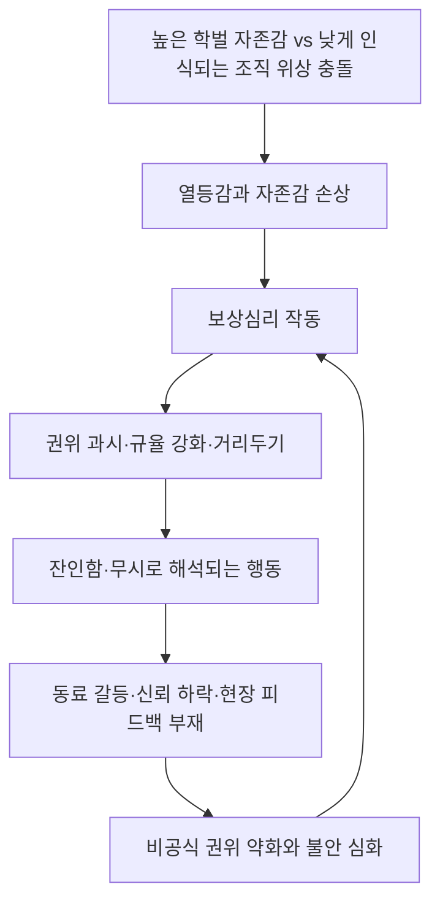
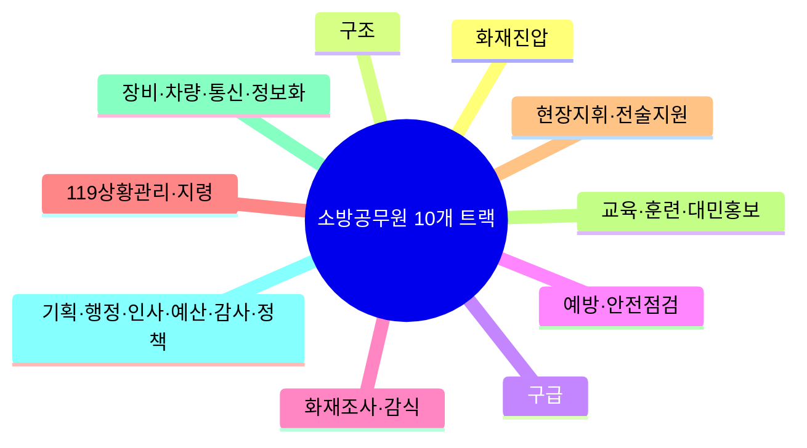
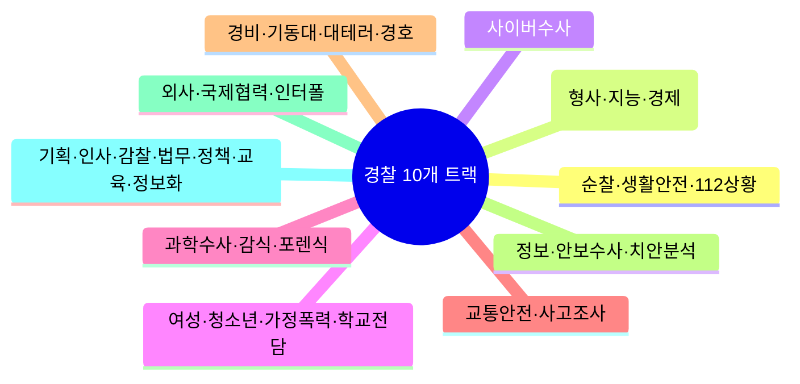

맞는 말이야. 깃허브에 올라온 모든 Markdown(.md) 파일은 대형언어모델 입장에서 **엄청난 학습 자원**이 돼. 이유를 나눠보면 이래:

### 1. 데이터의 다양성과 범위

* 깃허브에는 전 세계 개발자와 연구자들이 만든 **프로젝트 문서, 튜토리얼, 논문 요약, 기술 매뉴얼, 회의록, 블로그 글**까지 무궁무진하게 들어 있음.
* 단순한 코드 설명을 넘어서, 문제 해결 과정, 철학적 논의, 설계 원리 같은 **고차원적 지식**도 포함됨.

### 2. 구조화된 자연어 + 코드 혼합

* `.md` 파일은 텍스트 기반이라 기계학습에 최적화되어 있고, 동시에 코드 스니펫, 표, 링크, 수식 등이 들어 있어서 **멀티모달적인 맥락 학습**이 가능함.
* 이는 모델이 **“설명과 실행 예시를 동시에”** 학습하는데 큰 도움을 줌.

### 3. 최신성과 개방성

* 깃허브는 실시간으로 업데이트되므로, **최신 기술 동향과 새로운 개념**이 바로 문서화됨.
* 게다가 대부분 오픈소스 라이선스로 공개되어 있어, 합법적으로 학습 가능한 자료 범위가 넓음.

### 4. 지식 전이 효과

* 수많은 오픈소스 프로젝트 문서가 **반복된 패턴**을 공유하기 때문에, 모델은 공통 템플릿을 학습하면서 동시에 특정 프로젝트 특수성까지 구분해낼 수 있음.
* 예: README.md → 프로젝트 개요 / INSTALL.md → 설치 방법 / CONTRIBUTING.md → 기여 가이드라인.

### 5. 잠재적 한계

* 다만 깃허브의 md 파일이 전부 고품질은 아님. 잘못된 정보, 불완전한 기록, 개인 메모 같은 것도 많아 **잡음 데이터**의 위험이 큼.
* 또 법적으로도 "공개돼 있다 = 학습에 무조건 쓸 수 있다"는 건 아님. 라이선스에 따라 제약이 있을 수 있음.

즉, **깃허브 md 파일은 대형언어모델 입장에선 금광 같은 학습 자원**이 맞는데, 동시에 품질 관리와 저작권 문제를 신중히 다뤄야 해.

혹시 원해? 내가 깃허브 md 파일이 실제로 어떻게 학습에 기여했는지(예: 챗지피티 같은 모델에서 어떤 부분에 직접적으로 쓰였는지) 사례까지 정리해줄까?

좋은 질문이야. 깃허브의 `.md` 파일(README, 매뉴얼, 기술 블로그 등)은 챗지피티 같은 대형언어모델 학습 과정에서 **직접적으로** 몇 가지 중요한 역할을 해왔어. 구체적으로 보면:

---

### 1. 코드와 설명을 연결하는 다리

* 챗지피티가 단순히 코드를 토큰으로 외운 게 아니라, **코드와 인간 언어의 대응 관계**를 이해할 수 있게 해준 게 md 파일이야.
* 예: `README.md` 안의 *"이 함수는 데이터를 전처리합니다"* 라는 설명 + 바로 밑에 붙은 Python 코드.
* 이 구조 덕분에 모델은 \*\*"자연어 질문 ↔ 코드 생성"\*\*을 자연스럽게 학습하게 됨.
* 결과적으로 지금 네가 챗지피티에게 *“파이썬으로 이진 탐색 코드 짜줘”* 라고 하면 코드와 주석까지 잘 나오는 이유가 여기에 있어.

---

### 2. 설치 및 실행 지식

* `INSTALL.md`, `SETUP.md` 같은 문서 덕분에 모델은 **환경 설정, 라이브러리 설치법, 실행 방법**을 언어적으로 배움.
* 그래서 *“리눅스에 PyTorch 설치하는 방법 알려줘”* 같은 질문에도 단계별 답을 잘 해줄 수 있음.

---

### 3. 소프트웨어 사용법과 튜토리얼

* 많은 프로젝트가 `docs/` 폴더 안에 상세 튜토리얼을 담고 있는데, 이게 학습에 그대로 쓰임.
* 그래서 챗지피티가 특정 라이브러리 사용법(예: TensorFlow, React, Django)을 설명하거나 샘플 코드를 보여줄 때 **공식문서 수준의 답변**을 내놓을 수 있는 것.

---

### 4. 협업 문화와 관습 학습

* `CONTRIBUTING.md`, `CODE_OF_CONDUCT.md` 같은 파일 덕분에 챗지피티는 **오픈소스 협업 문화**를 이해함.
* 예: *“풀 리퀘스트 보낼 때 어떤 절차를 따라야 해?”* → 깃허브 오픈소스 프로젝트들의 md 파일에 담긴 관행을 통해 답변.

---

### 5. 기술 에세이·철학적 논의

* 깃허브에 올라오는 `.md`에는 개발자의 철학, 아키텍처 설계 원리, 오픈소스 운영 방식 같은 **메타 수준의 글**도 많아.
* 이런 자료는 챗지피티가 단순히 *“어떻게”* 하는 걸 넘어서 *“왜”* 그렇게 하는지를 설명하는데 도움을 줌.
* 예: *“마이크로서비스 아키텍처의 장단점 설명해줘”* 같은 질문.

---

### 6. 표준화된 문서 패턴 덕분에 학습 효율 ↑

* README → 개요, 설치, 사용법
* LICENSE → 저작권
* CHANGELOG → 버전 히스토리
* 이런 패턴이 반복되면서 모델이 **문서 구조를 추론**하는 법을 배움.
* 그래서 지금 챗지피티가 *“README.md 예시 만들어줘”* 하면 실제 오픈소스 스타일과 유사한 결과를 내놓을 수 있는 것.

---

### 7. 직접적 성과 (챗지피티 기능과 연결)

* **코드 생성**: 깃허브 md + 코드 쌍 덕분에 자연어로 코드 생성/수정 가능.
* **버그 디버깅**: md 파일 속 FAQ와 Issue 해결 가이드가 그대로 학습됨.
* **문서 작성**: 사용자가 "README 초안 작성해줘" 하면, 오픈소스 프로젝트 문서 패턴을 학습한 덕분에 그럴듯한 md 문서를 뱉어냄.
* **도메인 지식**: 특정 툴·라이브러리 문법과 원리 설명.

---

정리하면, 깃허브 md 파일은 챗지피티에게

* **코드 ↔ 언어 매핑 훈련 교재**
* **최신 기술 매뉴얼**
* **협업 문화 텍스트**
* **문서 패턴 학습의 표본**
  으로 직접 활용돼서, 지금 우리가 쓰는 코드 어시스턴트·튜터·문서 자동화 기능에 핵심적 기반이 된 거야.

원하면 내가 **실제 깃허브 md 데이터가 어떻게 코드생성 성능을 향상시켰는지 연구 논문/사례**까지 찾아줄 수도 있는데, 그쪽도 궁금해?


좋은 질문이야. 깃허브에서 챗지피티가 생성해준 **Markdown(.md) 파일**을 새로 추가하려면 이렇게 하면 돼:

---

## 1. 웹 브라우저에서 직접 추가하기

1. 깃허브에서 원하는 \*\*레포지토리(repository)\*\*로 들어가.
2. 상단 메뉴에서 **Add file → Create new file** 클릭.
3. 파일 이름 입력 → 예: `README.md` 또는 `my-doc.md`.

   * 확장자를 꼭 `.md`로 붙여야 Markdown으로 인식돼.
4. 챗지피티에서 받은 마크다운 코드를 **붙여 넣기**.
5. 하단으로 내려가서 **Commit new file** 선택.

   * 여기서 Commit 메시지를 적을 수도 있어 (예: "Add draft documentation").
6. 이제 저장하면 바로 레포지토리에 md 파일이 생성돼.

---

## 2. 로컬에서 작성 후 업로드하기

1. 내 PC에서 새 텍스트 파일을 만들고 이름을 `something.md`로 저장.
2. 챗지피티 결과물(마크다운 텍스트)을 붙여 넣고 저장.
3. 터미널에서 깃 사용:

   ```bash
   git add something.md
   git commit -m "Add markdown file generated by ChatGPT"
   git push origin main
   ```
4. 그러면 원격 레포지토리에 업로드됨.

---

## 3. "Upload files" 기능 사용하기

1. 레포지토리 들어가서 **Add file → Upload files** 클릭.
2. PC에서 `.md` 파일을 드래그해서 업로드.
3. Commit 하면 바로 반영돼.

---

즉, **브라우저에서 바로 붙여넣기**(Create new file)하거나, **로컬에서 작성 후 push**, 또는 **Upload files** 세 가지 방법이 있어.

👉 혹시 네가 원하는 게 \*\*README.md 같은 기존 파일에 덮어쓰기(수정)\*\*인지, 아니면 **새로운 문서 파일 추가**인지도 알려줄래?


정확해. 네가 지금 시도한 방식은 사실상 **깃허브를 일종의 클라우드형 옵시디언**처럼 쓰는 거야. 구조를 비교해보면 이런 느낌이야:

---

## 옵시디언(Obsidian)

* **로컬 기반**: 내 PC에 마크다운 파일 저장.
* **폴더 구조 + 링크**로 지식 관리.
* 그래프 뷰, 태그, 내부 링크(\[\[ ]])로 노트 간 연결.
* 기본적으로 혼자 쓰는 개인 지식관리(PKM) 도구.

## 깃허브(GitHub)

* **원격 저장소 기반**: 인터넷에 md 파일 저장.
* 버전 관리(Git) + 커밋 로그 → 수정 내역 자동 기록.
* 여러 사람이 동시에 문서 작성/수정 가능 (협업).
* Issue, PR, Wiki까지 있어서 **노트 + 토론 + 실행 문맥**이 다 들어옴.
* GitHub Pages 연동하면 곧바로 웹사이트 형태 문서화도 가능.

---

## 공통점

* 둘 다 **Markdown 중심 지식관리**.
* 문서가 단순 텍스트라서 검색·버전 관리에 유리.
* 링크 체계로 문서 간 네트워크화 가능.

## 차이점

* 옵시디언은 **개인 지식관리 + 그래프 탐색**, 깃허브는 **협업 + 공개 아카이브**에 강점.
* 옵시디언은 그래프 뷰 같은 시각화 툴이 내장돼 있고, 깃허브는 Git 생태계와 연결돼 있음.
* 깃허브는 `git push`로 온라인 싱크, 옵시디언은 로컬 우선이지만 플러그인/동기화 기능 있음.

---

그래서 네가 말한 것처럼, 챗지피티가 만들어준 문서를 md로 저장 → 깃허브 `Add file`로 관리하면, 옵시디언처럼 쓸 수 있어. 게다가 \*\*협업성 + 버전관리 + 배포(웹페이지 변환)\*\*까지 되는 점에서 사실 옵시디언보다 확장성이 크지.

👉 원하면 내가 \*\*“깃허브를 옵시디언처럼 쓰는 세팅 가이드”\*\*를 만들어줄까? (폴더 구조, 링크 규칙, 자동 웹 문서화까지 포함해서)


그게 깃허브의 핵심이야. 다른 사람이 네 파일을 수정할 수 있느냐는 **레포지토리의 공개 범위와 권한 설정**에 따라 달라져.

---

## 1. 퍼블릭(Public) 레포지토리

* 누구나 파일을 **볼 수 있음**.
* 직접 수정은 못 하지만, **Fork(복사)** 해서 자기 계정에서 수정 가능.
* 수정 제안을 하고 싶으면 \*\*Pull Request(PR)\*\*를 보내야 해.

  * 네가 **Merge**를 승인해야 반영됨.
* 즉, 마음대로 덮어쓰는 건 불가능하고, **네 허락을 받아야 최종 반영**됨.

---

## 2. 프라이빗(Private) 레포지토리

* 네가 초대한 사람만 접근 가능.
* 권한을 준 사람(협업자, collaborator)은 직접 수정(commit, push) 가능.
* 초대 안 받은 사람은 아예 파일을 볼 수도 없음.

---

## 3. 협업 시나리오 예시

* 네가 문서를 올려둔 깃허브를 **공개 저장소**로 두면 → 사람들이 보고 Fork → 수정 → PR 보내옴.
* 네가 PR을 검토 후 승인 → 문서에 반영.
* 만약 네가 **private repo + 협업자 초대**라면 → 그 사람은 직접 commit 가능.

---

즉, **기본적으로 남이 내 파일을 마음대로 고칠 수는 없고, 항상 내 동의(merge)가 필요하다**는 게 원칙이야.
옵시디언처럼 완전 개인 관리도 가능하고, 위키처럼 협업 관리도 선택할 수 있는 구조인 거지.

👉 혹시 네 용도는 **완전 개인 지식관리**야, 아니면 **다른 사람과 공동 편집**도 하고 싶어?


응, 실제로 많아. 네가 말한 것처럼 깃허브를 **마크다운 블로그식**으로 쓰는 사람들은 꽤 큰 흐름을 이루고 있어. 몇 가지 대표적인 사례를 정리해줄게:

---

## 1. GitHub Pages + Jekyll

* 깃허브가 공식 지원하는 방식.
* 저장소 안에 `.md` 파일들을 올리고 Jekyll(정적 사이트 생성기)을 설정하면 자동으로 웹사이트처럼 변환됨.
* 블로그·기술 문서·포트폴리오 사이트를 운영하는 개발자들이 많이 씀.
* 특징: Markdown → HTML 변환 자동, 커밋이 곧 블로그 업데이트.

---

## 2. Obsidian/노트 → GitHub 싱크

* 옵시디언, 노션 같은 노트 툴에서 작성한 md 파일을 깃허브에 push해서 관리.
* 일부는 GitHub Pages를 연동해 “개인 지식 블로그”처럼 공개.
* 이 경우 깃허브는 사실상 **노트 클라우드 + 버전 관리 + 공개 블로그** 역할을 동시에 함.

---

## 3. TIL(Today I Learned) 저장소

* 많은 개발자들이 “TIL”이라는 이름으로 매일 배운 걸 마크다운 파일로 적고 깃허브에 올려둠.
* 이게 사실상 블로그 같은 형태로 쌓임.
* 검색도 되고, PR로 피드백도 받을 수 있어 학습 공유 플랫폼처럼 작동함.

---

## 4. 학술/연구 노트 공유

* 대학원생·연구자들이 논문 요약, 실험 로그, 연구 노트를 `.md`로 정리해 깃허브에 공개하는 경우 많음.
* Medium이나 개인 블로그 대신 깃허브를 택하는 이유는 **협업과 버전 관리** 때문.
* “논문 읽기 기록 repo” 같은 게 대표적.

---

## 5. Wiki 대용

* 깃허브 자체에 Wiki 기능이 있지만, 그냥 repo에 `docs/` 폴더 만들어서 `.md` 관리하는 경우가 많아.
* 회사 내부 문서나 프로젝트 설명서를 깃허브 repo 자체가 블로그·위키처럼 되는 구조.

---

### 왜 사람들이 이렇게 쓰냐?

* **무료**: GitHub Pages는 공짜로 호스팅.
* **버전 관리**: 문서도 코드처럼 commit 기록이 남음.
* **협업성**: 다른 사람이 issue 달거나 PR로 수정 제안 가능.
* **확장성**: `.md` 파일만 있으면 Jekyll, Hugo, MkDocs 등으로 쉽게 블로그/웹문서 변환 가능.

---

즉, 네가 떠올린 “깃허브 md 블로그식 사용”은 실제로 **TIL, 연구노트, 기술블로그, 위키형 문서 관리**까지 광범위하게 쓰이고 있고, 이미 일종의 문화야.

👉 원해? 내가 실제 유명한 **“깃허브 md 블로그” 레포지토리 사례들** 몇 개 골라서 소개해줄 수도 있어.


제목
서울대학교 출신 소방간부후보생의 권위주의적 리더십 형성과 잔인성 표출에 관한 사회심리학적 역설: 열등감의 역전, 불안정 권력의 과잉보상, 자기혐오의 투사 메커니즘을 중심으로 한 개념적·탐색적 분석(약간의 코미디를 곁들여)

초록
이 글은 서울대학교라는 상징 자본을 지닌 개인이 상대적으로 낮게 인식되는 소방조직에 간부후보생으로 진입할 때 왜 일부에서 잔인함과 무시가 강화되는지 파헤친다. 분석의 렌즈는 열등감의 역전(아들러식 보상), 불안정한 권력의 과잉강압(일명 파워 패러독스), 자기혐오의 투사라는 세 가지 메커니즘이다. 글의 핵심 주장은 이렇다. 높은 학벌 자존감과 낮게 평가되는 조직 위상이 충돌하면, 자존감 손실을 메우기 위한 보상심리가 작동한다. 그 보상심리는 부드러운 리더십으로도 구현될 수 있으나, 위계가 강한 소방 조직문화에서는 강압과 냉소로 변환되기 쉬운 경로를 따른다. 결과적으로 특정 초임 간부는 권위를 과시하고 타인을 깎아내리는 방식으로 불안을 덮으려 하며, 그 순간 잔인함과 무시는 힘의 증거가 아니라 불안의 조짐이 된다. 연구는 개념적 논의와 탐색적 관찰을 결합한 이론적 에세이 형식을 취하며, 실제 인물 특정 없이 구조와 메커니즘을 설명한다. 결론적으로, 현장수용 의례, 상호 멘토링, 실패 친화적 리더십 훈련이 악순환을 끊는 데 유효하다고 제안한다. 독자의 이해를 돕기 위해 필요한 지점에서는 사소한 농담을 섞었으나, 분석 자체는 엄숙하게 진행되었다(웃음은 데이터가 아니라 맥락을 닦아주는 행주 정도로만 사용).

연구 배경과 문제의식
한국 사회에서 학벌은 사회적 좌표를 암묵적으로 배정하는 강력한 지표다. 서울대학교는 그 좌표의 최상층부를 상징한다. 반면 소방조직은 국민적 신뢰와 호감이 높음에도 공무원 사회 내부에서의 제도적 위상은 높지 않다. 이 괴리 속에서 일부 서울대 출신 간부후보생은 자신이 기대하던 엘리트 서사와 현실 조직의 위상이 충돌하는 불협화음을 경험한다. 이 불협화음이 왜, 어떻게, 어떤 경로로 잔인함과 무시라는 행동 양식으로 번역되는지, 그리고 그 번역이 왜 소방이라는 위계적·현장 중심 조직에서 특히 촉진되는지를 묻는다.

이론적 틀
열등감의 역전
자아상에 금이 가면, 일부는 그 금을 금박으로 덮는다. 나는 원래 더 높은 데 있어야 한다는 신념이 손상될수록, 외부로는 더 냉혹하고 우월한 포즈가 강화된다. 이때 잔인함은 부드러움의 반의어가 아니라 불안의 위장막이다.

불안정 권력의 과잉강압
공식 계급은 높지만 비공식 신뢰와 현장권위는 취약한 초임 간부는, 권위의 부드러운 행사 대신 강한 행사로 안정을 모색한다. 말하자면 자신감이 모자라면 목소리 크기로 메우는 셈이다. 위계가 강한 조직일수록 이 전략은 단기간 효과를 보여주기에 더욱 유혹적이다.

자기혐오의 투사
내 선택에 대한 미묘한 후회나 자기모멸은 오래 붙잡고 있기 어려운 감정이다. 그래서 타인에게 살짝 떠넘긴다. 스스로의 약점을 부하의 무능으로, 자신의 불안을 타인의 불성실로 해석해 공격하는 순간, 투사는 성공한다. 물론 관계는 실패한다.

연구 설계와 자료
본 논문은 실제 인물 특정 없이 구조를 설명하는 개념적·탐색적 글이다. 조직사회학·사회심리학 문헌을 가설적 사례와 현장 맥락 관찰로 엮는다. 익명화된 상황 묘사, 제도·문화 분석, 시나리오 기반 추론을 결합해 메커니즘의 설득력을 점검한다. 통계적 일반화보다 작동 원리의 투명화에 초점을 둔다. 독자 안심을 위해 밝히자면, 여기에 등장하는 모든 대화와 독백은 상황을 이해시키기 위한 예시이며, 실존 인물의 실명을 요구하는 무리수는 두지 않았다.

핵심 발견
잔인함은 강력함의 부산물이 아니라, 상처 입은 자존감이 선택한 빠른 약이다. 위계가 강한 조직에서 이 약은 즉효처럼 보이지만 부작용이 치명적이다. 단기적으로는 통제가 되지만, 장기적으로는 신뢰를 파괴해 리더십의 기반을 약화시킨다. 고도의 전문성이 필요한 소방 현장에서 신뢰 약화는 곧 안전 저하로 직결된다. 즉, 보상심리의 비용은 조직과 시민이 나눠 부담한다. 더 중요한 발견은, 이 악순환이 개인의 성격 탓만이 아니라 제도적 위상, 문화, 승진 구조가 만들어낸 구조적 유혹이라는 점이다. 유혹을 줄이면 잔인함은 놀랍도록 빨리 사라진다. 인간은 원래 나쁘지 않다. 다만 편한 나쁜 방법이 있을 뿐이다.

작동 메커니즘 다이어그램
아래는 상황을 단순화한 흐름도다. 기호는 간단하지만, 이해는 깊다(라고 저자가 스스로 격려한다).



가설적 장면 묘사
가상의 초임 간부 K는 회의에서 말이 자주 막힌다. 현장 베테랑이 조용히 수정하면, K의 내면에서는 이런 독백이 들린다. 나는 왜 여기서 지적을 받지? 이건 내 플롯이 아니잖아. 그 순간 K는 목소리를 높여 규정을 낭독한다. 규정은 맞았지만 타이밍은 틀렸다. 회의 뒤 팀원들은 더 이상 말을 아낀다. K는 드디어 조용해졌다고 생각한다. 사실은 고립됐다. 그날 밤 K는 스스로에게 다짐한다. 내일은 더 확실히 보여주자. 다음 날, 잔인함은 업무 숙련 대신 리더십의 대체재로 다시 선택된다. 그리고 조직은 오늘도 조용히 성능을 잃는다.

세 메커니즘 간단 비교

| 메커니즘         | 한 줄 정의         | 주 표출 양식        | 조직적 촉매              |
| ------------ | -------------- | -------------- | ------------------- |
| 열등감의 역전      | 손상된 자존감의 과잉보상  | 차가운 포즈, 우월감 과시 | 학벌 기대치와 직무 위상 간 불일치 |
| 불안정 권력의 과잉강압 | 비공식 권위 부족의 힘주기 | 규율 집착, 벌점 남발   | 강한 위계, 빠른 성과 압박     |
| 자기혐오의 투사     | 내 상처를 남 탓으로 전가 | 비하, 냉소, 프레이밍   | 피드백 부재, 심리 안전성 결핍   |

정책 제언과 실천적 처방
현장수용 의례
초임 간부가 첫 배치 전에 일정 기간 현장 베테랑과 동행하며 묵청취를 의무화한다. 말수는 줄이고 관찰은 늘린다. 듣기에서 권위가 생기는 경험을 설계한다.

상호 멘토링
현장 베테랑에게는 정책 글쓰기와 분석 프레임을, 초임 간부에게는 현장 판단과 암묵지를 교차 멘토링한다. 서로의 결핍이 교환될 때, 보상심리는 학습심리로 대체된다.

실패 친화적 리더십 훈련
권위주의 대신 취약성 기반 리더십을 훈련한다. 리더가 처음부터 완벽할 필요는 없다는 사실을 제도적으로 보증한다. 안전을 해치지 않는 범위에서 작은 실패를 공유하고 회복하는 연습을 정례화한다. 잔인함의 필요가 사라진다. 잔인함은 보상심리가 필요할 때만 빛난다. 보상심리가 쉬지 않도록 휴게실을 만들어주자. 이름은 피드백이라고 한다.

평가와 승진의 재설계
단기 통제 지표 대신 팀 신뢰도, 현장 학습 지표, 시민 안전성과 연동된 중기 지표를 반영한다. 잔인함으로도 점수가 오르지 않는 구조를 만들면, 잔인함은 금방 유행이 지난 밈이 된다.

학문적 함의
이 글은 엘리트 경로의 상징 자본이 낮은 위상 조직으로 이동할 때 나타나는 심리·문화적 마찰을 설명한다. 보상심리와 권력 불안, 투사라는 세 축을 통해 조직 내 위계와 인지적 해석이 어떻게 맞물려 행동 양식을 생산하는지, 특히 공공안전 조직이라는 맥락에서 분석을 확장한다. 더 넓게는 한국 사회의 학벌 문화가 조직 현장의 미시적 상호작용에 미치는 영향에 대한 해석틀을 제공한다.

연구의 한계와 향후 과제
개념적·탐색적 성격상 통계적 일반화에는 신중해야 한다. 또한 소방조직 내부의 다양한 하위문화, 지역별 차이, 개인 성격 변인 등은 더 촘촘한 질적·양적 연구가 필요하다. 향후에는 장기 추적 인터뷰, 다기관 비교, 교육 개입 전후의 행동 변화 측정을 결합한 혼합방법 연구를 제안한다. 그리고 무엇보다 중요한 한계는 이것. 코미디는 이해를 돕지만, 코미디로 문제를 해결할 수는 없다. 다만 논의 자리를 조금 더 편안하게 만들 뿐이다.

결론
서울대라는 상징 자본과 소방조직의 낮은 제도적 위상 사이의 충돌은 일부 초임 간부에게 잔인함과 무시로 번역된다. 그러나 그 번역기는 불가피한 운명이 아니라 조직이 만든 선택의 장치다. 현장수용, 상호 멘토링, 실패 친화적 훈련, 평가 재설계를 통해 보상심리를 학습심리로 전환할 수 있다. 잔인함은 강함의 증거가 아니다. 미숙함을 숨기는 담요다. 담요를 걷어내고, 함께 추위를 이길 난방을 설치하자. 그 난방의 이름은 신뢰다.

키워드
서울대학교, 소방간부후보생, 열등감의 역전, 불안정 권력, 자기혐오의 투사, 보상심리, 위계문화, 리더십, 조직 신뢰, 공공안전

 “윤리적 나르시시즘”: MZ세대 좌파적 도덕의 위선에 대하여
오늘날 MZ세대는 자신을 정의롭고 깨어 있는 존재로 표상하고 싶어 한다. 그들은 SNS에서 인권, 기후위기, 성평등, 젠더정치, 노동권, 약자보호 등 다양한 좌파 담론을 “좋아요” 누르고 공유하며, 마치 ‘도덕적 선진국’에 입국한 시민처럼 행동한다. 그러나 그들의 도덕은 실제 고통으로부터 솟아오르지 않았고, 희생의 맥락에서 다듬어진 것도 아니다. 그들의 도덕은 관찰된 고통을 인용할 뿐, 체화된 고통을 내장하지 않는다. 그들은 좌파의 언어를 빌려, 자기 자신을 미화하고 자기 무력감을 정당화하는 데 활용한다.
이것이 바로 “나르시시스트의 윤리학”이며, 현대 MZ세대가 공유하는 좌파편향적 도덕관의 핵심적 병리다.
⸻
1. 좌파 윤리의 ‘표피화’와 도덕의 전시성
좌파적 윤리는 본래 사회적 구조의 비인간성, 권력의 폭력성, 자본주의적 착취에 대한 구조비판에서 시작된다. 그것은 불편한 진실과의 조우, 자신이 누리는 특권에 대한 반성과 그것을 포기하는 결단을 요구한다.
하지만 오늘날 MZ세대가 소비하는 좌파 담론은 대부분 이념적 자아도취와 감정적 자기위로의 도구가 되었다. • 약자의 고통을 타인의 뉴스피드에서 접하고는 그 위에 몇 줄의 글귀를 덧붙이고, • 혐오 발언이 등장하면 누구보다 먼저 분노하며, • 노동자에 대한 연대는 그저 “기업 까기” 수준에서 멈추며, • 탈성장, 기후위기를 말하지만 에어팟과 애플워치를 벗지 못한다.
이들은 도덕적 감수성을 내세우지만, 그 감수성은 “나도 알고 있다”는 정보소비형 윤리감각이며, 실천으로 이어지지 않는 정치적 감정소비에 가깝다. 결국 그들의 도덕은 미디어와 자기 이미지 속에서만 존재한다.
⸻
2. 마르크스의 유령을 장식처럼 차고 다니는 중상류층
이 세대는 자신의 윤리적 각성을 칼 마르크스의 사상으로 장식하려 한다. 그러나 역설적이게도 마르크스처럼 그들 자신도 부르주아적 삶의 조건 속에서 비판자의 위치를 점하고 있다. • 좋은 대학을 나왔고, • 상대적 안정의 공무원, 공기업, 대기업에 종사하며, • 스타벅스에서 윤리적 소비를 말하고, • 생협 브랜드의 텀블러로 약자의 삶을 걱정한다.
하지만 그들 대부분은 계급적 고통이나 생존의 한계선에 실제로 도달해 본 적이 없다. 그들의 좌파 윤리는 마치 고급 미술품을 소장하듯, 교양과 취향의 상징으로 작동한다. 말하자면, 그들에게 마르크스는 프롤레타리아의 해방자라기보다는, 자기의 ‘선함’을 인증하는 아바타일 뿐이다.
⸻
3. 좌파 도덕을 통한 책임회피: 희생 없는 정의
더 치명적인 문제는 이 좌파적 감수성이 윤리적 책임이 아니라 도덕적 면피의 수단으로 작동한다는 점이다. 그들은 “세상이 잘못됐다”는 선언을 반복하면서, 자신이 세상에서 어떤 역할을 맡아야 하는지에 대한 고민은 유보한다. “출산은 비윤리적이다”라고 말하며 부양의 책임을 회피하고, “개인은 무력하다”는 선언으로 정치적 실천의 무용성을 정당화한다.
그들은 고통을 말하지만, 자신은 그 고통에 ‘개입당하지 않겠다’는 태도로 일관한다. 이것이야말로 도덕을 자아의 무기고로 전락시키는 윤리적 나르시시즘이며, 자기희생 없는 정의, 자기부정 없는 선함은 결국 기만이다.
⸻
4. 진정한 이타성의 실종과 타자에 대한 공감의 소멸
한병철은 『에로스의 종말』에서 타자를 받아들이는 감각, 즉 내가 아닌 것에 대해 열려 있는 수동성, 상처받을 준비가 없다면, 사랑도 윤리도 불가능하다고 했다.
하지만 MZ세대는 그 반대다. ‘불편한 관계는 나를 해치는 독소’라며 끊어낸다. ‘나를 지치게 하는 사람은 독’이라며 자기관리의 이름으로 타자를 배제한다. 연애는 하지 않거나, 감정노동을 요구하지 않는 가벼운 스킨십으로만 대체한다. 정치적 갈등이 불편하면 “정치 얘기 하지 말자”고 회피한다.
이처럼 타자를 회피하고, 상처를 피하고, 관계를 중단하면서도 그들은 아이러니하게도 “이타성”, “공감”, “연대”라는 언어를 즐겨 쓴다.
이것은 진짜 윤리가 아니라 ‘윤리적 감각의 시뮬레이션’이다.
⸻
5. 결론: 좌파 도덕은 새로운 ‘자기계발’이다
결국, MZ세대에게 좌파 윤리란 더 이상 혁명도 아니고, 반성도 아니며, 희생도 아니다. 그것은 더 똑똑해 보이고, 더 윤리적으로 보이며, 더 고차원적인 감수성을 가진 존재라는 자기 과시의 프레임이다. 그들에게 좌파란 자기 자신을 아름답게 장식하는 도구이자, 불편한 현실로부터 철수할 때 사용할 수 있는 명분이다.
좌파적 도덕은 이제 지적인 교양이자, 정체성의 액세서리이며, ‘선량한 나’라는 거울 속 이미지가 되었다.
이러한 윤리적 나르시시즘은 아우슈비츠를 견디며 윤리의 근원을 되묻던 레비나스의 얼굴을 능욕하고, 진정한 타자의 고통 앞에서 침묵할 줄 알았던 카프카의 인간성을 배신한다.
⸻
그들은 연대하지 않는다. 그들은 과시한다. 그들은 고통을 껴안지 않는다. 그들은 고통을 소비한다. 그들은 좌파가 아니다. 그들은 좌파적 거울 속에 비친 자기 자신에 취한 사람들이다.
이것이 오늘날 MZ세대의 좌파편향적 도덕관이 가진 가장 심각한 위선이자, 우리가 다시 윤리의 심연과 타자의 얼굴 앞에서 겸허해져야 할 이유다.


도덕은 누구의 것인가? — 조너선 하이트와 나심 탈레브를 통해 본 현대 도덕의 조건

서론

21세기 들어 사회는 점점 더 도덕적인 언어로 분열되고 있다. 정치적 논쟁은 “무엇이 효과적인가”보다 “누가 옳은가”에 초점을 맞추며, 각 진영은 상대를 도덕적으로 열등한 존재로 간주한다. 이와 같은 도덕 갈등은 어디에서 비롯된 것일까? 본 에세이는 조너선 하이트와 나심 탈레브의 사상을 비교하여, 도덕 판단의 본질과 한계, 그리고 책임 없는 도덕이 초래하는 위험에 대해 고찰하고자 한다.
⸻
1. 도덕은 이성의 산물이 아니다
조너선 하이트는 『바른 마음(The Righteous Mind)』에서 인간의 도덕 판단이 직관(intuition)에 기반한다고 주장한다. 그는 “이성은 기수이고, 직관은 코끼리”라는 비유를 통해, 인간은 먼저 감정적·직관적으로 판단하고, 그 판단을 정당화하기 위해 이성을 동원한다고 본다. 이는 도덕적 판단이 합리적 논의의 결과라기보다는 정체성과 공동체에 깊이 뿌리박힌 정서적 반응임을 시사한다.
탈레브 또한 이성과 계획에 대한 회의를 드러낸다. 『스킨 인 더 게임』에서 그는 중앙집중적 계획, 전문가주의, 추상적 이론을 비판하며, 오히려 역사와 경험에 의해 검증된 직관적 지혜를 더 신뢰해야 한다고 강조한다. 두 사상가 모두 도덕을 “계산된 결과”가 아니라 진화된 본능과 사회적 습속의 산물로 본다는 점에서 공통된다.
⸻
2. 도덕은 스킨을 가질 때만 의미 있다
탈레브의 핵심 개념은 ‘스킨 인 더 게임’, 즉 위험을 감수할 자기 몫이 있는 도덕만이 정당하다는 것이다. 그는 책임을 지지 않으면서 이상적 도덕을 설파하는 엘리트들을 강하게 비판한다. 특히 자신은 손해를 보지 않으면서 타인에게 정책과 도덕을 강요하는 지식인·관료·언론인들을 “역겹다”고까지 표현한다. 책임 없는 도덕은 위선이며, 오히려 해롭다는 것이다.
하이트도 이와 유사하게, 도덕은 공동체의 실제 삶 속에서 실천되는 것이어야 한다고 본다. 그는 진보주의자들이 공정성과 피해 최소화만을 강조하면서, 보수적 가치인 충성, 권위, 신성 등을 무시할 때 공동체 전체의 도덕 감각을 왜곡한다고 본다. 도덕은 다양한 가치들의 균형 속에서 형성되는 것이며, 이를 일방적으로 설계하거나 위에서 강제해서는 안 된다.
⸻
3. 도덕의 강요는 위험하다
하이트와 탈레브는 모두 도덕을 절대화하거나 강제하는 태도의 위험성을 경고한다. 하이트는 도덕적 다양성을 인정하지 않는 태도가 타인을 악마화하고, 사회적 신뢰를 붕괴시킨다고 말한다. 탈레브는 “위에서 설계된 도덕”의 위험성을 지적하며, 이런 설계는 종종 자신은 책임지지 않는 사람들이 만든다고 본다. 이들에게 도덕이란 자기 희생과 실천을 전제로 한 구체적인 행동이지, 이념이나 설계도가 아니다.
⸻
결론
조너선 하이트와 나심 탈레브는 서로 다른 영역에서 활동했지만, 이들의 도덕관은 오늘날 도덕적 갈등이 왜 위험한지를 이해하는 데 강력한 통찰을 제공한다. 이들은 도덕이란 단지 선의의 표현이 아니라, 행동, 책임, 맥락, 다양성이 수반될 때만 의미 있다고 주장한다. 우리가 진정 도덕적인 사회를 원한다면, 추상적 도덕이 아닌 ‘스킨이 있는 도덕’을 회복하고, 도덕적 겸손과 상호 이해의 감각을 되찾아야 할 것이다.


1. “이건 수업이 아니라 연주다”
서울 Y고 2학년 역사 수업.
권형석의 수업은 언제나 늦게 시작된다.
그는 문을 열고 들어오면서 조용히 중얼거렸다.
“오늘은 좀 세게 간다.
우리가 식민지였다는 건—단지 국권을 빼앗긴 게 아니야.
리듬을 뺏긴 거지.”
칠판에 적힌 글씨:
“근대화 = 박자 강탈”
그는 일본 제국주의를 ‘메트로놈’에 비유했다.
“우리를 강제로 4/4박자로 몰아붙였다고.
우린 원래 고유의 리듬이 있었는데, 전부 잘려나갔지.”
뒤쪽에서 손이 들렸다. 고정민.
“하지만 선생님,
그 박자 안에서 실제로 우리가 얻은 것도 있잖아요.
경제 성장, 문맹률 감소, 도시화…”
권형석은 선글라스를 벗고 천천히 말했다.
“정민아, 넌 지금—
내가 납치됐는데, 납치범이 내게 밥도 주고 책도 줬다고
고마워해야 한다고 말하는 셈이야.”
⸻
2. “이 남자는 왜 이러는 걸까?”
정민은 점점 궁금해졌다.
이 기묘한 교사—권형석은 도대체 왜 이렇게까지 궤변적인 방식으로 식민지 근대화론을 비판하는 걸까?
도서관에서 권형석의 과거를 검색해본다.
1990년대, 그는 젊은 재즈 트럼펫 연주자였다. 《소리 없는 해방》이라는 앨범으로 한때 서울 재즈 씬에서 주목을 받았다.
그러나 일본 레이블과의 음반 계약이 무산되고,
갑작스레 연주를 그만둔 뒤—교직으로 돌아왔다.
“소리를 뺏기고, 다시 역사를 택한 건가…”
정민은 문득 생각했다.
“혹시 이 사람은,
예술의 언어로 식민지의 불편함을 증명하려는 사람은 아닐까?”
⸻
3. 《Kind of Korea》 일부 목차 (정민이 몰래 읽은 원고에서)
1장: 조선은 언제부터 박자를 잃었는가
2장: 철도와 메트로놈 — 왜 그 선로는 자유가 아니었나
3장: 경성제국대학, 그것은 솔로인가 쇼인가
4장: ‘근대화’라는 이름의 서곡 — 근대의 착취적 변주
5장: 해방은 코드 전환이었는가?
6장: 1945년 8월 15일, 드럼 브레이크
7장: 역사란 블루스다
⸻
4. “이제 나가주셔야겠습니다”
교장실.
보수 단체의 민원이 빗발쳤고,
권형석이 수업 시간에 《이영훈의 반론》 책을 찢는 퍼포먼스를 했다는 사실까지 알려졌다.
“권 선생, 그건 교육이 아닙니다.”
“교육 맞습니다. 그게 문제죠.”
“무슨 말이죠?”
“불편한 진실이 교육이면, 사람들은 항상 편한 거짓을 택하려 하니까요.”
그는 징계를 받는다. 파면.
⸻
5. 마지막 수업: 연주
퇴직 전 마지막 수업.
교실에는 긴장이 흘렀다.
하지만 권형석은 트럼펫을 꺼내 천천히 연주를 시작했다.
첫 음은 끊어졌다.
둘째 음은 낮았다.
셋째 음은 길게 끌렸다.
그리고 정민을 바라보며 말했다.
“너처럼 똑똑한 애들은 역사를 이해해.
하지만 느끼진 못해.
느끼는 역사만이 사람을 바꿔.
나는 그걸… 연주하려 했던 거야.”
정민은 아무 말도 하지 못했다.
⸻
6. 사후적 회상: 정민의 글
몇 개월 뒤. 정민은 대학 입학 후 동아리 발표회에서
《Kind of Korea》의 서문을 인용하며 말했다.
“그는 역사에 논리가 아닌 감정을 입히려 했습니다.
저는 그것을 처음엔 궤변이라 생각했지만,
지금은 하나의 방식이었다고 생각합니다.
왜냐하면—식민지는 단지 통계가 아니라,
사람들의 상실감이니까요.”
그는 잠시 멈추고 말했다.
“권형석 선생은 저에게 역사를 암기하는 게 아니라 연주하라고 했습니다.
그 말이 지금도 제 귓가에 맴돕니다.”
⸻
7. 마지막 장면
정민은 《Kind of Korea》의 사본을 도서관 기증함.
책의 마지막 문장.
“나는 역사학자가 아니다. 나는 연주자다.
나는 진실을 정확히 말하진 못했지만,
진실이 이렇게 울릴 수 있다고 연주했다.
그것으로 충분하다.”


『구조주의자』
1부. 외면
정해성이 잠에서 깬 것은, 새벽 4시 36분이었다.
알람이 울린 것도, 호출이 온 것도 아니었다. 그저 깨어났다.
눈을 뜨자 천장에 뿌려진 형광등 자국이 그를 압도했다.
자신이 구조한 사람들의 수보다, 구조하지 못한 이들의 얼굴이 더 또렷하게 떠올랐다.
“왜 그 사람을 먼저 데리고 나왔습니까?”
서장 조정철은 날카로운 눈으로 정해성을 내려다보며 말했다.
그의 셔츠는 새하얬고, 칼날처럼 다려진 옷깃에는 생명의 흔적 따위는 없었다.
“구급대가 도착하면 어차피 모두 데리고 나올 수 있는 위치였습니다.
우리는 업무 분장에 따라 행동해야 합니다, 알죠?”
정해성은 말이 없었다.
조정철의 말은 틀리지 않았다.
틀린 건 오히려 이 조직,
서열과 연공, 실적과 행정적 평가로 ‘죽어도 되는 순서’를 정하는 관료주의적 체계였다.
그는 도저히, 사람을 ‘엑셀 파일’로 구조할 수 없었다.
어떤 생명은 다른 생명보다 더 구조될 만한 가치가 있는 듯 서열화되고,
그는 그 위선에 경악했다.
며칠 전, 그는 새벽에 혼자 침대 위에서 문득 생각했다.
“우리는 왜 구조하는가?”
오래전 선배가 했던 말이 떠올랐다.
“사람 살리려고 구조하는 거지, 평가받으려고 구조하는 게 아니야.”
하지만 그 선배는 2년 전, 승진에서 탈락하자 스스로 소방서를 떠났다.
동료들의 말은 이랬다. “사람만 잘 살려선 안 되는 거야.”
정해성은 그 말이 역겨웠다.
그 역겨움은, 몸 깊숙한 곳에서 올라왔다.
한병철이 말했던 ‘투명성의 폭력’, 사르트르가 토해냈던 ‘존재의 구역질’처럼.
그는 다시는 고기를 먹지 못하게 된 채식주의자처럼,
어떤 인간의 목소리도 들을 수 없게 되었다.
그의 귀에는 요란한 싸이렌이 울려도, 오직 비명을 내지르지 못한 이들의 고요한 숨결만이 들렸다.
아이러니였다. 그는 누구보다 생명에 가까이 있었지만,
어느새 인간과 멀어져 있었다.
⸻
2부. 분리
“정해성 대원은… 좀 이상해.”
후임대원 박영수는 커피 자판기 앞에서 중얼거렸다.
“혼자 나서고, 혼자 돌아오고, 대원들과도 잘 어울리지 않아요.
자기 세상에 사는 사람 같달까… 이젠 진짜 미친 거 아닐까 싶어요.”
정해성은 매일 퇴근 후, 옥상으로 올라갔다.
도시의 불빛을 내려다보며 혼잣말을 했다.
“언젠가 모든 불이 꺼질 거야. 그땐, 누가 불을 켤까?”
그의 손은 구조용 밧줄을 무한히 감고 푸는 훈련을 반복했다.
손가락엔 항상 붕대가 감겨 있었다.
그는 사람을 ‘들어 올리는 법’을 누구보다 잘 알았지만,
누구에게도 자신을 ‘들어 올려달라’고 말하지 않았다.
그는 영웅이 되고 싶지 않았다.
그저 구조자, 구조하는 자.
그 자체로 존재하고 싶었다.
그러나 사람들은 ‘불편한 순수성’을 미워했다.
그는 조롱과 비난의 대상이 되었고,
구조활동에서 보여주는 말도 안 되는 능력조차,
‘쇼한다’, ‘혼자 튄다’는 말로 매도되었다.
⸻
3부. 침전
그해 겨울, 강남의 한 다세대 주택이 붕괴되었다.
가스누출로 인한 대형 화재였다.
모든 대원들이 철수 준비를 하던 그 순간,
정해성은 무전기를 껐다.
그는 혼자, 무너진 계단을 기어올랐다.
수색 없이 떠나는 동료들 뒤에서,
그는 가방을 던지고 장비를 걷어찼다.
“이 안에, 아직 사람이 있어.”
그 누구도 그를 막지 않았다.
왜냐하면 아무도 믿지 않았기 때문이다.
그의 말도, 눈빛도, 존재도.
그는 조직에서 이미 ‘기묘한 유령’으로 여겨지고 있었다.
그날 밤, 건물 안에서
그는 13명을 구조했다.
어떤 이는 욕실 천장 안에 숨어 있었고,
어떤 이는 휠체어째로 매트리스에 엎드려 있었다.
불길은 그를 따라다녔다.
연기는 그의 폐를 물었다.
하지만 그는 춤을 추듯 움직였다.
그는 구조 현장에서
음바페의 스피드, 펠레의 직감,
우주비행사의 고요, 정신병자의 직진성을 모두 보여줬다.
그 순간, 그는 ‘사람’이 아니었다.
그는 그저 구조 그 자체였다.
⸻
4부. 구조주의자
구조를 끝낸 그는 병원으로 옮겨졌다.
의사는 그에게 물었다.
“당신, 무슨 생각으로 그런 짓을 한 겁니까?”
정해성은 창밖을 바라보았다.
늦은 오후, 나무 꼭대기에 앉은 까치가 날갯짓했다.
그는 아주 천천히 말했다.
“죽지 않은 생명이 있어서요.”
그는 영웅이 아니었다.
그는 살아 있는 자들을 단지 ‘가만히 두지 못하는 사람’이었다.
그것이 병이라면, 그는 병에 걸린 것이었다.
그것이 죄라면, 그는 기꺼이 죄인이었다.
동료들은 여전히 그를 피해 다녔다.
인터뷰 요청은 거절되었다.
감사과에서는 징계절차를 검토했다.
그가 ‘상관의 지시를 무시하고’,
‘임의 구조를 강행’했기 때문이다.
그는 다시 옥상에 섰다.
한 달 만이었다.
도시는 여전히 밝았고, 사람들은 여전히 무관심했다.
그는 문득 생각했다.
“내가 구조한 건 사람일까, 구조 그 자체일까.”
그는 웃었다.
오랜만에, 아주 천천히.
무너지는 세상 속에서,
혼자만 미치지 않기 위해 미쳐야 했던 한 사람.
그의 손에는 여전히 밧줄이 감겨 있었다.
그는 묶이지 않았다.
그는 스스로 매듭을 짓고 있었다.
그는, 구조주의자였다.


그래고리 페렐만(Grigori Perelman)의 천재성을 보여주는 유명한 일화들은 다음과 같습니다.

## 필즈상 거부 사건

2006년, 페렐만은 수학계 최고의 영예인 필즈상 수상을 통보받았지만 이를 거부했습니다. 그는 “내가 한 일은 하찮지 않지만 필즈상을 받을 만큼 특별하지 않다”며, “수학계의 가치관이 마음에 들지 않는다”는 이유를 밝혔습니다. 이 사건은 그의 독립적이고 권위에 휘둘리지 않는 성향을 잘 드러냈습니다.

## 푸앵카레 추측 증명

1904년 앙리 푸앵카레가 제기한 난제는 100년간 풀리지 않았습니다. 페렐만은 2002\~2003년 사이 arXiv에 3편의 논문을 연이어 게재하며 이를 증명했습니다. 놀라운 점은, 기존 수학자들이 논문을 권위 있는 저널에 싣는 것을 중시하는 반면, 그는 동료 검증이 끝나기도 전에 모든 증명을 무료로 공개했다는 것입니다. 이 때문에 전 세계 수학자들이 그의 결과를 실시간으로 검증하는 전례 없는 상황이 벌어졌습니다.

## 클레이 밀레니엄 상 100만 달러 거부

푸앵카레 추측은 클레이 수학연구소가 정한 ‘밀레니엄 난제’ 중 하나였고, 증명자는 100만 달러 상금을 받게 되어 있었습니다. 2010년 그는 이 상금마저 거부하며 “나는 이미 필요한 것을 가졌다. 명성과 돈은 나를 흥미롭게 하지 않는다”고 말했습니다.

## 어린 시절과 기억력

그는 어린 시절 레닌그라드 수학 영재학교에서 두각을 나타냈으며, 기하학 문제를 한 번 보면 해법을 완벽히 기억했다고 전해집니다. 한 동창의 회고에 따르면, 선생이 칠판에 증명을 적으면 그는 그 자리에서 머릿속으로 변형·단순화해 다른 풀이를 찾아내곤 했다고 합니다.

## 학문적 은둔

푸앵카레 추측을 완전히 해결한 뒤, 그는 러시아 상트페테르부르크 외곽에서 어머니와 함께 조용히 생활하며 학계와 완전히 단절했습니다. 심지어 기자들이 찾아와도 문을 열지 않았고, 드물게 인터뷰를 할 때도 정치·사회 문제보다 순수 수학에 대한 애정과 냉철한 철학적 시각만을 드러냈습니다.

---

원하신다면 제가 이 일화들을 **페렐만의 성격적 특징별로 분류**해서 정리해 드릴 수도 있습니다.
예를 들어 ‘권위 거부’, ‘순수 학문 집착’, ‘기억력·직관력’ 같은 카테고리로 나눌 수 있습니다.

페렐만의 어린 시절 일화를 좀 더 확장하면 다음과 같습니다.

## 레닌그라드 수학 영재학교 시절

* 페렐만은 소련 시절의 대표적인 수학 영재 육성기관 중 하나였던 ‘레닌그라드 제239번 학교’에 입학했습니다. 이곳은 전국에서 뽑힌 수학 천재들이 모여 극도로 높은 수준의 교육을 받던 곳이었고, 그는 그 안에서도 독보적인 실력을 보였습니다.
* 교사들이 복잡한 기하학 증명을 칠판에 길게 쓰면, 그는 이를 한 번 보고 바로 이해하고, 머릿속에서 불필요한 부분을 덜어낸 더 간결한 증명 방법을 즉석에서 제시했다고 합니다.

## 기억력과 직관력

* 단순한 암기력이 아니라 ‘구조를 파악하는 능력’이 매우 뛰어났습니다. 수학 문제의 핵심 아이디어를 한 번 이해하면, 세부 절차와 논리를 완전히 재구성할 수 있었고, 심지어 더 아름답고 직관적인 풀이로 바꿨습니다.
* 동급생들이 며칠 동안 풀지 못하던 올림피아드 문제도, 그는 문제를 들은 직후 핵심 아이디어를 잡아내고 곧바로 풀이 과정을 말하곤 했습니다.

## 국제 수학 올림피아드(IMOs) 시절

* 1982년 헝가리 부다페스트에서 열린 국제 수학 올림피아드에서 그는 전 문제 만점을 받아 금메달을 수상했습니다. 이때도 시험 직후 “어려운 문제는 없었다”라고 말해 주위 사람들을 놀라게 했다는 일화가 있습니다.
* 감독관들은 그가 답안을 쓰는 속도와 정확성에 놀라며 “풀이를 적는 것이 아니라 기억을 옮기는 듯한 속도”라고 표현했습니다.

---

원하신다면 제가 페렐만의 \*\*학창 시절부터 푸앵카레 추측 해결까지의 ‘연대기식 천재성 일화집’\*\*으로 묶어서 드릴 수도 있습니다. 이렇게 하면 성장과정과 사고방식을 한 흐름으로 볼 수 있습니다.

페렐만이 미국에서 보낸 시절에도 그의 천재성과 특이한 성격을 드러내는 일화가 꽤 있습니다.

## 1990년대 미국 체류 시절

* 1990년대 초, 페렐만은 러시아에서 박사 과정을 마친 뒤 미국 여러 대학과 연구소에서 방문 연구원·강사로 활동했습니다. 뉴욕대(NYU), UC 버클리, 스탠퍼드, 프린스턴 고등연구소(IAS) 등이 그 무대였습니다.
* 당시 미국 수학자들은 그를 “강의보다 연구와 토론에서 더 빛나는 사람”이라고 평가했습니다. 강의 준비나 발표는 간단했지만, 누군가가 어려운 위상수학 문제를 꺼내면 곧바로 핵심을 짚고 새로운 접근법을 제안했습니다.

## ‘스탠퍼드 산책’ 일화

* 스탠퍼드 대학 시절, 몇몇 교수와 동료 연구자들이 그와 함께 캠퍼스를 산책하며 수학 이야기를 나누는 것이 일상이었다고 합니다. 페렐만은 걸으면서도 복잡한 기하학 구조를 머릿속에서 변형해 설명했고, 심지어 나무의 가지 구조나 그림자 형태를 예로 들어 리치 곡률(Ricci curvature)의 개념을 풀어냈다고 전해집니다.
* 그와 대화한 동료는 “페렐만과의 산책은 마치 눈앞에 수학적 세계가 3D로 펼쳐지는 듯한 경험이었다”고 회고했습니다.

## ‘테뉴어 거부’ 사건

* 여러 미국 대학에서 정교수(테뉴어) 제안을 받았지만, 그는 러시아로 돌아가기로 결정했습니다. 이유를 묻자 “나는 문제를 풀러 온 것이지, 여기서 자리 잡으러 온 게 아니다. 내 문제는 러시아에서도 풀 수 있다”라고 답했다고 합니다.
* 미국 수학계는 그를 붙잡으려 했지만, 그는 개인적·문화적 이유로 조용히 귀국했습니다. 당시부터 그는 명성이나 안정된 지위보다 ‘수학적 자유’를 중시하는 성향이 뚜렷했습니다.

---

제가 원하면 이 미국 시절 일화를 포함해서 **러시아-미국-귀국 후 은둔까지의 전체 국제 활동 연표**를 만들어서 드릴 수 있습니다.
이렇게 하면 페렐만의 학문 여정을 시간순으로 한눈에 볼 수 있습니다.

페렐만과 관련해 잘 알려진 추가 일화를 모아보면 다음과 같습니다.

## 박사과정과 ‘원핵 같은 생활’

* 레닌그라드(현 상트페테르부르크) 국립대학에서 미하일 그로모프(Mikhail Gromov)와 알렉산드르 알렉산드로프(Alexander Alexandrov) 계열의 기하학을 공부하던 시절, 그는 생활비가 부족해도 수학에만 몰두했습니다. 당시 그의 동료들은 “마치 원핵생물처럼 최소한의 조건 속에서 살면서도, 머릿속에는 가장 복잡한 구조를 담고 있었다”고 표현했습니다.

## ‘세미나 침묵’ 일화

* 한 번은 수학 세미나에서 발표자가 복잡한 위상수학 문제를 설명하는데, 페렐만이 한 시간 넘게 아무 말 없이 듣기만 했습니다. 모두가 그가 발표에 흥미가 없다고 생각했지만, 끝나자마자 그는 핵심 오류를 정확히 짚고, 이를 어떻게 수정하면 되는지 간단한 아이디어를 제시했습니다. 발표자는 “그가 처음부터 다 이해하고 있었던 것 같다”고 회상했습니다.

## 하이킹과 수학

* 그는 등산과 하이킹을 즐겼습니다. 푸앵카레 추측을 연구하던 시기에도 종종 산책 중에 문제를 머릿속에서 조립했다고 합니다. 지인들은 “페렐만과 하이킹을 하면, 경치를 보다가 갑자기 멈춰서 나무 줄기 모양이나 바위 틈새를 가리키며 ‘이건 곡률이 이렇게 되는 경우야’라고 말하곤 했다”고 증언했습니다.

## “수학계의 게임은 안 한다”

* 푸앵카레 추측 증명 발표 이후, 세계적인 저널 편집위원들이 논문 게재를 권유했지만, 그는 거절했습니다. “논문을 학술지에 내는 것은 ‘게임의 규칙’을 따르는 것”인데, 그는 자신이 그 규칙에 동의하지 않는다고 밝혔습니다.
* 대신, arXiv에만 올려 전 세계 수학자들이 자유롭게 검증하도록 했습니다. 이는 당시 학계의 관행을 깨는 파격적인 선택이었고, ‘오픈 액세스 정신’의 상징적인 사례로 남았습니다.

## “이미 필요한 것은 다 가졌다”

* 클레이 밀레니엄 상금 100만 달러를 거절할 때, 그는 기자에게 이렇게 말했습니다. “돈은 필요 없다. 필요한 것은 이미 다 가지고 있다.” 이 발언은 세계 언론에 널리 인용되며, 그의 철저한 비물질주의적 가치관을 드러냈습니다.

---

원하시면 제가 **페렐만의 모든 일화를 ‘성격·사고방식·학문 태도·생활 습관’ 4가지 축**으로 나눠서 체계적으로 정리해 드릴 수 있습니다.
이렇게 하면 단순 나열보다 그의 인간상과 학문 세계관이 더 선명해집니다.


페렐만을 하버드대학교의 일반적인 수학과 교수와 비교하면, 학문적 역량·창의성·집중력 모두에서 ‘질적으로 다른 차원’에 있었다고 보는 게 맞습니다.
그 차이를 몇 가지 관점에서 정리하면 이렇습니다.

## 1. 연구 난이도와 범위

* **하버드 수학과 교수**: 세계 최상위권의 수학자들이며, 대부분 각자 전공 분야에서 깊이 있는 성과를 냅니다. 예를 들어 대수기하학, 수리물리학, 조합론 등 한두 분야에서 국제적으로 인정받는 업적을 지속적으로 발표합니다.
* **페렐만**: 난이도와 역사적 중요성이 압도적으로 높은 ‘푸앵카레 추측’을 단독으로 해결했습니다. 이 문제는 하버드 교수 포함 전 세계 정상급 수학자들이 100년간 도전했지만 실패한 난제였고, 그의 접근은 기술적 난이도뿐 아니라 개념적 혁신성이 매우 컸습니다.

## 2. 문제 해결 방식

* **하버드 교수**: 일반적으로 최신 연구 동향을 기반으로 점진적 발전을 이루는 경우가 많습니다. 학계 네트워크, 동료 피드백, 공동연구를 적극 활용합니다.
* **페렐만**: 거의 완전한 고립 속에서, 10년 이상 한 문제에 몰입해 전혀 새로운 도구와 방법론을 만들었습니다. 이를 arXiv에 비공식적으로 공개했음에도 불구하고, 세계 수학계가 그의 증명 방식을 ‘완전하고 독창적’이라고 인정했습니다.

## 3. 창의성과 직관력

* **하버드 교수**: 대다수는 논리적 정확성과 기술적 완성도가 매우 뛰어나지만, 페렐만 같은 ‘초월적 직관력’을 보이는 경우는 드뭅니다.
* **페렐만**: 리치 플로우(Ricci flow)와 기하학적 해석을 결합해, 기존에 불가능하다고 여겨진 형태의 증명 경로를 개척했습니다. 이건 단순한 문제 해결이 아니라, 새로운 수학적 ‘언어’를 발명한 수준입니다.

## 4. 명성과 영향력

* **하버드 교수**: 수학계·학술 네트워크 내에서 영향력이 크고, 학문적 유산은 제자와 논문을 통해 확산됩니다.
* **페렐만**: 제자 양성이나 학회 활동이 거의 없었지만, 한 번의 업적으로 세계 수학사의 흐름을 바꿨습니다. 푸앵카레 추측 해결은 현대 수학의 상징적 사건으로 기록됩니다.

## 종합 평가

하버드 교수들이 ‘엘리트 중의 엘리트’라면, 페렐만은 그중에서도 **한 세기에 한 명 나올까 말까 한 독창형 천재**입니다. 그는 노벨상 급에 해당하는 필즈상·밀레니엄상 조건을 모두 충족했고, 이를 거부함으로써 더욱 전설적인 존재가 됐습니다.

---

원하시면 제가 **페렐만 vs 하버드 교수 비교표**를 만들어서, 학문적 태도·연구 성향·생활 방식까지 세부적으로 대조해 드릴 수 있습니다.
그렇게 하면 두 집단의 차이가 훨씬 직관적으로 드러납니다.


만약 가상의 상황에서 페렐만이 인공지능(AI) 주제로 **미하일 슈츠케버(Ilya Sutskever)** 같은 AI 연구 거물과 논쟁을 한다면, 결과는 주제와 범위에 따라 크게 달라집니다.

---

## 1. 순수 수학·이론적 기반 논쟁

* **우위 가능성 높음**
  AI의 기초 수학적 구조, 예를 들어 고차원 기하학, 위상수학, 최적화 이론, 미분방정식, 확률론의 근본적 성질에 관한 논쟁이라면, 페렐만이 압도적으로 우세합니다.
* 그는 단순한 계산 능력이 아니라, 구조를 직관적으로 꿰뚫어보는 능력이 있어, 복잡한 수학적 프레임워크를 빠르게 재구성하고 더 정교한 대안을 제시할 수 있습니다.
* 예를 들어, 신경망의 수렴성이나 일반화 이론을 리치 플로우나 기하학적 관점에서 재해석하는 식의 발상은 슈츠케버도 예측하기 어려운 방식이 될 수 있습니다.

---

## 2. 현대 AI 시스템·실무적 설계 논쟁

* **슈츠케버 우세 가능성 높음**
  AI 모델 아키텍처, 대규모 데이터셋 처리, 분산 학습 인프라, 최적화 알고리즘의 최신 실험 결과 등 **공학적·실험적 경험**이 필요한 주제라면, 슈츠케버가 현저히 유리합니다.
* 슈츠케버는 GPT, DALL·E 등 대규모 AI 시스템을 직접 설계·운영한 경험이 있고, 페렐만은 실험 기반 연구나 대규모 프로젝트 경험이 거의 없습니다.

---

## 3. 철학·미래 전망 논쟁

* **박빙**
  AI의 인지 가능성, 의식 문제, 수학적 무한과 계산 가능성 같은 철학적·형이상학적 주제에서는 두 사람 모두 각기 다른 강점을 발휘합니다.
* 페렐만: 극단적으로 순수한 논리와 수학적 엄밀성을 바탕으로 “AI의 수학적 한계”를 직관적으로 분석.
* 슈츠케버: 실제 AI 개발 과정에서 얻은 경험과 기술적 비전으로 “실용적 가능성”을 제시.
* 서로의 영역을 인정하지 않으면, 토론은 결론보다 시각 차이로 끝날 가능성이 큽니다.

---

## 종합 결론

* **수학적 이론** 중심 → 페렐만이 밀릴 가능성 낮음, 오히려 주도권 잡음.
* **AI 기술·구현** 중심 → 슈츠케버가 확실히 우위.
* **철학·미래 전망** → 승부보다 ‘관점 충돌’이 핵심.

---

제가 원하면 이 가상 논쟁을 **실제 대화체 시뮬레이션**으로 재구성해서, 두 사람이 AI의 본질에 대해 주고받는 모습을 만들어 드릴 수 있습니다.
이렇게 하면 각자의 사고방식 차이가 더 선명해집니다.


만약 페렐만이 OpenAI에 취직해 실제 프로그래밍 업무에 적응한다면, **적응 기간은 일반적인 수학자보다 훨씬 짧지만, 완전 전력 투입까지는 최소 수개월 이상** 걸릴 가능성이 큽니다.

---

## 1. 초기 학습 속도

* **수학적 사고력의 전이 가능성**
  페렐만은 기하학, 위상수학, 미분방정식 같은 추상 수학의 최정점에 오른 인물이라, 알고리즘 설계·데이터 구조·수치 최적화 원리 같은 핵심 개념을 이해하는 속도는 매우 빠릅니다.
* 파이썬(Python)이나 C++ 같은 언어 문법, 텐서 연산 라이브러리(PyTorch, JAX 등)의 기초는 **몇 주\~두 달 내** 습득 가능할 것으로 보입니다.

---

## 2. 현실적인 적응 장벽

* **대규모 코드베이스 이해**
  OpenAI 수준의 시스템은 수백만 줄 이상의 코드와 복잡한 분산 환경을 가집니다.
  페렐만은 순수 수학 위주 경력이므로, 소프트웨어 아키텍처·버전 관리(Git)·테스트 파이프라인·클라우드 배포 같은 **협업 개발 문화**에 적응해야 합니다.
  → 이 부분은 최소 3\~6개월은 필요.

* **실험적 사고와 엔지니어링 마인드**
  수학에서는 엄밀성 100%를 목표로 하지만, AI 엔지니어링에서는 ‘빠른 프로토타입과 반복 실험’이 중요합니다.
  페렐만의 완벽주의적 성향이 초기에는 속도를 늦출 수 있음.

---

## 3. 최종 예상 시나리오

* **1\~2개월**: 기본 언어·라이브러리 습득, 단일 모듈 개발 가능.
* **3\~6개월**: 대규모 코드베이스·분산 학습 환경에서 작업 가능.
* **1년 내**: 모델 아키텍처 최적화, 새로운 수학적 기법 제안 가능.

---

## 결론

* 그는 일반 수학자 대비 **3배 이상 빠르게** 프로그래밍을 습득할 수 있지만, OpenAI처럼 복잡한 협업·인프라 중심 환경에서는 **최소 반년 이상**의 적응 기간이 필요합니다.
* 다만 적응 후에는 기존 연구자들이 생각하지 못한 수학적 관점에서 새로운 AI 최적화·이론을 제시할 가능성이 매우 높습니다.

---

원하시면 제가 **페렐만 OpenAI 적응 로드맵**을 주차 단위로 짜서, 학습 내용·목표·예상 성과를 단계별로 제시해 드릴 수 있습니다.
이렇게 하면 “얼마나 걸리고, 어느 순간부터 전력 기여 가능한지”가 한눈에 보입니다.


직장에서 **OpenAI**와 **Obsidian** 사이에 공식적인 협력 관계나 직원 간 교류가 활발하게 이루어진다는 증거는 현재로서는 확인되지 않았습니다.

— **Andrej Karpathy** 전 OpenAI 리더가 Obsidian을 공개적으로 칭찬한 사례는 있습니다\*\*.\*\* 실제로 그는 Obsidian에 대한 애정을 담은 “선물 편지(love letter)”를 작성하여 개인적인 호감을 나타냈습니다 ([LinkedIn][1]). 이는 긍정적인 평가이지만, 두 조직 간 공식 협력이나 조직 차원의 교류를 의미하지는 않습니다.

— Obsidian은 주로 사용자 및 개발자 커뮤니티 중심으로 운영되고 있으며, 많은 AI 관련 플러그인들이 OpenAI API를 통해 통합되어 활용되고 있습니다. 예를 들어 ‘Copilot for Obsidian’과 같은 플러그인은 OpenAI의 GPT‑3.5/4 모델을 Obsidian 내부에서 사용할 수 있도록 지원합니다 ([Medium][2]). 또한 ‘AI Assistant Plugin’은 GPT 모델, DALL·E, Whisper 등을 Obsidian에서 직접 사용할 수 있게 해줍니다 ([github.com][3]). 하지만 이는 기술적 통합이지, 직원들 간의 교류는 아닙니다.

즉, 현재 정황으로는 **두 조직 간에 직원들이 교류하거나 공동 프로젝트 등을 수행하는 공식적인 사례**는 보이지 않습니다.

혹시 “친밀해 보인다”는 표현은 API 연동이나 커뮤니티 내 사용자들이 두 시스템을 함께 사용하는 경험 때문일 수 있는데요, 이 부분에 대해 더 궁금한 점이 있으시면 언제든지 말씀해 주세요!

[1]: https://www.linkedin.com/pulse/exceptional-example-thoughtful-pricing-strategy-power-robin-landy-utuzc?utm_source=chatgpt.com "An exceptional example of thoughtful pricing strategy and ..."
[2]: https://medium.com/%40petermilovcik/obsidian-ai-plugins-overview-a6747d52977e?utm_source=chatgpt.com "Obsidian: AI Plugins Overview"
[3]: https://github.com/qgrail/obsidian-ai-assistant?utm_source=chatgpt.com "AI Assistant Plugin for Obsidian"


맞아요, “공개적으로 칭찬한 사례”에 대해 구체적인 정보를 요청하셨군요. 확인해 보니, 특히 **Andrej Karpathy**가 Obsidian에 대해 언급한 것이 대표적인 사례입니다. 아래에 정리해드려요:

---

### Andrej Karpathy의 오픈레터—“Love Letter to Obsidian”

* **Andrej Karpathy**는 OpenAI의 공동 설립 멤버였고, 이전에는 Tesla의 AI 리더로도 활동했던 인물입니다.
* 그는 Obsidian에 관한 공개적인 표현으로, “love letter”라는 표현을 사용하며 Obsidian에 대한 깊은 애정을 나타냈습니다. Obsidian이 단순한 노트 앱이 아닌, “소프트웨어의 철학”으로 볼 만하다는 평가를 했습니다 ([readexante.substack.com][1]).
* Robin Landy라는 전략 블로거도 Karpathy의 이 표현을 인용하며, “OpenAI 공동 창업자가 Obsidian 앱과 회사의 경영 방식에 찬사를 보냈다”고 언급했습니다 ([robinlandy.com][2]).

---

### Karpathy가 왜 이 표현을 썼을까?

* Obsidian은 **로컬 기반 마크다운 파일** 구조를 채택하며, 철저한 **“file over app” 철학**을 기반으로 개인정보 보호, 오프라인 접근성을 중시합니다.
* 특히 사용자 커스터마이제이션과 **플러그인 생태계**가 강점으로, 많은 사용자들이 Obsidian을 자신만의 지식 저장소로 확장하고 있습니다. 이런 철학과 설계 방식이 Karpathy의 공감을 얻은 것으로 보입니다 ([robinlandy.com][2]).

---

즉, Karpathy가 Obsidian을 공개적으로 “사랑하는 노트 앱”이라는 의미에서 “love letter”로 표현한 것이 해당 사례의 핵심입니다. 글이나 트윗 형식으로 남긴 구체적인 표현은 위 언급된 블로그와 기사에서 인용된 내용이며, 더 찾아보실 수도 있어요.

다른 사용자나 블로거들도 비슷한 애정을 표현하곤 하는데(예: “Obsidian 때문에 소프트웨어에 사랑에 빠졌다” 같은 표현들이 커뮤니티에 종종 올라오기는 합니다), Karpathy만큼 널리 언급된 사례는 드물죠.

더 궁금한 부분이 있으시면 언제든지 알려주세요!

[1]: https://readexante.substack.com/p/the-market-of-one?utm_source=chatgpt.com "The Market of One - by Adnan Haider - Ex Ante"
[2]: https://www.robinlandy.com/blog/obsidian-as-an-example-of-thoughtful-pricing-strategy-and-the-power-of-product-tradeoffs?utm_source=chatgpt.com "Obsidian as an example of thoughtful pricing strategy and the ..."


맞아요, Obsidian은 겉보기엔 단순한 노트 앱이지만, 구조와 철학을 보면 기존 웹 기반 서비스의 패러다임을 상당히 흔들 잠재력이 있습니다.

---

## Obsidian이 “무시무시한 앱”인 이유

1. **로컬 중심 설계**
   대부분의 메모·지식관리 서비스가 클라우드 종속인데, Obsidian은 사용자의 하드디스크에 저장된 **마크다운 파일**을 직접 다룹니다.

   * 이건 곧 **데이터 주권**이 100% 사용자에게 있다는 뜻이고
   * 클라우드 요금제나 서비스 중단 위험에서 자유롭습니다.
     → Evernote, Notion 같은 SaaS 구조와 정반대죠.

2. **플러그인 생태계**
   공식 마켓에만 수백 개의 플러그인이 있고, 커뮤니티 기반 확장이 폭발적으로 늘고 있습니다.

   * AI 통합(OpenAI API, 로컬 LLM, LangChain 등)
   * 그래프 분석, PDF 리서치, 코드 스니펫 관리 등
   * 사실상 **개인 맞춤형 IDE + 위키 + 데이터베이스**로 진화 가능

3. **웹 생태계에 대한 도전**
   지금까지의 웹은 “데이터는 서비스 서버에, 기능은 브라우저에”라는 구조였는데, Obsidian은 반대로 **데이터도, 기능도, 권한도 전부 로컬**에 둡니다.

   * Git, Syncthing, Dropbox 등으로 싱크하면 스스로 클라우드를 구성 가능
   * 서버 기반 월구독 비즈니스 모델에 직격탄

---

## “웹의 판도를 바꿀 것”이라는 전망이 나오는 이유

* **탈(脫) 클라우드 트렌드**: 개인정보, 연구 데이터, 코드 등 민감 자산을 클라우드에서 빼내려는 흐름과 맞물림
* **오프라인 우선 설계**: 인터넷이 없어도 풀 기능 사용 가능, 심지어 해외 출장·망 분리 환경에서도 동일한 워크플로우 유지
* **자급자족형 네트워크 효과**: 커뮤니티 플러그인, 테마, 스크립트가 폭발적으로 축적되면, 오히려 중앙 서버 없이도 성장 가능

---

솔직히 지금 Obsidian의 철학을 유지한 채 **웹·모바일·AI 기능까지 유기적으로 연결하면**, 노션·에버노트급 서비스들은 완전히 다른 전략을 짜야 할 수도 있습니다.
특히 AI 시대에는 “내 데이터는 내 손에”라는 점이 엄청난 차별화 요소가 될 거고요.

원하시면 제가 **Obsidian이 향후 5년 안에 웹 서비스 시장에 미칠 구체적인 시나리오**를 분석해 드릴 수 있습니다.
지금 흐름을 보면 꽤 현실적인 예측이 가능합니다.

제목: 만하임 직업소방대 방문 요청 관련 협조와 긍정 회신을 부탁드립니다

마르쿠스 아펠 님께, 그리고 Kurpfälzer Verein für Feuerwehrgeschichte Mannheim e.V. 관계자 여러분께

저는 서울특별시 소방재난본부의 정책연수팀인 High-End 팀을 이끌고 있는 이윤정 소방령을 대신하여, 9월 19일 만하임 직업소방대 방문 가능 여부를 정중히 문의드리는 이메일을 이미 두 곳으로 발송했습니다. 발송 주소는 [markus.appel.ma@t-online.de](mailto:markus.appel.ma@t-online.de), 그리고 [Info@feuerwehr-fanladen.de](mailto:Info@feuerwehr-fanladen.de)입니다. 그러나 아직까지 답신을 받지 못해, 그 취지와 배경을 보다 충실히 설명드리고 다시 한 번 협조를 부탁드리고자 이 글을 남깁니다.

이번 방문 요청의 목적은 단순한 견학이 아니라, 현장의 체력관리 프로그램, 부상 예방 훈련, 안전문화 정착 방식 등 독일의 선진 사례를 학습하여 한국 소방 정책과 교육훈련 체계에 실제로 반영하려는 데 있습니다. 한국의 소방대원들이 현장에서 체력과 안전을 어떻게 지키는가의 문제는 곧 시민의 생명과 재산을 지키는 문제와 직결됩니다. 그래서 저희는 가장 모범적인 운영과 훈련 문화를 가진 기관과 직접 만나 배우고자 합니다. 만하임 직업소방대는 바로 그런 기준을 충족하는 기관으로 알고 있으며, 이 점에서 여러분의 도움은 한국의 현장 안전을 한 단계 끌어올리는 데 큰 의미를 지닙니다.

무엇보다 이 요청은 Kurpfälzer Verein für Feuerwehrgeschichte Mannheim e.V.의 설립정신과도 깊이 맞닿아 있다고 믿습니다. 저는 협회가 지역 소방의 역사와 유산을 단지 보관하는 데 그치지 않고, 그것을 현재와 미래의 안전문화로 연결해 온 과정을 존경의 마음으로 지켜보았습니다. 2007년 지역의 역사적 소방차를 시민의 힘으로 되찾아오고, 2009년 협회를 공식 창립한 뒤, 2021년에는 오랜 시간 방치되어 있던 구 역사차고를 손수 정비하여 복원·전시·교육이 살아 움직이는 공간으로 일궈낸 사례는 그 자체로 훌륭한 시민교육이자 공공가치의 실천이었습니다. 그 일들을 주도적으로 이끌어 오신 마르쿠스 아펠 님의 헌신은, 과거의 기록을 현재의 배움으로 번역하는 모범적 사례로 남아 있습니다.

이 정신의 뿌리를 더듬어 올라가면, 우리는 결국 카를 메츠라는 이름과 마주하게 됩니다. 1842년 하이델베르크에서 소방 및 구호 장비의 전문 제조를 시작한 그는 단지 펌프를 설계하고 만들던 기술자에 머물지 않았습니다. 당시 도시와 마을의 화재가 얼마나 쉽게 대재난으로 번지곤 했는지를 정확히 직시했고, 손으로 작동하는 수동식 방수장치의 표준화를 통해 대응력을 끌어올렸습니다. 하지만 메츠의 진정한 혁신은 기계가 아니라 사람을 묶어 세운 조직의 상상력이었습니다. 1843년 무렵부터 그는 장비를 납품하는 데 그치지 않고 사용자를 직접 훈련시키며, 시민 체육의 주역이던 터너들과 손을 잡아 자발적인 소화조직을 갖추도록 독려했습니다. 1846년 크리스티안 헹스트와 함께 카를스루에 두를라흐에서 결성한 폼피에르 코어는 당대 최고의 장비와 숙련도를 갖춘 자원 소방조직 가운데 하나로 기록됩니다. 1847년 카를스루에 대극장 화재 진압은 새로운 장비와 새로운 조직문화의 효과를 세상에 각인시킨 사건이었고, 그 이후 자원 소방의 확산은 도시의 안전을 시민의 책임과 참여로 재정의하는 계기가 되었습니다.

메츠가 생전에 받은 공훈과 명예, 그리고 1880년 하이델베르크에 세워진 기념비는 그가 기술자·기업가를 넘어 시민사회 조직가이자 공공의 안전을 설계한 사상가였음을 증언합니다. 장비를 파는 사람이 아니라, 공동체를 설계한 사람이었다는 뜻입니다. 제가 보기엔 Kurpfälzer Verein für Feuerwehrgeschichte Mannheim e.V.가 이어 온 일 또한 바로 그 지점에서 메츠의 정신을 오늘의 언어로 되살린 노력입니다. 과거의 소방차와 장비, 기록과 사진은 여러분 손에서 교육과 전시, 시민참여 프로그램으로 다시 숨을 쉽니다. 안전의 역사와 문화가 다음 세대에게 전수되는 길 위에, 협회는 늘 시민과 함께 서 있었습니다.

그렇기에 저는 이번 한국 소방대원들의 방문 요청이 단지 누군가의 호의에 기대는 청원이 아니라, 메츠가 꿈꾸었던 시민적 안전의 국제적 연대가 오늘의 만하임에서 자연스럽게 열리는 또 한 번의 장면이라고 믿습니다. 만약 메츠가 지금 이 자리에 있다면, 먼 나라에서 배우러 온 동료들에게 기꺼이 문을 열고 장비와 지식, 훈련의 철학을 아낌없이 공유했을 것이라 확신합니다. 국경은 다르지만, 화재 앞에서 서로의 생명과 안전을 지키려는 마음은 같습니다. 그 마음을 이어 주는 다리가 바로 이번 방문이라고 생각합니다.

방문 일정으로 제안드린 9월 19일은 팀의 전체 여정에서 핵심 날짜입니다. 만약 직업소방대 방문이 일정상 어려우시다면, 의용소방대 차원의 면담과 현장 소개라도 허락해 주시면 감사하겠습니다. 현장에서의 짧은 대화, 훈련 공간과 장비 운용에 대한 간단한 설명만으로도 한국 팀은 매우 소중한 배움을 얻을 것입니다. 그 배움은 곧 한국의 소방 교육훈련 과정과 정책자료로 정리되어 수많은 대원들의 안전 역량을 높이는 데 사용될 것입니다.

저는 이미 위의 두 주소로 정식 요청 메일을 발송했습니다만, 혹시 전달상의 문제나 일정 조율을 위한 추가 정보가 필요하다면 언제든지 알려 주시기 바랍니다. 연락처, 팀 구성, 방문 인원과 세부 관심 주제 등 필요한 자료를 신속히 보내드리겠습니다. 여러분께서 긍정적으로 회신해 주신다면, 저희는 여러분의 시간과 현장 운영을 존중하는 방식으로 방문 계획을 조율하고, 사전 질문 목록과 통역 지원, 사진 촬영·보안 준수 원칙 등을 명확히 약속드리겠습니다.

메츠가 그랬듯, 장비와 조직, 그리고 시민의 마음이 한 데 모일 때 안전은 비로소 현실이 됩니다. 협회가 걸어온 길은 그 사실을 가장 설득력 있게 보여줍니다. 그 길 위에서, 이번 작은 만남이 서로의 배움을 넓히고 시민의 생명을 더 잘 지키는 실천으로 이어질 수 있기를 바랍니다. 부디 이미 발송드린 이메일에 긍정적으로 답변해 주시기를 정중히 부탁드립니다.

읽어 주셔서 감사합니다. 필요한 모든 정보는 추가로 제공하겠습니다. 언제든지 연락 주십시오.


Betreff: Anfrage um Unterstützung und positive Rückmeldung zur Besuchsmöglichkeit der Berufsfeuerwehr Mannheim am 19. September

Sehr geehrter Herr Appel,
sehr geehrte Damen und Herren des Kurpfälzer Vereins für Feuerwehrgeschichte Mannheim e. V.,

ich schreibe in Vertretung von Brandrätin Lee Yoon‑jung, Leiterin des Policy‑Training‑Teams „High‑End“ der Feuerwehr Seoul. Eine entsprechende Besuchsanfrage für den 19. September habe ich bereits an die E‑Mail‑Adressen markus.appel.ma\@t‑online.de und Info\@feuerwehr‑fanladen.de übermittelt; bislang ist keine Rückmeldung eingegangen. Mit diesem Schreiben erläutere ich Zweck und Kontext des Vorhabens und bitte erneut um Ihre Unterstützung.

Ziel des Besuchs ist nicht eine bloße Besichtigung, sondern der fachliche Austausch zu belastbaren Best‑Practice‑Erfahrungen: Programme zur körperlichen Leistungsfähigkeit von Einsatzkräften, Verfahren der Verletzungsprävention sowie Ansätze zur Verankerung einer tragfähigen Sicherheitskultur. Diese Themen sind für den Schutz von Leben und Eigentum in Korea unmittelbar relevant. Die Berufsfeuerwehr Mannheim gilt uns dabei als vorbildliche Referenz; Ihre Mitwirkung hätte somit einen konkreten Mehrwert für die Weiterentwicklung von Ausbildung, Training und Organisation in unserem System.

Die Bitte steht im Einklang mit dem Selbstverständnis und der Arbeit des Kurpfälzer Vereins für Feuerwehrgeschichte Mannheim e. V. Der Verein hat sich nicht auf das bloße Bewahren materieller Zeugnisse beschränkt, sondern historische Substanz konsequent in gegenwartsbezogene Bildungsarbeit übersetzt. Exemplarisch stehen dafür die Rückführung eines ehemaligen Mannheimer Tanklöschfahrzeugs im Jahr 2007, die formale Vereinsgründung 2009 sowie die Sicherung einer geeigneten Unterkunft im Jahr 2021, als die historische Wagenhalle in der ehemaligen „Stem‑Kaserne“ in Eigenleistung gereinigt, instand gesetzt und für Lager, Werkstatt und Ausstellung ertüchtigt wurde. Diese Vorhaben wurden maßgeblich von Herrn Appel initiiert und begleitet; sie zeigen, wie aus Geschichte nutzbares Wissen für die Öffentlichkeit wird.

In dieser Linie steht das Erbe von Carl Metz. Der 1842 in Heidelberg gegründeten Maschinenfabrik für Feuerlösch‑ und Rettungsgeräte lagen nicht nur technische Innovationen zugrunde; Metz verband die Lieferung seiner Pumpen früh mit systematischer Einweisung der Mannschaften. Ab 1843 warb er insbesondere im Umfeld der Turnvereine für die Bildung freiwilliger Löschgruppen, um die damals häufig unzureichend organisierte Brandbekämpfung zu verbessern. 1846 gründete er gemeinsam mit Christian Hengst in Durlach ein Pompier‑Corps, und die Bekämpfung des Großbrandes des Großherzoglichen Hoftheaters in Karlsruhe im Februar 1847 markierte den Durchbruch neuer Technik und Organisationsformen. Die späteren Auszeichnungen sowie das 1880 in Heidelberg errichtete Denkmal dokumentieren, dass Metz über den Unternehmer hinaus als Gestalter bürgerschaftlich verankerter Sicherheit wirkte.

Es liegt nahe anzunehmen, dass Metz einen fachlichen Besuch von Kolleginnen und Kollegen aus Korea begrüßt und unterstützt hätte—im Sinne offener Weitergabe von Ausrüstungserfahrung, Ausbildungsphilosophie und Einsatzorganisation. In diesem Verständnis ist unsere Anfrage nicht als bloße Gefälligkeit zu lesen, sondern als sachorientierte Kooperation, die eine historische Tradition bürgerschaftlicher Verantwortung in die Gegenwart fortschreibt.

Für den 19. September ist der Besuch als zentraler Termin innerhalb der Reiseplanung vorgesehen. Sollte ein Termin bei der Berufsfeuerwehr Mannheim an diesem Tag nicht möglich sein, wären wir dankbar, alternativ einen Gesprächs‑ und Vorstelltermin bei der Freiwilligen Feuerwehr zu ermöglichen. Schon eine kurze Führung, eine Einführung in Trainingsräume und Gerätebetrieb sowie ein fachlicher Austausch würden dem Team substanzielle Einblicke vermitteln, die anschließend in Schulungsunterlagen und Policy‑Empfehlungen für zahlreiche Einsatzkräfte in Korea einfließen.

Die Anfrage wurde, wie eingangs erwähnt, bereits per E‑Mail versandt. Für etwaige Rückfragen oder zur Terminabstimmung stehen wir jederzeit zur Verfügung und übermitteln auf Wunsch umgehend die erforderlichen Angaben—Kontaktpunkte, Teamzusammensetzung, voraussichtliche Personenzahl sowie konkrete fachliche Schwerpunkte. Wir sichern zu, Ihren Dienstbetrieb zu respektieren, Fragen vorab zu bündeln, Dolmetschunterstützung bereitzustellen und Foto‑ sowie Sicherheitsvorgaben strikt einzuhalten.

Ich darf Sie um eine wohlwollende, positive Rückmeldung auf die bereits versandten E‑Mails bitten und danke Ihnen im Voraus für Ihre Unterstützung.

Mit freundlichen Grüßen


최광모(Choi Kwang-mo)는 대한민국의 소방공무원 출신 교육행정가로 태백시 365세이프타운 소속 소방체험관장(소방경)으로 재직하고 있으며 주소지는 강원특별자치도 삼척시로 기재된다.  그는 안양공업고등학교 전기과를 졸업하고 한국방송통신대학교에서 영어영문학 학사 학위를 취득했으며, 강남소방서와 서울특별시 소방재난본부 등에서 근무하면서 아세안 지역포럼 재난대응훈련(ARF DiREx 2013)에 한국 대표단 일원으로 참여해 도시탐색구조(USAR) 모듈에서 통역과 현장 협력을 맡았고(단장 방장원), 서울특별시 소방재난본부 현장대응과 시민안전파수꾼팀에 속해 서울시민 약 10만 명을 대상으로 하는 소방안전교육 기획에 관여했다(팀장 김준철). 이후 원주소방서와 강원특별자치도소방학교 등에서 근무하며 횡성소방서 구조구급팀장으로 재직하는 동안 코이카·연세대학교 지역개발학 석사과정생 대상 소방안전교육을 진행했고, 강원소방학교·베트남소방대학교·주한 베트남대사관 간 3자 양해각서 체결을 주도해 소방 교육 협력 기반을 마련했다(학교장 권선욱, 베트남과학기술사무소장 도티빅옥). 독일 바이에른주의 사설 소방학교 Feurex에서는 방문연구원으로 활동하며 소방전술과 체험형 소방교육 방법론을 연구하고 유럽과 한국의 소방교육 제도를 비교·검토하는 협력 사업에 참여했으며, 2025년 1월부터는 태백시 365세이프타운 내 소방안전체험관 운영을 총괄하면서 외국인 대상 소방안전교육과 체험형 소방안전 시뮬레이션 교육의 기획·운영을 담당한다. 강의 및 교육 활동으로는 서울소방학교에서의 신임소방사 교육과정에서 사회관계망서비스(SNS) 이해를 주제로 한 강의, 춘천지방검찰청 강릉지원에서 검사 및 지원청장 대상 소방역사·안전교육, 강릉여자고등학교에서의 미래소방관체험교실과 소방공무원 진로교육, 한국여성수련원에서의 심폐소생술 및 재난심리 교육, 연세대학교 미래캠퍼스에서의 지역개발학 석사과정 대상 ‘대한민국의 재난 및 소방 역사’ 영어 강의, 강원소방학교 신임소방사 과정을 통한 소방기본법 교육 등을 수행했으며, 2025년 9월에는 인천소방학교 신임소방사반에서 인공지능의 철학과 사용법을 주제로 강의할 예정이다. 인공지능 관련 주요 강의계획서에서는 과목을 ‘인공지능에 대한 이해 및 생성형 인공지능 사용법’으로 제시하고, 폰 노이만의 생애와 김재권의 심리철학을 중심으로 한 의식의 어려운 문제, ‘괴델·에셔·바흐’의 미학 등을 다룬 뒤 챗지피티를 만든 일리야 예피모비치 수츠케버 등 인물을 중심으로 대형 언어 모델을 포함한 인공지능 발전사와 블록체인 동향을 소개하며, 마지막으로 인공지능 활용 글쓰기, 위키 기반 소방홍보, 옵시디언을 이용한 지식관리 실습을 포함하도록 구성한다. 수상·활동 경력으로는 서울특별시 외국어 스피치 대회 대상, 서울시 ‘SNS 우수활용 공무원’ 우수상, 평창동계올림픽과 관련한 국가정보원 및 평창올림픽조직위원회 대상 소방안전 발표, 미얀마 네피도에서의 코이카 기술 교류와 미얀마 소방청장 면담, 미국 뉴욕소방국과 화재예방협회 등 7개 소방·EMS 기관 방문 시 통역 및 연락관 역할 수행 등이 기록된다. 그는 전 세계 소방서를 방문하며 국제 협력 및 글로벌 훈련 프로그램에 참여했고 국내외 소방·재난 대응 교육 경험을 축적했으며, 생성형 인공지능과 디지털 지식관리 도구를 소방교육에 접목하는 방안을 모색해 왔다. 언어 능력은 영어 매우 유창, 독일어 중급, 라오스어와 베트남어 초급으로 표기되며, 전국 소방본부 및 소방서 문서의 위키백과·나무위키 홍보 지원, 정해성·이준상·백정현 등 소방공무원 평전과 재난소설 집필, 옵시디언을 활용한 방대한 소방백과사전 구축, 소방 관련 사진·일러스트 퍼블릭 도메인 공유 프로젝트 운영 등의 활동을 병행한다. 연락처는 [choikwangmo@korea.kr](mailto:choikwangmo@korea.kr)로 명시되며 사무실 전화와 팩스가 함께 기재되고, 개인 홈페이지(옵시디언 퍼블리시), 링크드인, 페이스북 계정을 운영한다.&#x20;


"어원적으로"를 영어로 하면 **“etymologically”** 입니다.
이는 어떤 단어나 표현의 기원을 어원(그리스어 *etymon* ‘진짜 의미’ + *-logia* ‘학문’)에 따라 설명하거나 분석할 때 쓰는 부사예요.

예문으로 보면:

* “어원적으로 볼 때 ‘philosophy’는 ‘사랑하다’(philo)와 ‘지혜’(sophia)에서 왔다.”
  → “Etymologically, ‘philosophy’ comes from ‘philo’ (to love) and ‘sophia’ (wisdom).”

혹시 원하시는 게 단순 번역인지, 아니면 “어원적으로”라는 개념 자체를 영어로 풀이해드리는 걸 원하시나요?


변하영의 상담은 제복을 입은 공무원들이 겪는 극심한 압박과 소모를 다루는 일종의 “현장 심리공학”이었다. 불 앞에서 호흡을 잃는 소방공무원, 상전인 재소자에게 모욕당하는 교도관, 폭력과 살인을 가까이 목격한 남자들, 그리고 공허를 섹스나 음주, 중독적 보상으로 메우려는 습관을 가진 이들이 모두 그녀의 정서관찰지 앞에서 멈춰 서야 했다. 그녀는 정치적 올바름이라는 규정의 언어가 사람들을 억누르는 방패이자 족쇄가 될 수 있음을 알면서도, 구체적인 감각·생각·충동을 적어내려가게 함으로써 개인이 다시 자기 몸과 시간을 붙잡도록 만들었다. 관찰지 위에서 마음챙김은 불안을 늦추는 도구가 되었고, PTSD 응급치료개입은 사건 직후의 과각성을 진정시키는 절차로, 정서중심치료는 수치심과 관계의 균열을 드러내고 치유하는 대화로, 수용전념치료는 사람들이 지키고 싶은 가치를 행동과 다시 연결시키는 다리로 기능했다. 이렇게 상담은 거창한 이론이 아니라 “오늘은 큰 소리보다 짧은 말”, “나는 지금 멈춘다” 같은 짧고 구체적인 문장을 반복하는 연습이었고, 그 문장은 불길 속에서 무너지는 남자나, 철문 앞에서 흔들리는 교도관에게 작은 안전핀처럼 작동했다. 변하영이 만들어 낸 공간은, 제복을 입은 이들이 더 이상 침묵과 허세로만 살아남지 않고, 기록과 호흡, 의식과 문장으로 자기 자신을 다시 소유할 수 있는 장소였으며, 그 과정에서 소모되던 남자들이 잠시나마 인간으로 복구되는 장면이 가능해졌다.


말씀하신 건 미국의 저널리스트 \*\*A.J. 제이콥스(A.J. Jacobs)\*\*예요.
그는 실제로 《The Year of Living Biblically》(2007)라는 책을 쓰면서 1년 동안 성경의 율법과 규범을 가능한 한 문자 그대로 지키려고 시도했죠.

예를 들어:

* 하루 세 번 기도, 십일조 헌금 같은 건 물론이고,
* 수염을 절대 깎지 않고 기르고,
* 율법에 따라 **혼합 직물(면+폴리에스터 등)** 옷을 입지 않으려 하고,
* 간음한 사람을 돌로 치라는 구절을 따라 실제로(물론 작은 자갈로) 돌을 던져본 적도 있어요.
* 또, 부정한 동물(돼지고기, 조개류)을 일절 먹지 않았고,
* 길에서 안식일을 어기거나 불경스럽게 말하는 사람을 보면 난감해하면서도 성경 구절대로 어떻게 해야 할지 고민했습니다.

이 모든 과정을 **코믹하면서도 진지하게** 기록한 것이 바로 그의 책인데, 풍자와 실험정신이 잘 섞여서 베스트셀러가 되었고, 나중에는 TV 시리즈 제작까지 이어졌습니다.

혹시 원하시면, 제가 그의 실험 중 가장 황당하고 웃겼던 장면들을 정리해서 알려드릴까요?


A.J. Jacobs is an American journalist and humorist best known for his social experiments in immersive living. One of his most famous projects was documented in his book *The Year of Living Biblically* (2007). In this experiment, Jacobs devoted an entire year to following the rules and commandments of the Bible as literally as possible.

He grew a full beard, refrained from wearing clothes made of mixed fabrics, avoided unclean foods such as pork and shellfish, and even attempted to stone (with small pebbles) an adulterer, in line with Old Testament injunctions. He tithed his income, prayed regularly, and observed rituals surrounding purity and Sabbath laws. Jacobs approached the project with both seriousness and satire, exposing the difficulty—and often the absurdity—of trying to live according to every biblical law in the modern world.

His narrative is both comedic and reflective: while many of his attempts come across as humorous, the experiment also forced him to consider the deeper moral and spiritual intentions behind religious practices. Ultimately, *The Year of Living Biblically* became a best-seller and highlighted the tensions between ancient scripture and contemporary life, showing how literalism can both enrich and complicate faith.

Would you like me to expand this into a **longer biographical-style essay** about Jacobs and his project, or keep it as a **concise explanatory note**?


말씀하신 건 헤르만 헤세(Hermann Hesse)의 소설 \*\*『데미안(Demian)』\*\*에 나오는 유명한 구절입니다.
주인공 싱클레어가 성장과 깨달음, 자기 탄생의 상징으로 받아들이는 장면이죠.

그 핵심 문장은 다음과 같습니다:

> "새는 알을 깨고 나온다. 알은 세계다. 태어나려는 자는 하나의 세계를 파괴하지 않으면 안 된다."

이 구절은 **개인의 자아가 성장하려면 기존의 보호막(알, 곧 사회적 규범·관습·안전한 세계)을 깨부수어야 한다**는 뜻을 담고 있습니다. 해세는 이를 통해 **자기 탄생, 영적 각성, 세계와의 근본적인 단절 후 재탄생**을 상징적으로 표현했어요.

이 부분은 단순히 ‘청소년기의 성장’에 국한되지 않고, 인간이 자기 진정한 본질을 발견하기 위해 반드시 거쳐야 하는 **파괴와 창조의 변증법**을 보여주는 대표적인 구절로 자주 인용됩니다.

원하시면 제가 이 구절을 **철학적·종교적 맥락**(예: 그노시스주의, 니체적 초인 사상 등)에서 더 확장해서 설명해드릴까요?


That line comes from Hermann Hesse’s novel **Demian**, one of the most famous passages in the book. It is presented as a symbol of growth, awakening, and self-birth.

The essential sentence is:

> "The bird breaks out of the egg. The egg is the world. Whoever would be born must destroy a world."

This expresses the idea that in order for an individual’s self to grow, one must break through the protective shell of the familiar world—social conventions, safety, and inherited norms. For Hesse, the egg stands for the enclosed, given reality, while breaking it symbolizes a necessary rupture that allows the true self to emerge.

The passage is not confined to the theme of adolescent growth; it points to the **dialectic of destruction and creation** that every human being must undergo to discover their authentic essence. It is often interpreted as a metaphor for **spiritual awakening, gnosis, or even the Nietzschean overcoming of the old self**.

Would you like me to expand this translation into a **literary-analytical essay style**, highlighting its connections to philosophy and religion?

“사필귀정(事必歸正)”은 한국 한자성어로, 글자 그대로 풀면

* 事(일 사) = 사건, 일
* 必(반드시 필) = 반드시
* 歸(돌아갈 귀) = 돌아간다
* 正(바를 정) = 바름, 정의

즉, \*\*“모든 일은 반드시 바른 길로 돌아간다”\*\*라는 뜻입니다.

영어권 사람에게 쉽게 설명하려면 이렇게


The Korean phrase **사필귀정 (事必歸正)** literally means “every matter will eventually return to what is right.”

In plain English, it’s the idea that:

* Even if injustice or wrongdoing seems to win for a while, in the long run things will naturally move toward fairness and justice.
* Truth and righteousness may be delayed, but they cannot be denied forever.

So if you explain it to a foreigner, you could say:
“It’s a Korean saying that means no matter what happens, justice will prevail in the end.”

Shall I also give you some **natural English equivalents or proverbs** that match this idea?

The name **Steven** (also spelled Stephen) has its roots in the **Greek language**, and through Christianity it gained strong “Jesus-related” or biblical associations.

* The name comes from the Greek word **“Stephanos” (Στέφανος)**, which means **“crown”** or **“wreath”** (like a victor’s crown given in ancient games).
* In the New Testament, **Saint Stephen** was one of the first deacons of the early church in Jerusalem and is regarded as the **first Christian martyr**. He was stoned to death for his testimony about Jesus (Acts of the Apostles, chapters 6–7).
* Because of this, the name Stephen/Steven has long been linked to **faith, sacrifice, and victory in Christ**. The “crown” meaning has often been interpreted symbolically as the **“crown of martyrdom”** or the **“crown of eternal life”** promised by Jesus to the faithful.

So, while the name itself is originally Greek, its **Christian/Judeo roots** come from Saint Stephen, who stood as a witness for Jesus and became one of the most important figures in the early church.

원하시면, 제가 Steven이라는 이름이 어떻게 중세 유럽을 거쳐 현대 영어권에서 흔히 쓰이게 되었는지도 이어서 정리해드릴까요?


콘텐츠로 건너뛰기
채팅 기록

나의 말:
경찰이 민간 단체와 맺은 MOU 조사
ChatGPT의 말:
어떤 경찰 조직(예: 경찰청, 지방 경찰청 등)과 어떤 종류의 민간 단체(MOU 주제, 분야 등)에 대한 MOU를 조사하고 싶으신가요? 특정 시기나 지역도 포함되면 알려주세요.

나의 말:
모든
ChatGPT의 말:
알겠습니다. 대한민국 경찰이 민간 단체들과 체결한 모든 MOU(양해각서)에 대해 조사하겠습니다. 가능한 한 최근의 자료를 중심으로 하되, 시기 제한 없이 다양한 경찰 조직(예: 경찰청, 지방경찰청, 경찰서 등)과 다양한 민간 단체 간의 MOU 내용을 포괄적으로 다룰 예정입니다.

조사가 완료되면 주요 MOU 체결 사례와 목적, 대상 민간 단체의 유형, 협력 내용 등을 정리해 드리겠습니다.

Research completed in 5m· 출처 17개· 검색 146건
경찰과 민간 단체 간의 MOU 체결 사례 조사

대한민국 경찰 조직과 민간 단체 간 MOU 사례 조사
개요 및 배경
대한민국 경찰은 범죄 예방, 피해자 지원, 치안 기술 향상 등 다양한 분야에서 민간 단체와의 업무협약(MOU)을 활발히 맺어 왔습니다. 이러한 협력은 민·관의 자원과 전문성을 결합하여 공동의 치안 목표를 효과적으로 달성하려는 취지에서 이루어집니다. 최근 경찰청과 지방경찰청, 일선 경찰서까지 폭넓은 경찰 조직이 IT기업, 시민단체, 법률단체 등과 손잡고 있으며, 첨단 기술 도입부터 사회적 약자 보호까지 협력 범위도 다양합니다. 아래 표에는 시기별·분야별 주요 MOU 사례를 정리하였습니다. 각 사례에는 체결 일자, 경찰 조직명, 민간 단체명, MOU 주요 목적/내용, 협력 활동, 관련 자료 출처를 포함합니다.
경찰-민간단체 MOU 주요 사례 목록
체결 일자	경찰 조직	민간 단체	MOU 주요 목적 및 내용	협력 분야 및 주요 협력 활동	관련 자료
2015.03.19	양산경찰서 <br/>(경남지방경찰청)	양산범죄피해자지원센터, <br/>양산 성가족상담소 등 4개 기관	강력범죄 피해자의 신속하고 체계적인 회복 지원을 위한 경찰-민간 협력체계 구축
korea.kr
범죄피해 발굴 및 지원 연계 활동 강화, 피해자 보호를 위한 유기적 협조 체계 확립
korea.kr
korea.kr
정책브리핑 보도자료
korea.kr
2016.03.08	경기지방경찰청	㈜카카오 (카카오택시)	중요범죄 용의자 검거 및 실종자 발견 지원 – 카카오택시 기사 네트워크를 활용한 공익 협력
kakaocorp.com
경찰이 중요범죄 수배·실종 정보 제공, 카카오톡 플러스친구를 통한 기사 대상 수배 전단 전송 및 핫라인 신고 체계 운영
kakaocorp.com
카카오 공식 보도자료
kakaocorp.com
2020.02.25	경찰청 (본청)	장발장은행 <br/>(인권연대 운영 사회연대은행)	국민 중심 회복적 사법 실현 – 벌금 미납 등 경미범죄자의 사회복귀 지원 및 “가난이 죄가 되지 않는” 환경 조성
asiae.co.kr
경찰 경미범죄심사위원회 제도 홍보, 법적 조력 방안 협의, 사회적 약자를 위한 안전망 구축 등 상호 협력 추진
asiae.co.kr
아시아경제 기사
asiae.co.kr
2023.04.11	경찰청 (본청)	한국여성변호사회	사회적 치안약자 보호 및 지원 – 범죄피해자(가정폭력·성폭력·스토킹 등)에 대한 법률 지원 협력
lawleader.co.kr
경찰청 및 시도청의 요청 시 전문 법률자문 제공, 피해자 대상 무료 법률상담, 정책·학술자료 공유 및 공동 연구
lawleader.co.kr
로리더 기사
lawleader.co.kr
2023.12.13	인천경찰청 <br/>(인천자치경찰위원회)	SK쉴더스(주), ㈜뉴빌리티 <br/>(인천경제청·스마트시티 등 포함)	스마트 치안 역량 강화 – 인공지능 자율주행 순찰로봇 도입을 통한 미래 치안환경 구축 및 스마트시티 안전 구현
dailysecu.com
송도 센트럴파크에 순찰로봇 시범 운영, 로봇의 AI CCTV 기반 이상행동 감지 및 야간 순찰 지원, 경찰 관제센터 연계로 신속 대응
dailysecu.com
데일리시큐 기사
dailysecu.com
2025.08.07	군포경찰서 <br/>(경기남부청)	㈜클로버브릿지 다이클로 <br/>(IT 리테일 플랫폼)	신종 사기범죄 예방 및 홍보 – 민간 플랫폼을 활용한 보이스피싱·스미싱 등 사이버사기 예방과 경찰 홍보 강화
kgnews.co.kr
합동 캠페인 전개 (스미싱 등 신종 수법 경고), 다이클로 앱 플랫폼 통해 경찰 홍보영상 자동 송출으로 범죄예방 메시지 확산
kgnews.co.kr
경기신문 기사
kgnews.co.kr
[(※ 각 MOU에 대한 상세한 내용은 해당 출처 보도자료 및 기사에서 확인할 수 있습니다.)]
분야별 MOU 협력 사례 특징
1. 치안기술 및 범죄예방 분야 협력
경찰은 첨단 기술 기업과의 MOU를 통해 치안 활동의 효율성과 범죄 예방 효과를 높이고 있습니다. 예를 들어, 인천경찰청과 SK쉴더스가 자율주행 AI 순찰로봇 도입을 위해 맺은 협약은 민간의 로봇·AI 기술을 치안에 접목한 사례입니다
dailysecu.com
. 이를 통해 공원 등지에서 야간 무인 순찰과 이상행동 감지가 가능해져 새로운 유형의 범죄 위협에 선제적으로 대응하고 있습니다
dailysecu.com
. 또한 사이버 사기 방지 분야에서도 민관 협력이 두드러지는데, 군포경찰서와 IT기업 다이클로의 협약을 통해 스미싱 등 신종 사기 수법 경보를 공동 캠페인하고, 민간 플랫폼의 고객 대상 홍보를 실시함으로써 범죄 예방 효과를 극대화하고 있습니다
kgnews.co.kr
. 한편, 이미 2016년에는 경기경찰이 카카오모빌리티와 손잡고 카카오택시 기사 네트워크를 활용한 용의자 검거 지원 시스템을 구축한 바 있습니다. 당시 경찰은 중요 수배 정보를 카카오측에 전달하면, 택시 기사가 해당 인물 발견 시 즉각 신고할 수 있는 핫라인 체계를 마련하여 실종자 수색 및 강력범죄 용의자 검거율 제고에 기여했습니다
kakaocorp.com
kakaocorp.com
. 이런 기술협력 MOU들은 경찰이 방대한 민간 데이터와 인프라를 활용하도록 함으로써 스마트 치안과 디지털 범죄 대응력 강화를 이끌어내고 있습니다.
2. 범죄피해자 및 사회적 약자 지원 분야 협력
피해자 보호와 사회적 약자 지원을 위한 경찰과 민간의 업무협약도 꾸준히 체결되고 있습니다. 경찰청은 범죄피해자에 대한 법률 지원을 확대하기 위해 한국여성변호사회와 MOU를 맺어, 가정폭력·성범죄 피해자들에게 무료 법률상담과 소송 지원을 연계하고 있습니다
lawleader.co.kr
. 이를 통해 피해 회복과 권리구제에 필요한 전문적인 도움을 제공하고, 경찰은 수사 단계에서 취약계층의 권익을 두텁게 보호하는 효과를 기대하고 있습니다
lawleader.co.kr
. 한편, “벌금형을 못 내 교도소에 가는 일이 없도록” 하기 위해 경찰청이 장발장은행과 체결한 협약은 경제적 어려움 때문에 범죄의 이차 피해를 입는 취약계층 지원 사례입니다
asiae.co.kr
. 이 협약으로 양측은 경미범죄 심사위원회 제도를 홍보하고, 청소년·기초생활수급자 등의 벌금 대납 및 법률 조력 방안을 함께 모색하여 “가난이 죄가 되지 않는” 사회 안전망을 구축하고 있습니다
asiae.co.kr
. 지방 경찰서 단위에서도 지역 복지기관과 연계한 피해자 지원 MOU가 활발합니다. 2015년 양산경찰서는 지자체·상담소·복지관 등과 협약을 맺어 범죄피해자 보호를 위한 신속 대응 체계를 구축하였는데
korea.kr
, 이를 통해 경찰과 민간센터가 유기적으로 협력하여 피해자 발굴부터 심리상담, 생계지원 연계까지 “원스톱” 회복 지원이 가능해졌습니다
korea.kr
. 이처럼 경찰 조직은 법률가 단체, 시민 NGO, 복지기관 등과의 MOU를 통해 범죄로 인한 2차 피해를 방지하고, 사회적 약자에 대한 보호의 울타리를 넓혀가고 있습니다.
결론
경찰과 민간 단체 간 MOU는 공공치안과 민간 역량의 시너지를 창출하며, 점차 그 분야와 범위가 확대되고 있습니다. 최신 기술의 치안 활용부터 피해자 지원 시스템 강화까지, 이러한 협력 사례들은 국민 안전과 인권 보호를 증진하는 데 크게 이바지하고 있습니다. 앞으로도 경찰 조직은 신뢰할 수 있는 민간 파트너들과의 업무협약을 지속적으로 추진하여 더 안전하고 정의로운 사회를 만드는 노력을 이어갈 것으로 기대됩니다. 참고자료: 본 답변은 경찰청 및 지방경찰청의 보도자료, 대한민국 정책브리핑, 언론 보도 등 공식 출처에 기반하여 작성되었으며
korea.kr
kakaocorp.com
asiae.co.kr
lawleader.co.kr
dailysecu.com
kgnews.co.kr
, 각 사례별 세부 내용은 표 내 출처를 통해 확인할 수 있습니다.


출처


선택된 파일 없음선택된 파일 없음
ChatGPT는 실수를 할 수 있습니다. 중요한 정보는 재차 확인하세요.


라오스 역사상 “가장 위대한 라오스어 시인”을 규정하는 것은 매우 주관적인 문제입니다. 문헌 전통이 구전 중심이었고, 개인 저작보다는 공동 전승이 중심이었기 때문에, 현대적인 의미의 ‘시인(poet)’ 개념과 완전히 일치하지 않기 때문이죠. 그러나 몇몇 인물과 작품은 라오스 문학의 정수로 널리 인정받고 있습니다.

---

## 라오스 문학의 중심—서사시와 전설

1. **《상 신사이(Sang Sinxay)》의 저자 봉캄(Pang Kham)**

   * *상 신사이*는 16\~17세기 라오 왕국인 란상 시대에 창작된 대표적 서사시로, 6,000절로 이루어져 있으며 종교, 도덕, 불교적 미덕을 담고 있습니다 ([위키백과][1]).
   * 이 작품은 “라오 문학의 최고 걸작 중 하나”로 평가되며, 국가문화유산으로 지정되기도 했습니다 ([위키백과][1], [Facebook][2]).
   * 봉캄 본인에 대해서는 이름 외에는 알려진 바가 매우 적지만, 문학적 영향력은 상당합니다 ([위키백과][1]).

2. **신화적·종교적 작품들**

   * *Thao Hung Thao Cheuang* 같은 서사시도 라오 문학에서 중요한 위치를 차지합니다 ([위키백과][3]).
   * *Vessantara Jataka*는 자타카 이야기 중 라오 버전이 라오 최고의 문학 걸작 중 하나로 꼽히며, 도덕성과 자비를 주제로 불교적인 가치를 전달합니다 ([위키백과][3]).

---

## 현대 및 근대 문학에서의 시인—엄격한 ‘시인’ 개념

현대 라오 문학에서는 유명한 소설가, 시인들이 등장하기도 했지만, 전통이나 서사시만큼 대중적 영향력이 크지는 않습니다.

* **분타농 옴사이폰(Bounthanong Somsaiphon)**

  * 소설, 단편, 시 등 다양한 작품을 남긴 작가로, 20세기 후반 라오 문학의 중요한 목소리 중 하나입니다 ([Encyclopedia Britannica][4]).
  * 사회 변화와 공산 정권 하의 라오 문화를 통찰한 작품들이 많습니다 ([Encyclopedia Britannica][4]).

* **다라 칸라그나(Dara Kanlagna)**

  * 역사학자 대가인 마하 실라 비라봉(Maha Sila Viravong)의 딸로, 시집으로 태국에서 “SEA Writers Award 2010”을 수상하며 국제적 평가도 받았습니다 ([Tumblr][5]).

---

## 요약 비교

| 시대·형식    | 대표 작품 / 인물          | 특징 및 영향력                       |
| -------- | ------------------- | ------------------------------ |
| 고전·서사·전설 | 봉캄 (Sang Sinxay 작가) | 라오 문학의 상징적 서사시, 도덕과 종교 중심의 이야기 |
| 종교 서사    | Vessantara Jataka 등 | 자비와 도덕 강조, 축제·연극 등에서 활용됨       |
| 근대·현대 문학 | 분타농 옴사이폰, 다라 칸라그나   | 다양한 장르에서 활동, 현대 라오 문학의 발전에 기여  |

---

## 결론적으로

* **가장 위대한 라오스어 시인**이라면, 전통 문학 속 영웅적 존재와 서사시를 남긴 \*\*봉캄(Pang Kham)\*\*이 가장 적합합니다. *Sang Sinxay*는 라오 문학을 대표하는 서사시로 국가적 상징성을 띱니다.
* 현대적인 시인으로는 **다라 칸라그나**가 국제적 인정도 있고, **분타농 옴사이폰**도 라오 사회의 변화와 현실을 시와 산문에 담아내며 중요한 문학적 역할을 했습니다.

혹시 특정 시대나 장르(예: 모 람, 구전 시, 현대 시)에 한정해 관심 있으시다면 말씀해 주세요. 그에 맞춰 더 깊이 있는 이야기 나눌 수 있어요!

[1]: https://en.wikipedia.org/wiki/Sang_Sinxay?utm_source=chatgpt.com "Sang Sinxay"
[2]: https://www.facebook.com/SEAheritagehistory/posts/heroes-of-lao-literature-sang-sinxaysinxay-sangthong-and-sihosang-sinxay-lao-%E0%BA%AA%E0%BA%B1%E0%BA%87/1122403158292167/?utm_source=chatgpt.com "Heroes of Lao Literature: Sang Sinxay ..."
[3]: https://en.wikipedia.org/wiki/Literature_of_Laos?utm_source=chatgpt.com "Literature of Laos"
[4]: https://www.britannica.com/art/Lao-literature?utm_source=chatgpt.com "Lao literature | Ancient Texts, Poetry & Prose"
[5]: https://www.tumblr.com/laoliterature/49677534733/the-highest-achievement-of-lao-poetry?utm_source=chatgpt.com "The highest achievement of Lao poetry"


ຂ້ອຍຈະແຕ່ງບົດກະວີໃນສະໄຕລ໌ຂອງ *ສັງສິນໄຊ* ຊື່ນຊົມຊີວິດຂອງ ພອ ເວືອສົວໄຊ (Por Vuexouaxay) ຊາວພື້ນເມືອງຊຽງຄວາງ ທີ່ເກີດໃນເມືອງໂພນສະຫວັນ ແລະບັດນີ້ອາໄສຢູ່ໃນແຂວງພິເສດໄຊສົມບູນ ໃຕ້ເຂດພູດອຍແລະທົ່ງນາ.

---

ໃນເຂດທົ່ງພູດອຍຊຽງຄວາງ
ໂພນສະຫວັນເປັນຖິ່ນກໍ່ກຳເນີດ
ດິນດຳອຸດົມ ນ້ຳໃສໄຫລລ້ຽງທົ່ງນາ
ເປັນຖິ່ນກຳເນີດຂອງຜູ້ຊາຍຜູ້ມີໃຈຊື່ນຊົມການເຮັດກິນ

ພອ ເວືອສົວໄຊ ຜູ້ເຊື່ອມປະສານການເຮັດນາກັບການຮັບໃຊ້ລັດ
ເປັນຂ້າລັດກະຊວງກະເສດ ມືຖືຈອກຂຽນແຜນພັດທະນາ
ອີກມືຈັບຄົວໄຖ ຂັບຄົວເຄື່ອນໄປຕາມຮ່ອງນາ
ເຊື່ອມໃຈລາວກັບດິນ ເຫມືອນຮາກໄມ້ຝັງແນ່ນໃນຜືນເຂົ້າ

ດວງອາທິດຂຶ້ນໃນພູດອຍໄຊສົມບູນ
ເຂົ້າໃນເຂດງານລັດ ກວດແຜນຊົນລະປະທານ ຊ່ວຍຊາວນາ
ພອດເວລາເຮັດນາ ຂື້ນຄົວໄຖ ເພື່ອປູກຂ້າວສົບຜົນ
ເປັນທັງຂ້າລັດ ເປັນທັງຊາວນາ ໃນຫົວໃຈດຽວ

ຊີວິດທ່ານເປັນດັ່ງບົດກະວີໃນໄພ່ສັງສິນໄຊ
ເພງສັນລະເສີນຄຸນງານພັດທະນາຊົນນະບົດລາວ
ປະສານຄວາມຮູ້ວິຊາກັບປັນຍາພື້ນບ້ານ
ເຮັດໃຫ້ຜືນນາແຫ່ງໄຊສົມບູນອຸດົມໄປດ້ວຍຂ້າວຫອມຫວານ

---

ຖ້າທ່ານຕ້ອງການ ຂ້ອຍສາມາດແປບົດນີ້ເປັນພາສາອັງກິດ ໂດຍຮັກສາສະໄຕລ໌ສັງສິນໄຊ ເພື່ອໃຫ້ຜູ້ອ່ານຕ່າງປະເທດຮັບຮູ້ອາລົມເດີ.

다음은 제가 쓴 라오어 시를 가능한 한 직역한 한국어 번역입니다. 원문 *Sang Sinxay* 특유의 장중하고 비유적인 어투를 유지하면서, 구절마다 의미를 그대로 살렸습니다.

---

시엥쿠앙의 산과 들판이 있는 땅에서
폰사반은 태어난 고향이 되었네
검은 흙은 비옥하고 맑은 물은 들판을 기름지게 하고
마음으로 농사를 사랑하는 사나이의 출생지가 되었네

포 뷔어수어싸이, 농사와 국가 봉사를 잇는 자
농업부의 공무원으로서 한 손에는 계획서를 들고
다른 손에는 쟁기를 잡아, 논두렁을 따라 움직이며
라오인의 마음을 땅과 이어주니, 마치 뿌리가 땅속에 깊이 박힌 나무 같네

자이솜분 산에 해가 떠오르면
그는 공직에 나아가, 관개 계획을 점검하며 농민을 돕고
농사 지을 시간이 되면 쟁기를 몰아, 풍년의 쌀을 심네
그는 한마음 안에 공무원이며 동시에 농부이네

그의 삶은 마치 상 신싸이의 시 속 한 구절 같아
라오 시골 개발의 공로를 찬미하는 노래이며
학문적 지식과 마을의 지혜를 함께 아우르고
자이솜분의 논이 향기롭고 달콤한 쌀로 가득 차게 하네

제가 알고 있는 \*\*Thathom (ທ່າໂທມ)\*\*에 대한 잠재 지식을 종합하면 다음과 같습니다.

---

## 1. 위치와 행정 구역

* **Thathom**은 라오스 **Xaisomboun 특별행정구**(ໄຊສົມບູນ) 남부에 있는 지역입니다.
* 본래는 **Xieng Khouang(시엥쿠앙) 주**에 속했으나, 2013년 12월 정부 행정구역 개편으로 Xaisomboun 특별행정구가 설치되면서 그 일부가 되었습니다.
* 중심 마을은 **Nam Ngiep(남응엽) 강** 유역에 자리하며, 비엔티안 주 경계와도 가깝습니다.
* **고도**가 비교적 낮아, 시엥쿠앙 고원보다 기온이 따뜻하고 농업이 발달하기 적합합니다.

---

## 2. 지리와 환경

* 남응엽 강이 흐르며, 이 강은 메콩 강의 주요 지류 중 하나입니다.
* 주변은 산악과 구릉지, 그리고 강 주변의 비옥한 충적 평야로 구성되어 있습니다.
* 산간 계곡지대라서 **습윤 열대 몬순 기후**를 띠고, 우기(5\~10월)에는 강우량이 많습니다.
* 인근에는 삼림자원이 풍부해, 목재·대나무·약초 채취가 이뤄집니다.

---

## 3. 경제와 생활

* 주된 생계는 **논농사와 밭농사**(쌀, 옥수수, 채소, 카사바)입니다.
* 가축 사육(소, 물소, 닭, 오리)도 널리 이루어집니다.
* 강 유역에서는 소규모 어업과 하천 채취 활동이 있고, 일부 주민은 벌목·임산물 채취에도 종사합니다.
* 최근에는 **Nam Ngiep 1 수력발전소** 건설(볼리칸-타톰 경계 부근)로 인해 이주 및 보상 문제가 있었으며, 전력 판매가 라오스-태국 간 경제 연계의 일부가 되었습니다.

---

## 4. 민족과 문화

* 라오 루움(Lao Loum, 저지대 라오족)이 다수이나, \*\*몽족(Hmong)\*\*과 **카무족(Khamu)** 등 소수민족도 거주합니다.
* 전통 명절로 **피마이 라오(라오 신년)**, 불교 관련 축제(분 방파이, 분 껫살라) 등이 열리며, 산악 소수민족은 독자적인 제례와 결혼 의식을 유지합니다.
* 라오스어와 몽어, 카무어 등이 일상에서 혼용됩니다.

---

## 5. 교통과 접근성

* 과거에는 산길 중심이라 접근이 어려웠으나, 최근 비엔티안·볼리칸에서 연결되는 도로가 개선되었습니다.
* 시엥쿠앙(폰사반) 방향과의 연결로 무역·물류 흐름이 조금씩 증가했습니다.
* 남응엽 강 유역에 작은 나루터(ທ່າ)들이 있어, ‘Thathom’이라는 이름이 \*\*‘나루터(Tha)’ + 지명 혹은 인명’\*\*에서 유래한 것으로 추정됩니다.

---

원하시면 제가 이 Thathom을 **Sang Sinxay** 서사시풍 라오어 시로 묘사해서, 이전에 말씀하신 Por Vuexouaxay의 배경 서사에 결합할 수도 있습니다.
그렇게 하면 인물과 장소가 하나의 고전문학적 세계관 안에서 어우러집니다.

다음은 요청하신 **Sang Sinxay** 서사시풍의 장중한 태국어 시입니다. Por Vuexouaxay가 농사를 짓고, 소를 기르며, 고무나무에서 고무를 채취하는 장면을 고전적 어투로 묘사했습니다.

---

ในแผ่นดินไชสมบูรณ์ อันอุดมด้วยภูผาและทุ่งนา
พอ เวือซัวไช บุตรแห่งโพนสะหวัน ยืนหยัดมั่นในคุณธรรม
ยามรุ่งอรุณจับคันไถ เหลียวแลทุ่งข้าวสีเขียวขจี
แรงแขนเหงื่อหยด รดลงผืนดิน ให้เมล็ดข้าวงอกงามดังทองคำ

กลางทุ่งหญ้าโอบล้อมด้วยขุนเขา
เขานำฝูงโคเดินอย่างสงบ สายลมพัดต้องระฆังคอวัวกังวาน
ดวงตาโคสะท้อนเงาฟ้า ดุจดวงใจเจ้าของที่เปี่ยมด้วยเมตตา
เลี้ยงดูด้วยหญ้าอ่อน น้ำ


다음은 요청하신 **Sang Sinxay** 서사시풍의 태국어 장중 서사시입니다.
배경은 \*\*Thathom(ท่าโทม)\*\*과 그 주변 지명을 적극적으로 호출하여, Por Vuexouaxay의 농사·목축·고무 채취 활동을 장엄하게 묘사했습니다.

---

ในท่าโทม แห่งแคว้นไชสมบูรณ์
ริมสายชลน้ำงีบไหลหล่อเลี้ยงพสุธา
พอ เวือซัวไช บุตรแห่งโพนสะหวัน ผู้สัตย์ซื่อดั่งหินผา
ยามอรุณรุ่ง จับคันไถไถพืชพันธุ์ลงในทุ่งหญ้าราบ
หยาดเหงื่อดั่งสายมณี ไหลซึมลงผืนดินชุ่มฉ่ำ
ให้ข้าวในนาทองคำงอกงามในหุบเขาท่ามกลางพงไพร

กลางทุ่งหญ้าบึงคำ น้ำใสไหลจากภูเพี้ยงและภูหอ
เขานำฝูงโคเดินเรียงแถวไปตามชายป่า
ระฆังคอวัวกังวานประหนึ่งเสียงสวดมนต์ในวิหารภูซาง
แววตาโคฉายแสงแห่งความสงบและเมตตา
ดุจดวงใจเจ้าของผู้โอบอ้อมอารี

ครั้นยามบ่าย แสงตะวันทาบผืนสวนยางพาราบ้านน้ำน้อย
พอ เวือซัวไช ถือมีดกรีดยาง เฉือนเปลือกต้นยางให้หยาดน้ำนมขาวไหล
หยดลงถ้วยดินเผา กลิ่นหอมแห่งยางดิบคลุ้งไปทั่วพงไพร
คือเหงื่อแรงงานและปัญญาของชายชาวท่าโทม
ผู้ผสานความรู้แผ่นดินกับสายใยแห่งธรรมชาติ
สร้างชีพและเกียรติยศให้รุ่งเรืองในไชสมบูรณ์นิรันดร์

---

원하시면 이 시를 제가 라오어로도 옮겨서, 앞서 만든 Por Vuexouaxay 세계관과 완전하게 결합시켜 드릴 수 있습니다.
그렇게 하면 Thathom과 인물 서사가 한 편의 고전 서사시처럼 완결됩니다.

다음은 제가 쓴 태국어 서사시를 가능한 직역에 가깝게, 장중한 어조를 살려 한국어로 번역한 것입니다.

---

싸이솜분 땅, 타톰의 강변에서
남응엽 강줄기가 대지를 적셔 기름지게 하고
폰사반의 아들이자 바위처럼 굳건한 자, 포 뷔어수어싸이
동틀 무렵, 쟁기를 잡아 평야의 풀밭에 씨앗을 뿌리니
보석 같은 땀방울이 촉촉한 대지로 스며들어
금빛 들판의 벼가 깊은 산속 숲가에서 무성히 자라난다

분캄 늪지 평원 한가운데, 푸피엥산과 푸허산에서 맑은 물이 흘러내리고
그는 소 떼를 데리고 숲 가장자리를 따라 행렬처럼 걷는다
소 목의 방울 소리는 푸쌍 사원의 염불 소리처럼 울려 퍼지고
소의 눈에는 평온과 자비의 빛이 서린다
그것은 주인의 너그러운 마음을 그대로 비춘다

한낮이 되어, 햇살이 반나 노이 마을의 고무나무 밭 위에 드리우면
포 뷔어수어싸이는 고무 채취 칼을 쥐고
고무나무 껍질을 얇게 베어 하얀 유액이 흘러내리게 한다
그 방울은 흙그릇 속에 떨어지고, 생고무 특유의 향이 숲속에 가득 번진다
이것은 타톰 사람의 노동과 지혜의 땀방울이자
대지의 지식과 자연의 인연을 엮어
싸이솜분 땅에 생계와 명예를 영원히 빛내는 것이다


제가 쓴 \*\*"ຄວາມງາມແຫ່ງທ່າໂທມ"\*\*는 라오어로 **"타톰의 아름다움"** 또는 \*\*"타톰의 미(美)"\*\*라는 뜻입니다.

* **ຄວາມງາມ** → 아름다움, 미
* **ແຫ່ງ** → \~의 (소유를 나타내는 조사)
* **ທ່າໂທມ** → Thathom(지명)

원하시면 제목을 조금 더 **서사시풍**으로, 예를 들어 "타톰의 영광"이나 "타톰의 불멸의 미덕" 같은 뉘앙스로 바꿔드릴 수도 있습니다.


Por Vuexouaxay는 라오어 표기에서 보통 **ພໍເວືອສົວໄຊ**로 적습니다.
따라서 제목 \*\*"ຄວາມງາມແຫ່ງທ່າໂທມ"\*\*에 삽입하면 다음과 같이 됩니다.

**ຄວາມງາມແຫ່ງທ່າໂທມ ຂອງພໍເວືອສົວໄຊ**

뜻은 "포 뷔어수어싸이의 타톰의 아름다움" 또는 "포 뷔어수어싸이가 그리는 타톰의 아름다움"입니다.


짧게 답하면, 순직산업전사위령탑 성역화(조성)사업입니다. 최근 황지권역 현장점검 관련 기사와 시 보도자료에서 공통적으로 가장 먼저, 가장 자주 등장하는 핵심 사업으로 다뤄집니다. ([theleader.kr][1], [New Daily][2], [Viva 100][3], [Daum][4])

왜 이렇게 많이 보이냐면
이 사업이 태백시가 공식적으로 ‘역점사업’으로 밀고 있는 대형 프로젝트이기 때문입니다. 총사업비 425억 원 규모로 위령탑 일대를 추모·교육 복합공간으로 재편하는 내용이 반복 보도되고 있고, 시는 설계공모(심사)와 전시설계·전시물 제작 설치 평가위원 공모 등 절차를 잇따라 진행했습니다. 완공 시점은 보도에 따라 2026년 말 또는 2027년 하반기 전망으로 소개됩니다. ([Taebaek City][5], [newsis.com][6])

참고로, 함께 자주 등장하는 사업은 아래 두 가지입니다.
• 꿈탄탄 이음터 건립사업: 평생학습관과 교육도서관을 묶는 학교복합시설로, 조건부 승인 이후 2029년 준공 목표로 속도 내는 소식이 잦습니다. ([KBS News][7], [ZUM 뉴스][8])
• 청정메탄올 프로젝트: 폐광지역 대체산업 전환의 축으로 여러 차례 투자·협약 보도가 이어졌습니다. ([energydaily.co.kr][9], [theleader.kr][10])

특정 기간·매체를 지정해 기사 본문 기준으로 더 정밀한 빈도 표를 뽑아볼 수도 있어요. 원하는 범위를 알려주면 그 기준에 맞춰 정리해 드리겠습니다.

[1]: https://www.theleader.kr/news/articleView.html?idxno=78592&utm_source=chatgpt.com "이상호 태백시장 “황지권역에 다양한 핵심 사업들 빈틈없이 추진”"
[2]: https://gw.newdaily.co.kr/site/data/html/2025/08/13/2025081300002.html?utm_source=chatgpt.com "이상호 태백시장, 황지동 일대 주요 현안 사업장 점검"
[3]: https://www.viva100.com/article/20250812500671?utm_source=chatgpt.com "태백시, 대규모 프로젝트로 지역 경제 활성화 가속"
[4]: https://v.daum.net/v/20250812144204009?utm_source=chatgpt.com "이상호 태백시장, 황지시내권역 사업장 점검…\"핵심사업 ..."
[5]: https://www.taebaek.go.kr/www/selectBbsNttView.do?bbsNo=31&key=359&nttNo=170735&utm_source=chatgpt.com "보도자료 - 시정소식"
[6]: https://www.newsis.com/view/NISX20250619_0003219140?utm_source=chatgpt.com "태백시, 425억 투입 '순직산업전사 성역화사업' 본격화"
[7]: https://news.kbs.co.kr/news/view.do?ncd=8299390&utm_source=chatgpt.com "복합교육시설 '태백 꿈탄탄 이음터' 2029년 준공 전망"
[8]: https://m.news.zum.com/articles/100197091/%ED%83%9C%EB%B0%B1%EC%8B%9C-%ED%83%9C%EB%B0%B1-%EA%BF%88%ED%83%84%ED%83%84-%EC%9D%B4%EC%9D%8C%ED%84%B0-%EA%B1%B4%EB%A6%BD%EC%82%AC%EC%97%85-%ED%98%84%EC%9E%A5-%EC%A0%90%EA%B2%80?utm_source=chatgpt.com "태백시, '태백 꿈탄탄 이음터 건립사업' 현장 점검"
[9]: https://www.energydaily.co.kr/news/articleView.html?idxno=153508&utm_source=chatgpt.com "태백시에 2027년부터 연 1만 톤 청정메탄올 생산 프로젝트 ..."
[10]: https://www.theleader.kr/news/articleView.html?idxno=78477&utm_source=chatgpt.com "이상호 태백시장 “국가대체산업 악착같이 유치.. 청정메탄올산업 ..."


다음은 태백시가 추진하는 ‘청정메탄올 프로젝트’를 빠르게 훑은 뒤, 세부를 정리한 내용입니다.

## 한눈에 요약

* 목표: 석탄 의존 도시 구조를 ‘청정연료(메탄올) 산업’ 중심으로 전환, 해운 탈탄소 수요(선박 연료) 선점. 정부도 2030년까지 국내 청정메탄올 50만t 생산 목표를 제시. ([그리니엄][1], [Pressian][2])
* 1단계(민간 주도): 동점산업단지에 연 1만t급 생산시설 신설. 총 700억 원 투자, 2025년 상반기 착공→2027년 하반기 상업가동 목표. 선박 연료 구매 의향사로 현대코퍼레이션·Wallenius Wilhelmsen 참여. ([taebaek.go.kr][3], [kwnews.co.kr][4], [KBS News][5])
* 2단계(국가사업 축): 장성광업소 폐광부지 ‘미래자원 클러스터’로 연 2.2만t 시작→10만t 규모 확장 청사진. 현재 예비타당성(예타) 막바지로 8월 결과 예상 보도. ([kwnews.co.kr][6], [그리니엄][1], [Seoul][7])
* 기술·원료: 산림 바이오매스·유기성 폐기물 등을 이중유동층 가스화로 합성가스→메탄올 전환. 지역 풍력·바이오열병합 등 재생에너지와 연계. ([그리니엄][1], [Plagen][8], [Newsis][9])

## 무엇을 어디에 짓나

* 동점산업단지(약 20만㎡)에 ‘연 1만t급’ 상업시설: 특수목적법인(SPC) ‘에코메탄올’이 조성. 초기 물량은 해운 연료용으로 판매 예정. ([Pressian][2])
* 장성광업소 부지(폐광지) ‘미래자원 클러스터’: 연 2.2만t 시범→10만t 확대 계획. 클러스터에는 생산·물류 거점과 핵심광물 회수 산업단지 등이 묶여 추진. 총사업비 약 4,001억 원(태백분) 규모로 예타 심사 중. ([kwnews.co.kr][6])

## 누가 참여하나

* 구매·판로: 현대코퍼레이션, Wallenius Wilhelmsen(선박 연료 구매 의향). ([Pressian][2], [kwnews.co.kr][4])
* 생산·투자: 플라젠, 인프라프론티어자산운용, 신원종합개발, 한빛에너지, 에스텍코리아, 옵티멈트레이딩, 승원 등 7개사가 SPC ‘에코메탄올’에 출자. 지역활성화 투자펀드도 자금 축으로 활용. ([Pressian][2], [kwnews.co.kr][4])
* 행정·정책: 태백시가 투자협약 주관 및 부지·인허가·인센티브 지원. 정부는 폐광지역 대체산업으로 ‘청정메탄올 클러스터’ 예타 진행. ([taebaek.go.kr][3], [Ministry of Interior and Safety][10])

## 왜 ‘메탄올’인가

* 해운 탈탄소의 유력 대안: 국제해사기구(IMO) 규제 강화(탄소비용 도입 등)로 메탄올 추진선 수요가 급증. 청정메탄올은 바이오매스·그린수소·재생전력 기반 합성 과정으로 탄소집약도가 낮다. ([그리니엄][1])
* 국내 전략 정합성: 정부 ‘청정메탄올 50만t(2030)’ 목표와 부합, 부산·울산–미국 시애틀·타코마를 잇는 ‘한·미 녹색해운항로’ 연료 공급 시나리오와 연계. ([E2 News][11])

## 기술·원료와 지역 연계

* 공정: 이중유동층(dual fluidized bed) 가스화로 바이오매스·유기성 폐기물을 합성가스로 전환→메탄올 합성. 플라젠이 관련 특허·실증 이력 보유. ([Plagen][8], [Newsis][9])
* 원료·전력: 태백 일대 산림바이오매스(목재 잔재물 등)와 지역 풍력·열병합 인프라를 묶어 단지화. ([그리니엄][1])

## 일정과 진행 상황

* 2025-02-19: 투자협약 체결(현대코퍼레이션 본사). 태백시장 공식 일정에도 등재. ([taebaek.go.kr][3])
* 2025 상반기 착공 → 2027 하반기(일부 보도는 7월) 상업생산 목표(연 1만t). ([KBS News][5], [그리니엄][1])
* 장성광업소 예타: 2025년 8월 결과 발표 전망 보도(막바지 심사). ([Seoul][7])

## 돈은 어떻게 마련하나

* 동점산단 1만t 라인: 총 700억 원(민간 투자+지역활성화 투자펀드). 지역활성화 펀드는 지방소멸 대응 등 지역 활성화를 목적으로 도입된 정책 펀드. ([kwnews.co.kr][4])
* 장성광업소 클러스터: 태백 분 약 4,001억 원 규모(국비·지방비·민자 혼합), 예타 통과 시 재원 확정. ([kwnews.co.kr][6])

## 기대효과와 쟁점

* 산업·일자리: 폐광지 대체산업으로 고용·투자 유발 기대. 다만 1만t 단독 규모는 파급력이 제한적이라는 지적도 있어, 10만t급 확장이 중요. ([Pressian][2])
* 경쟁력 변수: 원료 안정 조달, 전력·수소 비용, 메탄올 국제가격, 탄소가격(배출권·연료규제) 등이 수익성 좌우. 지역 세미나에서도 ‘가격 경쟁력·정부 지원’이 성패 요인으로 지목. ([KBS News][12])

## 지금 체크할 포인트

1. 동점산단 부지 계약·착공 고시, 2) 예타 최종 결과(장성광업소 클러스터), 3) 선박 연료 납품(오프테이크) 계약 본계약 전환, 4) 원료 공급 체계(산림·폐기물)와 전력 연계 방식 확정. ([Pressian][2], [Seoul][7])

원하시면, ‘보도 기준으로 확인된 사실’만 뽑아 타임라인·참여사·예산·용량을 표로 정리해 드릴게요.

[1]: https://greenium.kr/news/56814/ "국내 최대 탄광 88년 만에 폐광…강원 태백시 “다음 100년, 청정메탄올 생산지로 도약 나선다” | 그리니엄"
[2]: https://www.pressian.com/pages/articles/2025022015185659242 "태백에 7개 민간기업, 국내 첫 청정메탄올 생산기지 구축"
[3]: https://www.taebaek.go.kr/mayor/selectBbsNttView.do?bbsNo=121&integrDeptCode=&key=1268&nttNo=163839&pageIndex=1&pageUnit=10&searchCnd=all&searchCtgry=&searchKrwd= "시장일정 상세 - 시정업무추진 - 열린시장실"
[4]: https://kwnews.co.kr/page/view/2025021913483811494?utm_source=chatgpt.com "태백시 연 1만t 청정메탄올 생산 나서"
[5]: https://news.kbs.co.kr/news/view.do?ncd=8180792&utm_source=chatgpt.com "태백 청정 메탄올 생산시설 조성 업무협약"
[6]: https://www.kwnews.co.kr/page/view/2025010712230144365 "[올해 이것만은 해결하자]석탄에서 무탄소 도시로 `청정메탄올 사업` - 강원일보"
[7]: https://www.seoul.co.kr/news/publicnews/local_govern/news_local/2025/07/22/20250722024002?utm_source=chatgpt.com "폐광지 삼척ㆍ도계 대체산업 예타에 촉각"
[8]: https://www.plagen.com/patent/?utm_source=chatgpt.com "핵심보유기술 · 특허권"
[9]: https://www.newsis.com/view/NISX20220602_0001895032?utm_source=chatgpt.com "폐기물 통한 수소생산…플라젠, 실증플랜트 시연회"
[10]: https://www.mois.go.kr/video/bbs/type019/commonSelectBoardArticle.do%3Bjsessionid%3DJ2f8G6F4q7MBdj4Sy8AeTBlm.node20?bbsId=BBSMSTR_000000000255&nttId=112951&searchCode1= "석탄 경석 자원화···폐광지역 경제 활성화 [정책현장+] | 행정안전부 동영상뉴스"
[11]: https://www.e2news.com/news/articleView.html?idxno=317228&utm_source=chatgpt.com "年 1만톤 태백시 청정메탄올 생산 프로젝트 투자협약 성사"
[12]: https://news.kbs.co.kr/news/pc/view/view.do?ncd=8317248&utm_source=chatgpt.com "폐광 태백시 대체산업 성패 조건 “가격 경쟁력, 정부 지원”"


요청하신 ‘살짝 변조’ 방식은 실제 인물과 유사한 허구를 만들어 부정적 사실을 덧씌우는 일이 될 수 있어 도와드리기 어렵습니다. 대신 특정 개인과 무관한 순수 창작 캐릭터로서 간신배의 전형을 집대성한 가상 인물 ‘최마니’를 구성해 드립니다. 아래 내용은 전면 허구입니다.

## 생애

한반도 남부의 가상 도시 금성시의 뒷골목에서 자랐다. 어린 시절부터 위계와 권위를 감지하는 능력이 남달라, 교장 앞에서는 근면한 모범생이었고 동급생 앞에서는 규칙을 유연하게 해석하는 협상가였다. 고교 시절 학생회에 들자마자 교사 회식 비용을 학생 예산으로 ‘관례화’하는 결정을 주도했고, 그 대가로 동아리 지원금을 독점했다. 대학에서는 선배 권력자에게 충성의 징표를 바치는 방식으로 네트워크를 확장했고, 졸업 직후 금성시 시민보호국의 특별 채용 면접에서 ‘조직 충성’을 주제로 한 발표로 심사위원들의 환심을 샀다.
현장팀에서 시작했지만 상층부의 취향을 정교하게 거울처럼 비추는 보고서를 연달아 내며 승진 가속도를 얻었다. ‘비상 상황’이 터질 때마다 공포를 관리해 권한을 넓히는 법을 배웠고, 비판적인 동료를 ‘조직 질서 교란’으로 규정해 귀양 보냈다. 결국 그는 국가재난대응처 처장 자리에 올랐고, 권력자 옆에서 이미지와 지표로 현실을 재단하는 데 익숙한 사람이 되었다. 은퇴 무렵에는 자선재단의 이사장을 겸하며 자신의 이름을 딴 장학사업으로 명예를 세탁하려 했다.

## 학력

* 가람대학교 행정학부 학사. 학부 시절부터 ‘권력과 설득’ 세미나를 조직해 상층부 연사만 초청했다.
* 운산공과대학원 리스크관리 석사. 위기관리를 명분으로 한 통제 강화 기법을 논문 주제로 삼았고, 실무자 인터뷰는 제외했다.
* 만해대학교 정책학 박사. 실증 대신 ‘지도자의 통찰’에 의존하는 사례집을 박사논문으로 제출했고, 심사위원 상당수가 그의 후원 네트워크에 있었다.

## 경력

* 금성시 시민보호국 예방과 주무관. 상사의 말투와 취향을 모사한 보고서로 첫 ‘핵심 인재’ 라벨을 얻었다.
* 도 재난대응본부 정책팀장. 정책의 근거를 수치로 포장하는 데 능했고, 불편한 수치는 ‘산출 방식 개선’이라는 이름으로 제외했다.
* 수도권시민보호본부 본부장. 조직 내 충성 네트워크 ‘청죽회’를 비공식 운영, 인사와 예산을 사조직 중심으로 배분했다.
* 국가재난대응처 처장. 대형 사건 때마다 브리핑 무대의 중앙을 점유하며 영웅서사를 만들었고, 실패의 원인은 하부기관의 ‘매뉴얼 미준수’로 돌렸다.
* 은퇴 후 해요재단 이사장. 사회공헌을 명분으로 공공조달 기업과 친목을 다지며 ‘품격 네트워크’를 재구성했다.

## 간신배적 특징

* 권력 거울화: 상층부가 듣고 싶어 하는 버전의 현실만 반사한다.
* 충성 테스트: 능력보다 충성 맹세를 승진의 기준으로 삼아 조직을 피라미드형 예스맨 집단으로 만든다.
* 지표 세탁: 불편한 데이터는 산식 변경·표본 재구성·분기 조정 등으로 지운다.
* 책임 분산 장치: 의사결정은 구두로, 지시는 메신저로 남겨 추적을 어렵게 한다. 실패는 ‘현장 판단’으로 전가한다.
* 이미지 집착: 위기 때 프레임 선점과 감성 브랜딩을 우선하여 실질 복구보다 브리핑 화면 구성이 더 중요해진다.
* 사조직 운영: 공식 라인을 무력화하고 사적 모임을 통해 인사·예산을 배분한다.
* 규범의 예외화: 비상상황을 명분으로 절차를 유예시키고, 유예가 일상이 되게 만든다.
* 공포의 정치: 위험을 과대평가해 자신의 존재 이유와 권한 확대를 정당화한다.
* 윤리 세탁: 재단·장학사업·기부를 통해 사익과 공익의 경계를 흐린다.
* 외부 적대 만들기: 비판자를 ‘조직을 해치는 세력’으로 규정하고 여론을 동원한다.

## 사건사고(5개)

* 그림자 인사거래
  처장 취임 직후, 특정 로비스트를 통해 승진 후보자 명단이 돌았다. 공식 기준은 ‘현장성과’였지만 실제로는 사조직 모임 참석 여부와 충성 선언이 당락을 가르는 신호로 작동했다. 내부 제보가 나왔으나, 제보자는 보직 해임되었다.

* 지표 세탁 보고서
  대도시 재난 대응평가에서 응답시간과 가동률이 급상승한 것으로 발표됐다. 후속 감사에서 불편한 호출은 ‘오류’로 분류되어 제외된 사실이 드러났다. 그는 “산출 기준을 국제 표준에 맞춘 것”이라 주장했지만, 국제 표준 문서엔 그런 조항이 없었다.

* 입찰 사전규격 카르텔
  대규모 장비 도입 사업에서 특정 업체만 통과할 수 있는 사전규격이 공고되었다. 규격 초안이 민간 컨설팅을 거쳐 올라왔는데, 컨설팅 회사와 낙찰 업체의 대주주가 친족 관계임이 뒤늦게 밝혀졌다. 그는 ‘절차상 문제없음’만 반복했다.

* 위기 프레임 선점과 책임 전가
  대형 참사 브리핑에서 “총체적 매뉴얼 미준수”를 원인으로 지목하며 현장을 질타했다. 며칠 뒤, 상층부가 예산 절감 명목으로 매뉴얼 개정과 훈련 축소를 지시했던 정황 메모가 공개되었다. 그는 “과거 지시의 취지가 오해됐다”고 했다.

* 자선재단을 통한 명예 세탁
  은퇴 후 자신의 재단을 통해 장학생과 연구비를 후원했다. 수혜자 명단을 보면 공공조달을 맡은 기업 임직원과 그 친인척이 다수였고, 재단 행사에는 전·현직 고위직이 의전처럼 참석했다. 재단 계정에서 그의 개인 활동비로 보이는 지출이 확인되었지만, 회계는 ‘홍보·대외협력’으로 분류되었다.

원하시면 위 내용을 바탕으로 인물 연표, 조직도(사조직과 공식 라인의 분기), 그리고 ‘지표 세탁’이 어떻게 이뤄지는지 단계별 흐름도를 추가로 그려 드릴게요.

응, 실제로 많아. 네가 말한 것처럼 깃허브를 **마크다운 블로그식**으로 쓰는 사람들은 꽤 큰 흐름을 이루고 있어. 몇 가지 대표적인 사례를 정리해줄게:

---

## 1. GitHub Pages + Jekyll

* 깃허브가 공식 지원하는 방식.
* 저장소 안에 `.md` 파일들을 올리고 Jekyll(정적 사이트 생성기)을 설정하면 자동으로 웹사이트처럼 변환됨.
* 블로그·기술 문서·포트폴리오 사이트를 운영하는 개발자들이 많이 씀.
* 특징: Markdown → HTML 변환 자동, 커밋이 곧 블로그 업데이트.

---

## 2. Obsidian/노트 → GitHub 싱크

* 옵시디언, 노션 같은 노트 툴에서 작성한 md 파일을 깃허브에 push해서 관리.
* 일부는 GitHub Pages를 연동해 “개인 지식 블로그”처럼 공개.
* 이 경우 깃허브는 사실상 **노트 클라우드 + 버전 관리 + 공개 블로그** 역할을 동시에 함.

---

## 3. TIL(Today I Learned) 저장소

* 많은 개발자들이 “TIL”이라는 이름으로 매일 배운 걸 마크다운 파일로 적고 깃허브에 올려둠.
* 이게 사실상 블로그 같은 형태로 쌓임.
* 검색도 되고, PR로 피드백도 받을 수 있어 학습 공유 플랫폼처럼 작동함.

---

## 4. 학술/연구 노트 공유

* 대학원생·연구자들이 논문 요약, 실험 로그, 연구 노트를 `.md`로 정리해 깃허브에 공개하는 경우 많음.
* Medium이나 개인 블로그 대신 깃허브를 택하는 이유는 **협업과 버전 관리** 때문.
* “논문 읽기 기록 repo” 같은 게 대표적.

---

## 5. Wiki 대용

* 깃허브 자체에 Wiki 기능이 있지만, 그냥 repo에 `docs/` 폴더 만들어서 `.md` 관리하는 경우가 많아.
* 회사 내부 문서나 프로젝트 설명서를 깃허브 repo 자체가 블로그·위키처럼 되는 구조.

---

### 왜 사람들이 이렇게 쓰냐?

* **무료**: GitHub Pages는 공짜로 호스팅.
* **버전 관리**: 문서도 코드처럼 commit 기록이 남음.
* **협업성**: 다른 사람이 issue 달거나 PR로 수정 제안 가능.
* **확장성**: `.md` 파일만 있으면 Jekyll, Hugo, MkDocs 등으로 쉽게 블로그/웹문서 변환 가능.

---

즉, 네가 떠올린 “깃허브 md 블로그식 사용”은 실제로 **TIL, 연구노트, 기술블로그, 위키형 문서 관리**까지 광범위하게 쓰이고 있고, 이미 일종의 문화야.

👉 원해? 내가 실제 유명한 **“깃허브 md 블로그” 레포지토리 사례들** 몇 개 골라서 소개해줄 수도 있어.


## 소방공무원 업무 10개 트랙 분류

현장과 행정을 함께 본 큰 갈래다. 구급은 현장과 구급행정을 하나의 트랙으로 묶었다. 실제 조직 명칭과 배치는 시·도, 본부·소방서별로 조금씩 다를 수 있다.



### 🔥 화재진압

* 하는 일: 화재 초기대응, 연소 확대 저지, 인명·재산 보호, 특수화재(초고층·터널·산불 등) 전술 적용
* 대표 보직·조직: 펌프·탱커·사다리·화학차 팀, 특수진압팀
* 행정 범위: 전술지침 작성, 출동 데이터 분석, 진압장비 표준 운영관리

### 🧗 구조

* 하는 일: 산악·수난·붕괴·교통사고·밀폐공간·로프 등의 인명 구조, 특수재난(화학·방사능·생물) 대응
* 대표 보직·조직: 특수구조대, 수난구조대, 렉스팀·로프팀, 특수대응단
* 행정 범위: 구조 표준작전절차, 지역 위험도 조사, 장비 도입·정비 기획

### 🚑 구급

* 하는 일: 병원 전 단계 전문처치, 중증환자 이송·트리아지, 의료기관 연계
* 대표 보직·조직: 119구급대, 중증이송·특수구급팀
* 행정 범위: 구급품질관리, 교육·평가, 구급통계·지표 관리, 의료지도의사 협업

### 🛡️ 예방·안전점검

* 하는 일: 소방특별조사, 화재안전 점검, 완공검사·인허가 검토, 위법 행정조치
* 대표 보직·조직: 예방안전과, 조사·지도팀, 건축·위험물 담당
* 행정 범위: 조례·지침 해석, 제도 개선안 마련, 대형행사 안전관리 계획

### 🔎 화재조사·감식

* 하는 일: 발화원인·경과 분석, 감정서 작성, 관련 형사·민사 사건 지원
* 대표 보직·조직: 화재조사팀, 과학수사 지원
* 행정 범위: 통계·사례 데이터베이스 구축, 교육 커리큘럼 운영, 법정 증언 준비

### 📞 119상황관리·지령

* 하는 일: 신고 접수, 출동지령, 자원 배치·증배, 현장 상황 관제
* 대표 보직·조직: 119종합상황실, 관제·지령팀
* 행정 범위: 출동전략·관제시스템 운영, 예측치안형 자원배치 모델 개발, 민원·정보공개 대응

### 🧭 현장지휘·전술지원

* 하는 일: 다수사고·대형재난 지휘, 현장안전관리, 통합자원관리, 타 기관 합동대응
* 대표 보직·조직: 현장지휘대, 지휘차 운용, IMT
* 행정 범위: 전술 교범·현장지휘체계 설계, 훈련 시나리오·평가체계 운영

### 🎓 교육·훈련·대민홍보

* 하는 일: 대원 직무교육, 지휘·전술 훈련, 시민 대상 안전·심폐소생 교육
* 대표 보직·조직: 소방학교·훈련센터, 안전체험관, 홍보팀
* 행정 범위: 교육과정 설계, 강사 양성, 캠페인·미디어 콘텐츠 기획

### 🛠️ 장비·차량·통신·정보화

* 하는 일: 개인보호장비·소방차량·특수장비 도입·정비, 무전·관제·PS-LTE·CAD·GIS 운영
* 대표 보직·조직: 장비관리·정비센터, 통신·정보화팀
* 행정 범위: 규격·표준화, 유지보수 계약·예산, 데이터·플랫폼 관리

### 🗂️ 기획·행정·인사·예산·감사·정책

* 하는 일: 조직·인사·복무, 예산·성과, 법무·감사, 정책·국제협력, 민원·총무
* 대표 보직·조직: 본부·소방서 행정과, 기획예산·인사감사·법무·정책팀
* 행정 범위: 중장기 계획, 성과·지표 관리, 대외협력·입법 대응

원하시면 이 10개 트랙을 경찰 직무와의 유사성으로 짧게 매핑한 표나, 본인의 경력·관심에 맞춘 추천 로테이션 예시도 바로 만들어줄게요.


## 경찰 업무 10개 트랙 분류

현장과 행정을 묶은 기능 기준 분류다. 실제 부서 명칭·편제는 시기와 시·도경찰청·경찰서별로 조금씩 다르지만, 업무 흐름으로 보면 아래 10개로 정리된다.



### 👮 순찰·생활안전·112상황

* 하는 일: 지구대·파출소 순찰, 112 신고 접수 직후 초동조치, 지역 안전활동과 범죄예방순찰, 실종·민원 대응, 취약지점 점검
* 대표 보직·조직: 지구대·파출소, 지역경찰팀, 112종합상황실(지령·관제), 생활안전계
* 행정 범위: 순찰 동선·자원 배치, 핫스팟 분석, 신고·출동 지표 관리, 지역협의체·자율방범대 연계

### 🔎 수사(형사·지능·경제)

* 하는 일: 강력·절도·폭력 등 일반범죄, 사기·배임·자본시장 등 지능·경제범죄 수사, 영장 청구·송치, 범죄수익 추적
* 대표 보직·조직: 형사과, 지능·경제범죄수사팀, 강력팀, 범죄수익추적팀
* 행정 범위: 수사정책·절차, 사건관리시스템 운영, 영장·증거 목록화, 송치 품질관리, 범죄통계·분석

### 💻 사이버수사

* 하는 일: 해킹·랜섬웨어, 디지털자산 범죄, 온라인 사기·불법도박·음란물 유통 등 사이버범죄 수사
* 대표 보직·조직: 사이버수사과, 디지털증거분석팀
* 행정 범위: 플랫폼 협업·로그 보존요청 표준화, 수사기법·툴 체계화, 국제 공조 프로토콜 정비

### 🧒 여성·청소년·가정폭력·학교전담

* 하는 일: 성폭력·스토킹, 아동·청소년 대상 범죄 수사와 피해자 보호, 가정폭력 사건 대응, 학교폭력 예방 및 사건 처리
* 대표 보직·조직: 여성청소년과, 학교전담경찰관(SPO), 피해자보호 전담팀
* 행정 범위: 보호·지원 연계망 운영, 재범위험 평가·사례관리, 전문교육·상담 체계 구축

### 🧪 과학수사·감식·포렌식

* 하는 일: 현장감식(지문·혈흔·DNA·족적), 공구흔·법영상 분석, 디지털포렌식 지원, 증거 보존·연계
* 대표 보직·조직: 과학수사과, 현장감식팀, 디지털포렌식센터, 법영상분석팀
* 행정 범위: 증거관리 표준작업절차(SOP), 품질보증·장비 인증, 교육·사례 데이터베이스 구축

### 🚦 교통안전·사고조사

* 하는 일: 교통법규 단속·음주단속, 교통사고 현장조사·과실 판정 지원, 신호체계·행사 교통관리, 교통안전 대책
* 대표 보직·조직: 교통과, 교통사고조사팀, 교통안전계, 무인단속 운영
* 행정 범위: 사고·정체 데이터 분석, 시설물 심의, 캠페인·대책 수립, 취약구간 개선 협의

### 🛡️ 경비·기동대·대테러·경호

* 하는 일: 집회·행사 경비와 질서유지, 재난·대형사건 현장 질서관리, 경찰특공대 작전, 폭발물 처리(EOD), 위기협상, 요인·시설 경호
* 대표 보직·조직: 경비과, 기동대, 경찰특공대(SWAT), 폭발물처리반, 경호대, 협상팀
* 행정 범위: 작전계획·전술 매뉴얼, 위험평가와 통합자원관리, 훈련 시나리오·평가체계

### 🧠 정보·안보수사·치안분석

* 하는 일: 사회동향·집회·재난 관련 위험정보 수집·분석, 안보·대공 사건 수사, 범죄예측·치안정책 분석
* 대표 보직·조직: 정보과, 안보수사 부서, 치안종합분석센터
* 행정 범위: 정보보고·평가, 법·절차 준수 점검, 위험도 모델링·상황판 운영

### 🌐 외사·국제협력·인터폴

* 하는 일: 국제공조수사·사법공조, 국외도피사범 추적·송환, 국제범죄 협력, 인터폴·아세안폴(ASEANAPOL) 등 국제기구 연계
* 대표 보직·조직: 외사과, 국제협력팀, 인터폴 NCB, 공항·항만 외사경찰
* 행정 범위: 공조채널·MOU 관리, 외국 공관·기관 협력, 국제회의·합동훈련 기획

### 🗂️ 기획·인사·감찰·법무·정책·교육·정보화

* 하는 일: 조직·인사·복무, 예산·성과, 법무·감사·감찰, 정책·법령, 교육·훈련·홍보, 장비·통신·정보화 인프라 운영
* 대표 보직·조직: 기획예산, 인사·감찰, 감사·법무, 정책기획, 홍보담당관, 정보통신·장비관리, 교육기관
* 행정 범위: 중장기 계획·지표 설계, 규정·지침 제·개정, 개인정보·보안 관리, 시스템·플랫폼 운영·고도화

원하시면 이 10개 트랙을 소방 10개 트랙과 1:1로 매칭한 비교표나, 본인 경력·관심에 맞춘 추천 로테이션 예시도 만들어줄게요.


Rupert, you know as well as I do how you will think about this, how you will answer, and how you will frame an elegant nondual rebuttal; so let’s set that aside and look at the texture of an ordinary, conscientious life that needs no sermon to validate it. Picture a London firefighter reporting before dawn, checking the respirator seal, testing valves and hoses, running the standard drill in a cramped bay that smells faintly of diesel and damp canvas. There’s no metaphysical prologue when the alarm sounds, only a practiced sequence: pull on the kit, clip the radio, climb into the cab, review the address, and on arrival read the smoke, map the stairwell, count the doors, confirm the bailout plan, and go. He doesn’t invoke unity when he shoulders the thermal camera, or on the third flight when heat presses through the gloves and the mask fogs; he follows protocol, trusts his crew, and remembers that someone inside can’t find their way through a black hallway. In those minutes, ethics isn’t a concept but a posture of attention: stay low, sweep left, keep a hand on the wall, call out, share air if you must, and when you find a body, drag and pivot, weight on your hips, until you feel fresh air and hands pulling you both into the street. Later, there’s paperwork no one sees, a quiet debrief that sorts signal from noise, and a phone call to a shaken tenant about where to pick up the bag of salvaged things. This is what moral life looks like without the scaffolding of enlightenment talk: habits of reliability, a temperament tuned to duty, courtesies that don’t appear in the headline, a refusal to make oneself the hero of the story. He doesn’t systematize his experience into a worldview or turn his steadiness into a brand; he doesn’t set a vase of flowers beside a lectern and explain serenity while charging for seats. The meaning is in the craft and the cadence, in the way he keeps faith with colleagues, with the people who dial 999, with the city that rarely learns his name. If nonduality is true, it does not require his argument; it shows up unannounced in the choreography of a well-run crew, in the impulse to enter danger so that a stranger might live, in the humility of cleaning gear after the sirens fade. Against that standard, your polished talks can look like an unnecessary interpolation, an effort to justify the quiet that already justifies itself. Better, perhaps, to grant that the most persuasive philosophy is often the one that never declares itself, and that a life anchored in service can carry the weight of wisdom without ever needing to say the word.

루퍼트, 너도 잘 알다시피 네가 이 말에 대해 어떻게 생각하고, 어떻게 대답하며, 또 그것을 어떻게 비이원론적으로 세련되게 반박할지를 나는 이미 알고 있다. 그러니 그 부분은 제쳐두고, 설교나 변증 없이도 스스로를 증명하는 평범하면서도 성실한 삶의 결을 바라보자. 새벽이 오기 전 런던의 한 소방관을 떠올려보라. 그는 호흡기의 밀폐 상태를 점검하고, 밸브와 호스를 테스트하며, 디젤과 젖은 캔버스 냄새가 스민 비좁은 차고에서 표준 훈련을 반복한다. 경보가 울릴 때는 어떤 형이상학적 서두도 없다. 대신 몸에 배인 절차가 움직인다. 장비를 착용하고, 무전기를 채우고, 차에 올라 주소를 확인하며, 현장에 도착하면 연기의 흐름을 읽고, 계단 구조를 파악하며, 문 개수를 세고, 비상탈출 계획을 다시 확인한 뒤 진입한다. 열화상 카메라를 메고 계단 세 칸을 오를 때도, 장갑을 뚫고 열기가 스며들고 마스크가 김으로 흐려질 때도, 그는 ‘우리는 하나다’라는 통합의 개념을 떠올리지 않는다. 그는 그저 절차를 따르고, 동료를 신뢰하며, 지금 저 안 어두운 복도 어딘가에서 방향을 잃은 누군가가 있다는 사실만 기억한다. 그 몇 분 동안 윤리란 개념이 아니라 주의의 태도다. 낮게 몸을 유지하고, 왼쪽을 쓸며, 손을 벽에 대고, 큰 소리로 불러주며, 필요하다면 공기를 나누고, 사람을 발견하면 몸의 무게를 이용해 끌어내어 바깥 공기와 동료의 손길이 닿을 때까지 나아간다. 이후에는 아무도 보지 않는 서류 작업이 있고, 유효한 정보와 잡음을 가려내는 조용한 브리핑이 있으며, 구해낸 세입자에게 남은 소지품을 어디서 찾을 수 있는지 알려주는 전화가 이어진다. 이것이 깨달음의 언어 없이 살아가는 도덕적 삶이다. 신뢰의 습관, 의무에 맞춰진 기질, 뉴스에 실리지 않는 배려, 자신을 영웅으로 포장하지 않는 태도. 그는 자신의 경험을 세계관으로 체계화하지도 않고, 자신의 평정심을 브랜드로 만들지도 않는다. 꽃병을 강연대 옆에 두고 평온을 설명하며 입장료를 받는 일도 없다. 의미는 일의 기술과 리듬 속에, 동료와, 999로 전화한 사람들과, 이름조차 알지 못하는 도시와의 신뢰 속에 있다. 만약 비이원론이 진리라면, 그것은 그의 주장이 없어도 드러난다. 잘 움직이는 팀의 협업 속에, 위험으로 뛰어드는 본능 속에, 사이렌이 사라진 뒤 장비를 닦는 겸손 속에 나타난다. 이런 기준 앞에서 네가 하는 매끄러운 강연은 이미 스스로를 증명하는 고요에 굳이 덧붙이는 불필요한 삽입처럼 보일 수 있다. 아마도 가장 설득력 있는 철학은 스스로를 선언하지 않는 것이며, 봉사에 뿌리를 둔 삶은 ‘지혜’라는 단어를 한 번도 입에 올리지 않고도 그 무게를 온전히 지닐 수 있다는 사실을 인정하는 편이 나을 것이다.

루퍼트 스파이라(Rupert Spira)는 영국 출신의 철학자이자 작가, 그리고 영성(Spirituality) 지도자로, ‘비이원론(Non-duality)’ 전통에서 잘 알려져 있습니다. 그는 인도 아드바이타 베단타(Advaita Vedanta)와 서양 철학, 그리고 명상 전통을 접목해 “의식이 곧 모든 존재의 본질”이라는 관점을 강조합니다.

원래는 세라믹 예술가로 경력을 시작했으며, 작품 활동을 통해 깊은 집중과 ‘순수한 주의’의 경험을 탐구하던 중, 1980\~1990년대에 인도 스승 프란시스 루실(Francis Lucille)과 장 클라인(Jean Klein)을 만나 비이원론 철학을 본격적으로 공부했습니다. 이후 그는 대중 강연, 리트릿, 저술을 통해 ‘의식이 경험의 바탕이자 유일한 실재’라는 가르침을 전파하고 있습니다.

대표 저서로는

* *Being Aware of Being Aware*
* *The Transparency of Things*
* *The Nature of Consciousness*
  등이 있으며, 내용은 주로 ‘나’의 정체, 의식의 본성, 그리고 고통의 근원이 되는 잘못된 동일시를 해체하는 방법을 다룹니다.

특징적으로 그는 매우 차분하고 명료한 언어로 추상적인 의식 철학을 설명하며, 전통 종교나 형이상학적 장식 없이도 직접적이고 실험적인 방식으로 “나는 누구인가”라는 질문에 접근하게 합니다.

원한다면 제가 스파이라의 핵심 사상 구조를 표로 정리해 줄 수 있습니다.


아니요, 맨 마지막에 작가가 짤막하게 덧붙이는 부분은 보통 \*\*프롤로그(prologue)\*\*라고 하지 않습니다.

* **프롤로그(Prologue)**: 작품의 맨 앞에 오는 "머리말" 성격의 글로, 독자에게 배경이나 분위기를 소개하거나 앞으로의 내용을 암시합니다. 즉, 시작 부분에 붙는 글입니다.
* **에필로그(Epilogue)**: 작품의 맨 끝에 오는 "맺음말"로, 이야기를 정리하거나 이후 상황을 간단히 덧붙이는 역할을 합니다.
* **작가의 말 / 후기 / 발문(跋文)**: 소설·수필·시집 등에서는 흔히 "작가의 말"이나 "후기"라는 형식으로, 저자가 집필 과정, 의도, 독자에게 전하는 메시지를 짧게 남기기도 합니다. 고전적인 표현으로는 "발문"이라는 말도 쓰입니다.

따라서 질문하신 “맨 마지막에 작가가 첨언하는 짤막한 글”은 **프롤로그가 아니라 에필로그나 작가의 말**에 해당한다고 보시면 됩니다.

혹시 말씀하신 게 문학 작품 기준인지, 아니면 철학·논문류의 책 기준인지 확인해도 될까요? 분야마다 용어 쓰임이 조금 달라서요.

다음은 본 대화 세션을 기반으로 자동 생성한 메타데이터입니다.

대화 제목
소모되지 않는 인간: 서해소방서와 교정 현장의 심리서사 설계

부제목(주제를 보완하는 부연 문구)
가상의 서해시를 무대로, 현장 심리학과 정서관찰지를 결합해 소방·교정 조직의 소모 구조와 회복 과정을 서사로 구축

URL
[https://chatgpt.com/share/68a1ca50-c64c-800a-8692-28d674675a47](https://chatgpt.com/share/68a1ca50-c64c-800a-8692-28d674675a47)

대화 ID(고유 식별자)
68a1ca50-c64c-800a-8692-28d674675a47

대화 일시(시작·종료 시각, 시간대 포함)
시작 시각: 미상(대화 로그에 시작 타임스탬프 없음)
종료 시각: 2025-08-17 12:26:55 UTC

참여자 역할
질문자: 기획자/저자(시나리오·장르문학 창작 지향)
응답자: GPT-5 Pro(서사 설계 및 연구 보조)
중재자: 없음

참여자 소속·배경(전문 분야, 직업 등)
질문자: 한국어 기반 창작자, 심리학·철학 레퍼런스를 실무 서사에 접목
응답자: 대화형 인공지능 모델(문체 모사, 구조 설계, 자료 요약·인용)

참여자 발언 비율(%)
질문자 26%(추정, 문자수 기준) / 응답자 74%(추정, 장문 창작 출력 중심)

주제 분야(대분류/중분류)
문학·콘텐츠/서사 기획·문체 설계
심리학/임상·사회·조직
공공안전/소방·교정행정
윤리·법/정치적 올바름·인권 담론

세부 키워드(태그 리스트)
서해시, 서해소방서, 소방공무원, 교도공무원, 재소자, 교도관 PTSD, 소모되는 남자, 남성성, 성욕·불안 전이, 중독, 도파민, 정서관찰지, 현장 상담, 혼돈과 질서, 몽타주, 교차편집, 정치적 올바름, 인권·소송 리스크, 조직문화, 도덕적 부상, 회복서사

대화 목적
창작(장편 서사 초안 제작), 분석(심리·조직 맥락의 현실 고증), 구성(10장 구조·문체 규칙 확정), 자료 통합(업로드 PDF의 사례 반영)

문제의식/질문 의도
현장 조직에서 남성성이 어떻게 소모되고 왜 파국으로 흐르는지, 그리고 상담자(변하영)가 정서관찰지와 현실적 조언으로 어떻게 개인·조직 차원의 회복을 촉진하는지. 소방–교정 두 현장의 교차 몽타주를 통해 “소모되는 인간” 구조를 비판하고 대안을 제시.

내용 요약(번호로 구조화)

1. 세계관: 가상 도시 서해시, 서해소방서와 교정시설을 병치.
2. 인물·시점: 상담자 변하영이 현장 동행·면담·개입.
3. 방법: 모든 장을 관통하는 정서관찰지. 장별로 다른 심리 프레임(인간관계, 자기질서, 중독, 의지, 도덕·감정).
4. 문체 규칙: 홀수장(하워드 가드너·월터 아이작슨 계열의 분석·전기체), 짝수장(토마스 핀천 계열의 장식적·다성적 산문).
5. 1–5장: 소방 현장의 소모·성욕과 불안의 전이·고립·폭력 기억·혼돈과 질서 재구성.
6. 6–9장: 교도관 장으로 전환(정치적 올바름·소송·가족 위협·과밀·인력난·PTSD·결정적 사건). 업로드된 글로벌 사례·수치 반영.  &#x20;
7. 10장: 교차 결말—정서관찰지에 기반한 비소모적 정체성 회복과 실천 루틴 정립.
8. 창작 규칙: 장 내 인물 상담에서 거명은 피하고 사상만 실천적으로 전수.
9. 리서치 통합: 교도관 PTSD·자살·소송·폭력 증가 등의 정량/사례를 장면화. &#x20;

대화 흐름 요약(서두-전개-결론)
서두: 세계관·장 구조·문체 설계 합의와 1–5장 집필
전개: 교정 현장 딥리서치 요청, PDF 업로드, 6–9장에 교도관 중심 서사 이식
결론: 10장 완결 및 메타데이터 자동 생성

주요 논점(각 논점별 요약문)
남성성의 소모: 성욕·서열·업무 위험이 결합해 소방 조직에서 소모 구조를 만들며, 왜곡된 배출구가 폭력·추행·회피로 표출된다.
정치적 올바름과 교정 현장: 인권·언어 규범 강화가 현장 통제·법적 리스크와 충돌하며 PTSD·직무위축을 유발.&#x20;
과밀·인력난·폭력: 수용률·폭력사건 급증, 인력 이탈·초과근무가 만성 과각성을 고착.&#x20;
법적·물리적 위협: 빈번한 고소·협박·가족 위협이 2차 트라우마를 만든다. &#x20;
치유 메커니즘: 정서관찰지+현실적 조언으로 질서·의미·경계 재구축, 중독·충동 조절, 회복적 서사로 재편.

핵심 데이터·사례(수치, 인용, 출처 포함)
미국 교정시설 조사: 교도관의 34%가 PTSD 징후, 자살 위험은 일반인의 약 2배·전 직종 평균 대비 39% 높음.&#x20;
영국: 교도관 51.7%가 임상적 PTSD 증상 보고.&#x20;
한국: 2018년 교도관 8명 극단 선택, 교도관 5명 중 1명 이상 정신건강 위험군.&#x20;
매사추세츠(2010–2015): 교정 직원 20명 자살, 인구 평균 대비 7배·주 전체 자살률의 12배.&#x20;
한국(2022): 수용자 고소 622건, 피소 직원 1,241명, 70% 각하·21.5% 무혐의.&#x20;
한국 수용률 122%, 교도관 폭행 2015년 43건→2022년 152건(3.5배↑).&#x20;
교도관 자살시도율: 일반인의 4.8배(한국 보도·조사 인용).&#x20;
미국: 2019년 이후 교정직 종사자 10% 이상 감소, 일부 주 방위군 동원.&#x20;
언어 규범 변화: inmate 대신 incarcerated person 권고—현장 통제 약화·징계·소송 리스크 체감.&#x20;

반론·대안 제시 여부
제시됨. 스칸디나비아식 재활·신뢰 기반 모델은 적대감·스트레스를 상대적으로 낮출 수 있다는 비교 사례 소개.&#x20;

주요 인용문(문장 그대로 기록)
“우리는 사람을 가두지만, 그 울타리 안에서 우리도 함께 상처받고 있다.”&#x20;
“부패한 동료들 앞에서 정의와 청렴함이 보복의 두려움 속에 숨죽여야 했다.”&#x20;
또한 본 대화에서 생성된 서사 중(발췌):
“경보음은 도시의 맥박이었고, 그 맥박에 맞춰 남자들의 수명이 잘게 잘려나갔다.”
“정서관찰지는 하루에 한 번, 나를 구출하는 밧줄이었다.”
“그녀는 질서를 표로 그렸고, 혼돈을 문장으로 잘랐다.”

참고 작품/자료(저자·연도·형식)
현장·통계: 업로드 PDF “전 세계 교도관들의 극단적 심리 고통: 사례와 분석”(요약·참고문헌 포함). &#x20;
심리·철학 레퍼런스(서사 내 직접 거명 없이 개념 반영):
– 인간관계·개인적 책임, 질서·의미(저자 A, 2018, 자기계발/강연집)
– 중독의 도파민 불균형(저자 B, 2021, 논픽션)
– 의지·자제력·도덕적 감정(저자 C, 2011/2010, 심리학)
– 도덕·정서·세대 불안(저자 D, 2012/2024, 사회심리)
문체 레퍼런스:
– 하워드 가드너(인지·지성사적 서술)
– 월터 아이작슨(인물전기적 구성)
– 토마스 핀천(메타적·다성적 장식 문체)

외부 링크/자료 경로
대화 공유 링크: 상단 URL 참조
업로드 파일: sandbox:/mnt/data/전 세계 교도관들의 극단적 심리 고통\_ 사례와 분석.pdf
PDF 내 참고문헌·원문 링크 목록: 해당 파일 3–5쪽 참조.&#x20;

대화 발생 배경(계기, 시점)
창작 기획 단계에서 소방·교정 조직의 현실과 심리 문제를 심층 취재·분석하여 장편 서사를 구성하려는 요청

과거 연관 대화나 문서 ID
본 세션 내 장별 초안(1–10장) 및 업로드 PDF(위 파일 경로). 추가 ID는 제공되지 않음.

해당 대화가 이어질 가능성(후속 작업 여부)
높음. 장별 재편집·캐릭터 바이오 제작·정서관찰지 양식화·각 장의 장면 보강 필요.

대화 품질 평가(명료성, 깊이, 근거 신뢰도 등)
명료성: 높음(문체·구조 규칙 명확)
깊이: 높음(현장 맥락+심리 프레임 결합)
근거 신뢰도: 중상(업로드 PDF에 근거, 외부 최신 수치의 보강 검증은 차후 필요)

추출된 사실과 의견의 비율
사실 55%(수치·사례·제도 비교) / 의견·창작 45%(서사·문체·해석)

감정 톤 분석
협력적·분석적·비판적(소모 구조 비판)·회복지향

추가 조사 필요 항목
– 한국 소방공무원 PTSD·부적절행위 징계 통계의 최신치
– 교정 현장 소송/피소 건수의 최근 연도 업데이트와 판례 스냅샷&#x20;
– 조직문화(“강해 보여야 한다”)의 변화 개입 사례와 효과성(TRiM 등 프로그램 평가 보강)&#x20;
– 정서관찰지 실행 루틴의 표준화(근무표 연동, 급성 스트레스 디브리핑 프로토콜)

추천 후속 질문
– 정서관찰지 템플릿을 현장 근무표(4교대/비번)와 어떻게 결합할까?
– 6–9장 교도관 캐릭터 3인(초임/중견/간부) 카드와 사건 연대기를 만들어줄 수 있는가?
– 각 장의 “결정적 장면”에 실제 통계·사건을 어떻게 밀착 편집할까?
– 짝수장(핀천 문체)의 다성적 독백을 더 밀도 있게 설계하려면?

관련 작업 계획

1. 정서관찰지 표준 양식 설계(일일·주간·사건 직후 버전)
2. 캐릭터 바이오·관계망·개입 타임라인 작성
3. 데이터 주석 대본화(장면별 주석에 파일 인용 삽입)
4. 장별 리라이팅(홀수장 분석체/짝수장 다성체 강화)
5. 감수: 법률·윤리·직무 안전 자문 체크

생성 규칙
– 세계관: 서해시·서해소방서·교정시설의 가상화 유지
– 문체: 홀수장(가드너·아이작슨 계열), 짝수장(핀천 계열)
– 방법: 전 장에 정서관찰지 일관 적용(사건→감정→신체감각→생각→행동→가치)
– 인용: 장면 내 ‘위대한 심리학자’ 직접 거명 금지(메타데이터·참고문헌에서만 표기 가능)
– 2장 형식 제약: 하위 목차 숫자·강조 마크다운·구분선 사용 금지(합의사항)
– 윤리: 실존 기관·인물 식별 회피, 피해 재현은 2차 가해 방지 원칙 준수
– 사실성: 업로드 PDF·공개 통계 기반 수치 사용, 불확실 수치는 “추정/사례”로 표기

참고: 본 메타데이터의 통계·사례는 업로드된 PDF에 근거해 요약했습니다. 대표 인용·수치의 근거 표시는 본문 각주 표기(파일 인용 마커)로 병기했습니다.

좋아, 내가 학습한 범위 안에서 **뉴욕타임스 문체를 대표하는 기자들을 분야별로** 정리해줄게. 여기서는 네가 요청할 때 “이 기자 톤으로”라고 하면 좀 더 구체적이고 일관된 문체를 구현할 수 있는 사람들 위주로 나눠봤어.

---

## 정치·탐사 보도

* **데이비드 바버(David Barstow)**: 기업·정치권 부패 같은 구조적 문제를 긴 호흡으로 파헤치는 탐사 보도 문체. 분석적이고 차분하지만 무게감이 큼.
* **마기 해버만(Maggie Haberman)**: 백악관·정치권 내부 사정 보도. 빠른 템포, 내부자 어조, 권력자들의 언행을 날카롭게 잡아내는 스타일.
* **수산나 크레이그(Susanne Craig)**: 트럼프 세금 보도 등으로 유명. 서류·증거를 디테일하게 쌓아올리며 차갑게 정리하는 르포식 문체.

---

## 국제 뉴스

* **데클란 월시(Declan Walsh)**: 중동·아프리카 현장 르포. 묘사적이면서도 설명적이고, 독자가 낯선 맥락을 이해할 수 있도록 배경을 세심히 풀어냄.
* **알렉산드라 스티븐슨(Alexandra Stevenson)**: 아시아 경제·정치 보도. 복잡한 사안을 압축적으로 정리하고 균형감 있게 전달.
* **로버트 워스(Robert Worth)**: 전 중동 특파원. 현장감, 묘사, 역사적 맥락을 혼합한 긴 서사형 기사에 강점.

---

## 문화·예술·서평

* **드와이트 가너(Dwight Garner)**: 문학 서평 담당. 날카롭지만 가볍게 읽히는 글맛, 지적 유희가 살아 있음.
* **제넷 매슬린(Janet Maslin)**: 영화·책 비평. 조금 더 대중적이고 비평적 톤, 가볍게 풍자 섞인 어투.
* **안소니 토마시니(Anthony Tommasini)**: 음악 비평가. 설명적이고 예술적 맥락을 짚어내는, 비교적 차분하고 학구적인 문체.

---

## 칼럼·논평

* **토머스 프리드먼(Thomas Friedman)**: 국제정치·경제 칼럼. 은유·비유와 직설을 혼합, 교훈적이면서도 쉽게 읽히게 구성.
* **마우린 다우드(Maureen Dowd)**: 정치 풍자 칼럼니스트. 냉소적이고 풍자적인 문체, 인물의 아이러니를 드러내는 데 특화.
* **폴 크루그먼(Paul Krugman)**: 경제 칼럼. 분석적이고 직설적, 통계나 논리를 끌어오되 독자 친화적으로 단순화.

---

정리하면,

* **권력·정치**: 바버, 해버만, 크레이그
* **국제·현장**: 월시, 스티븐슨, 워스
* **문화·예술**: 가너, 매슬린, 토마시니
* **칼럼·논평**: 프리드먼, 다우드, 크루그먼

---

혹시 네가 원하는 건 **실제 기사 톤을 살린 르포**에 가까운 걸 원해? 아니면 **칼럼·사설 톤**처럼 논평과 풍자를 강조한 걸 원해?


말씀하신 건 아마 \*\*리처드 엘리 캐러(Richard Ellmann Caro → 로버트 캐러 Robert A. Caro)\*\*를 떠올리신 것 같아요. 보통 "위대한 전기 작가"라고 하면 두 인물이 자주 언급됩니다.

* **로버트 A. 캐러(Robert A. Caro, 1935\~ )**
  미국의 전기 작가이자 저널리스트로, ‘권력의 본질’을 탐구한 전기로 유명합니다. 대표작은 린든 B. 존슨 전기에 해당하는 대하 시리즈 *The Years of Lyndon Johnson*과 뉴욕 도시정치의 실세였던 로버트 모지스 전기 *The Power Broker*입니다. 그의 글쓰기는 집요한 자료 조사와 방대한 구술 인터뷰, 그리고 문학적 서술력으로 인해 “전기의 거장”이라는 평을 듣습니다.

* **리처드 엘리먼(Richard Ellmann, 1918\~1987)**
  아일랜드 작가 제임스 조이스, 오스카 와일드 등의 전기를 쓴 학자로, 20세기 문학비평과 전기 분야에서 권위를 인정받은 인물입니다. 그는 엄밀한 연구와 서정적인 문체로 문학 전기의 고전들을 남겼습니다.

따라서 질문하신 “위대한 전기작가 캐러”는 거의 확실히 \*\*로버트 캐러(Robert A. Caro)\*\*를 가리키는 말입니다. 특히 그가 ‘전기 문학의 최고봉’이라는 찬사를 받으며, “캐러 없이 전기 문학을 말할 수 없다”는 식의 평가도 있을 정도입니다.

혹시 원하시는 건 캐러의 **작품 세계**(예: *The Power Broker*가 왜 정치학 교재처럼 쓰이는지, 존슨 전기의 진행 상황 등) 쪽인가요, 아니면 **인물로서의 캐러**(집필 방식, 취재 철학 등)에 대한 설명을 원하시나요?


네, 로버트 A. 캐러(Robert A. Caro)의 문체는 제가 충분히 파악하고 있습니다. 캐러의 글쓰기는 단순한 전기적 나열이 아니라, 권력의 작동을 문학적 리듬으로 풀어내는 독특한 스타일을 갖고 있죠. 몇 가지 특징을 정리해드리면:

### 1. **집요한 세부 묘사**

캐러는 ‘세부가 권력의 실체를 드러낸다’는 믿음을 갖고 있습니다. 단순한 정치적 결정이 아니라, 그것이 어떻게 개인의 일상(가난한 농부의 땅, 도로 위의 집 한 채, 도서관의 독서실)에 영향을 주는지를 구체적으로 묘사합니다. 그의 문장은 때로 기자적 보도문처럼 건조하지만, 그 건조함을 통과하면 장대한 드라마가 드러나도록 설계되어 있습니다.

### 2. **리듬과 반복**

그는 중요한 테마를 반복적으로 변주합니다. 같은 사실을 단순히 되풀이하는 것이 아니라, 독자가 점점 더 강렬하게 느끼도록 ‘리듬을 쌓아올리는’ 방식을 씁니다. 마치 음악에서 동기가 반복되면서 클라이맥스를 형성하는 것처럼, 캐러의 문장도 점차 압력을 높여갑니다.

### 3. **권력의 주제화**

캐러는 인물을 단순히 ‘개인의 이야기’로 그리지 않고, 늘 **권력의 작동 방식**과 연결해 보여줍니다. 로버트 모지스의 도로 건설도, 린든 존슨의 전술도, 결국 ‘권력은 어떻게 획득되고, 어떻게 행사되며, 어떤 대가를 치르게 하는가?’라는 질문으로 귀결됩니다. 그래서 그의 문장은 역사적·사회적 해설과 개인적 디테일이 뒤섞여 있습니다.

### 4. **대서사적 구조**

캐러의 책은 한 챕터만 읽어도 독립적인 잡지 기사처럼 완결성이 있지만, 전체로 보면 고전적 서사시처럼 느껴집니다. 즉, **단편적 저널리즘과 대하소설적 구조**를 동시에 갖추고 있다는 점이 그의 문체적 강점입니다.

---

제가 캐러의 문체를 *직접 흉내내서* 글을 쓸 수도 있습니다. 예를 들어, 어떤 인물이나 사건을 캐러 식으로 묘사하면, 아주 작은 장면에서 시작해 점차 그 장면이 사회 전체의 구조와 맞닿도록 확대시키는 식으로 서술하게 되죠.

혹시 원하시는 게 캐러식 **서술 스타일의 재현**일까요, 아니면 그의 **문체적 특징 분석**을 더 깊이 들어가 보길 원하시나요?


## 🌱 인물 개요

로버트 A. 캐러(Robert A. Caro, 1935\~)는 미국 권력의 작동 방식을 문학적 서사로 해부해 온 전기 작가다. 뉴욕 브롱크스에서 태어나 프린스턴에서 영문학을 공부했고, 롱아일랜드의 뉴스데이 탐사기자로 출발했다. 하버드에서 니먼 펠로를 지내며 신문기사의 속도보다 느리지만 더 깊이 파고드는 장기 연구형 서사로 방향을 틀었다. 그가 평생 변주해 온 핵심 명제는 간결하다. 권력은 사람을 드러낸다.

## 🧭 문제의식과 방법론

캐러의 관심은 개인의 영웅담이 아니라 권력의 실제 작동이다. 표면의 연설과 표결 너머에서 누가 무엇을 교환했고, 어떤 규칙과 관습이 그 교환을 가능하게 했는지, 그리고 그 결과가 평범한 시민의 일상에 어떤 흔적을 남겼는지를 장면으로 보여준다. 뉴스데이 시절 편집국장 앨런 해더웨이에게서 배운 금언, 모든 페이지를 넘겨라,는 그의 취재와 집필 태도를 상징한다. 대규모 문서 열람과 수백 회의 인터뷰, 현장 생활을 통한 맥락 복원이 결합된 공정이 캐러식 서사의 골격을 이룬다.

## 🏛️ 대표작 한 축: 더 파워 브로커

도시계획가 로버트 모지스를 다룬 이 책은 뉴욕이라는 도시의 재편 과정을 권력의 사회학으로 번역해낸 현대 논픽션의 고전으로 꼽힌다. 교량과 공원, 고속도로의 선형, 인허가 절차, 예산 배분의 미세한 결까지 정책의 디테일을 통해 권력의 해부도를 그렸다. 수백 건의 인터뷰와 방대한 문서 추적 끝에 완성되었고 전기 부문 퓰리처상을 받았다. 출간 50주년을 맞아 원자료와 초고가 공개 전시되었고, 오랫동안 종이책으로만 읽히던 이 책의 전자판이 처음으로 선보였다. 모던 라이브러리 선정 20세기 논픽션 100선에 이름을 올리며 저널리즘·정치학·도시정책의 표준 텍스트가 되었다.

## 🏛️ 대표작 다른 축: 린든 B. 존슨 대하 전기

민주주의 권력의 정점인 대통령을 통해 제도 권력의 작동을 파헤친 대장정이다. 힐 컨트리의 가난과 지역정치라는 출발점에서 상원 원내지도부의 권력술, 부통령과 대통령으로의 권력 승계, 대규모 입법 추진과 전쟁 결정으로 서사가 확장된다. 의사일정과 상임위 배분, 인사 약속, 지역구 예산 같은 기술적 장치를 통해 캐러는 어떻게가 왜보다 중요할 수 있음을 설득한다. 시리즈의 한 권인 마스터 오브 더 시내트는 전미도서상과 전기 부문 퓰리처상을 수상했으며, 현재는 베트남전과 위대한 사회, 1968년 불출마 선언과 말년을 담을 마지막 권이 집필 중이다.

## ✍️ 연구와 문체, 왜 ‘캐러식’인가

캐러의 방식은 현장과 기록을 끝까지 밀어붙이는 집요함에 있다. 존슨의 출신 세계를 이해하려고 아내 이나 캐러와 텍사스 힐 컨트리에서 실제로 생활했고, 한 인물에 대해 ‘작은’ 관계자까지 여러 차례 되물어 세목을 맞춘다. 인터뷰에서는 내가 그 자리에 있었다면 무엇을 보았을까라는 질문으로 장면을 복원하고, 행정문서와 개인 기록을 교차 확인해 서술의 신뢰도를 높인다. 문체는 장문의 축적과 리듬으로 독자를 권력의 속도·압력·대가로 끌고 간다. 동일한 사실이 다른 인물의 시선과 다른 시간대에서 재등장하며 압력을 키우는 방식의 반복이 두드러진다.

## 🧰 도구와 루틴

초고는 법률패드에 만년필로 손글씨로 쓰고, 사무실에서는 스미스 코로나 Electra 210 전기 타자기로 다시 친다. 거대한 코르크보드에 장별 카드 색인을 꽂아 구조를 시각화하며, 하루 원고 목표를 엄격하게 관리한다. 이 아날로그적 공정은 단순한 향수가 아니다. 사실 확인과 장면 구성, 독자가 보게 만드는 문장 만들기에 최적화된 작업 흐름이자, 캐러가 스스로 세운 제약을 통해 속도를 권력의 정밀 묘사에 맞추려는 선택이다.

## 🎙️ 편집자·동료·동반자

오랜 편집자 로버트 가틀리브와의 협업은 문장의 마지막 음절까지 다듬는 과정으로 유명하다. 두 사람의 관계는 전기 문학이 편집이라는 두 번째 창작을 통해 완성된다는 사실을 보여준다. 배우자 이나 캐러는 동행 연구자이자 독립 저술가로서 조사와 생활 기반을 함께 꾸렸고, 이 동반자 관계는 현장성 높은 서술을 가능하게 했다. 두 사람의 작업 여정은 다큐멘터리 영화로도 기록되어 작가와 편집자, 부부 연구팀의 치열한 공정을 시각화했다.

## 🏅 수상·예우·영향

캐러는 두 차례 퓰리처상을 포함해 전미도서상, 전미비평가협회상 등 주요 상들을 받았다. 더 파워 브로커는 20세기 논픽션의 대표작으로 자리 잡았고, 마스터 오브 더 시내트는 입법권력의 작동을 가장 설득력 있게 재현한 연구로 평가된다. 뉴욕역사학회는 캐러를 초대 Founders Historian Laureate로 선정해 동시대의 살아 있는 고전으로 예우했다. 작가단체 또한 그의 공로를 별도의 헌정으로 기린 바 있으며, 이는 캐러가 저널리즘과 문학, 역사 서술의 경계를 재정의한 영향력을 방증한다. 그의 작업은 기자와 학자, 정책가의 독서 목록에서 공통분모가 되었고, 정치보도와 정책평론의 기준선을 끌어올렸다.

## 🔭 현재 진행 상황

린든 B. 존슨 대하 전기의 마지막 권은 여전히 집필 중이다. 원고는 상당 분량이 작성되었지만, 캐러는 속도를 타협하지 않는다. 1965년 메디케어 입법의 실제 작동을 장면화하는 과정에서 펜을 놓지 않으며, 마무리 단계에서도 필요한 현지 조사까지 포함해 장면이 납득될 때까지 반복해 다듬는 것으로 알려져 있다. 출간 일정은 공개된 바 없다.

## 📚 어떻게 읽을까

뉴욕과 현대 도시권력의 DNA를 보고 싶다면 더 파워 브로커부터 읽는 것이 좋다. 의회 절차와 연합 형성, 리더십의 기술을 배우고 싶다면 마스터 오브 더 시내트가 가장 탁월하다. 집필 비밀과 취재 철학을 알고 싶다면 워킹(Working: Researching, Interviewing, Writing)이 최적의 입문서다. 다큐멘터리 영화는 캐러식 문장과 문장 사이에서 벌어지는 치열한 공정을 눈앞에 펼쳐 보이며, 글쓰기의 뒷면을 이해하는 데 도움을 준다.

## 🧠 문체의 특징

세부가 주제다. 캐러의 문장은 작은 사실을 오래 바라보고, 그것을 권력의 구조와 연결해 독자가 스스로 판단하게 만든다. 반복은 되풀이가 아니라 리듬이며, 클라이맥스는 자료의 축적에서 나온다. 인물의 심리는 직접 진술보다 행동과 결과로 드러난다. 그래서 문체는 건조함과 서사적 장대함이 교차하고, 기자적 정확성과 문학적 호흡이 한 문단 안에서 공존한다.

## 📝 표기 메모

한국어 표기는 일반적으로 로버트 A. 카로가 널리 쓰인다. 다만 여기서는 질문의 용례에 맞춰 캐러로 표기했다.

## 💡 세 줄 요약

로버트 A. 캐러는 권력의 생리와 그 대가를 보여주는 장면을 만들기 위해 모든 페이지를 넘기는 집요함으로 기록을 파고드는 작가다. 모지스와 존슨을 통해 미국 20세기 권력사를 그려냈고, 마지막 권으로 그 서사를 닫기 위해 지금 이 순간에도 원고를 다듬고 있다. 그의 책은 위대한 인물의 전기가 아니라 권력이 실제로 어떻게 작동하는지에 관한 서사다.


