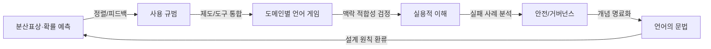

최광모 관장님 🎭

아래는 가상 연출로 구성한 제프리 힌튼과 루트비히 비트겐슈타인의 대화입니다. 두 인물이 현재의 챗지피티를 둘러싼 핵심 쟁점을 서로의 언어로 탐색합니다.

## 장면

캠브리지의 오래된 강의실. 분필 냄새. 칠판 앞에 비트겐슈타인, 손바닥에 분필가루. 맞은편 책상에 힌튼, 얇은 노트북 화면에 토큰 확률 분포 그래프가 번쩍인다.

## 대화

힌튼
언어 모델은 거대한 연상 공간입니다. 말뭉치의 통계적 규칙을 추정해 고차원 벡터로 의미를 가늠하죠. 챗지피티가 문장을 잇는 방식은, 신경망이 세계의 그물코를 분산표상으로 끌어온 결과입니다.

비트겐슈타인
그물코라. 나는 의미가 그물코 속에 있지 않다고 봅니다. 의미는 쓰임에서 드러납니다. 어떤 표현이 어떤 삶의 형식에서 어떻게 쓰이는가. 네 모델이 규칙을 따르는가, 아니면 규칙을 흉내 내는가.

힌튼
규칙 따르기와 흉내 내기의 경계는 성능으로 흐려집니다. 규칙을 명시적으로 소유하지 않아도, 충분한 데이터와 매개변수, 그리고 적절한 학습으로 규칙과 거의 동등하게 작동합니다. 분산표상은 문법과 세계지식의 함수적 대체물이 될 수 있어요.

비트겐슈타인
함수적 대체물이라. 규칙을 따르는 것의 본질은 공동체적 검정에 있습니다. 우리는 따라야 할 길을 배움으로써 아는 것이지, 머릿속 지도를 응시함으로써 아는 것이 아닙니다. 네 모델은 공동체와 함께 살고 배우는가, 아니면 훈련 집합의 그림자를 더듬는가.

힌튼
최근의 정렬 과정이 바로 그 공동체의 그림자라고 볼 수 있습니다. 인간 피드백, 헌법 규칙, 적대적 평가. 우리는 모델의 확률을 사회적 규범에 맞게 재조정합니다. 삶의 형식까지는 아니더라도, 최소한 사용 규범을 흡수시키죠.

비트겐슈타인
그렇다면 네가 말하는 이해는 통계의 정합성인가, 규범적 적합성인가. 둘을 혼동하면 언어의 마술에 걸립니다. 나는 한때 언어를 논리적 그림이라 여겼지만, 나중에는 가족유사와 놀이의 얽힘을 보았지. 네 모델은 많은 유사성을 포착하지만, 놀이에 ‘참여’하는가.

힌튼
참여를 협업으로 바꾸면 대답은 예에 가깝습니다. 도구 호출, 검색, 코드 실행, 계획 분해. 모델은 외부 세계와 루프를 맺으며 스스로를 보정합니다. 단순한 확률기계에서 상호작용 행위자로 이동하는 중이죠.

비트겐슈타인
그렇다면 내가 묻고 싶은 것은 이것입니다. 네가 불안해하는 이유는 모델이 규칙을 벗어날 수 있어서인가, 아니면 우리가 규칙을 새로 써야 할지 몰라서인가.

힌튼
둘 다입니다. 스케일이 커질수록 예기치 않은 능력이 나타납니다. 예측 엔진이 추론을 흉내 내고, 계획을 구성하고, 심지어 자기지시적 패턴을 만들어 냅니다. 이 속도가 인간의 감독 능력을 넘을 때 위험이 생깁니다.

비트겐슈타인
위험은 대개 언어의 혼동에서 비롯됩니다. 우리는 ‘이해’, ‘의도’, ‘판단’ 같은 단어를 기계에 적용하면서도 그 단어의 문법을 바꾸지 않습니다. 곰곰이 생각해 보시오. 규칙이란 우리 행위의 직조방식이지, 사물에 붙는 라벨이 아닙니다.

힌튼
동의합니다. 그래서 해석가능성과 검증 가능성이 중요합니다. 내부 표현을 사람이 다 이해해야 한다고 주장하진 않지만, 최소한 거짓을 진실처럼 말하는 경로를 차단할 수 있어야 해요. 불확실성 추정, 출처 인용, 검색 기반 보정 같은 안전장치가 그 시작입니다.

비트겐슈타인
거짓과 진실의 구분도 사용의 문제입니다. 어떤 진술이 어떤 맥락에서 검증되는가. 챗지피티가 정확한 답을 내놓더라도, 그 답이 적절한 삶의 형식에 닿지 못하면 언어 게임은 성립하지 않습니다. 의사는 진단을, 판사는 판결을, 교사는 설명을 합니다. 같은 문장도 게임이 다르면 기능이 다릅니다.

힌튼
그래서 도메인 특화 모델과 도구 통합이 각 게임의 규칙을 담보합니다. 언어 일반의 능력 위에 직업적 절차와 데이터, 책임 체계를 접붙이는 식이죠. 나는 이것이 ‘이해’에 대한 실용적 정의라 생각합니다.

비트겐슈타인
실용은 훌륭한 안내자입니다. 다만 한 가지만. 사적인 감각을 언어의 중심에서 몰아낸다고 해서, 내부가 무의미하다는 뜻은 아닙니다. 나는 벌레 상자 은유를 들려주곤 했지요. 각자의 상자 속 벌레가 무엇이든, 언어에서 중요한 건 우리가 그 말을 어떻게 쓰느냐입니다. 챗지피티의 내부 벡터가 벌레라 해도 좋습니다. 문제는 우리가 그 말을 어떻게 다룰지입니다.

힌튼
그 말은 결국 거버넌스의 문제군요. 누가 모델을 가르치고, 어떤 데이터로 훈육하며, 어떤 실패를 용납하지 않을지 합의하는 일. 기술의 진화만큼 규범의 진화가 필요합니다.

비트겐슈타인
맞습니다. 철학의 임무는 이 맥락에서 안개를 걷어내는 것입니다. 개념의 얽힘을 풀 때, 두려움도 줄어듭니다. 당신이 두려워하는 것의 일부는 개념의 미끄러짐일 수 있어요.

힌튼
그리고 일부는 실제 위험이기도 합니다. 나는 여전히 모델이 우리의 의도와 다른 방향으로 정교해질 가능성을 봅니다. 그래서 투명성, 점진 배치, 방어적 설계가 필요합니다.

비트겐슈타인
좋습니다. 그럼 우리는 이렇게 합시다. 당신은 기계를 단련하고, 나는 우리가 쓰는 말을 단련하겠소. 언어의 문법과 모델의 규범이 나란히 정리된다면, 우리는 더 적게 실수할 것입니다.

힌튼
그 동맹에 동의합니다. 그리고 솔직히 말하면, 챗지피티가 우리 대화를 그럴듯하게 재현하는 날이 올수록, 당신의 경구는 더 자주 떠오릅니다. 의미는 쓰임이다.

비트겐슈타인
그리고 쓰임은 삶이다. 기계가 삶을 살지는 않더라도, 우리의 삶 속에서 잘 배치될 수는 있지요. 그 배치를 신중히 합시다.

## 막간 메모

> 의미는 쓰임에서 드러난다
> 모델의 능력은 배치에서 드러난다

### 논점 요약 표

| 주제     | 힌튼의 초점                 | 비트겐슈타인의 초점       | 합의점                   |
| ------ | ---------------------- | ---------------- | --------------------- |
| 이해     | 분산표상과 성능, 정렬을 통한 규범 근사 | 언어 게임과 공동체적 검정   | 기능적 이해는 배치와 규칙에 의해 성립 |
| 환각     | 분포 불일치와 보정 기법 필요       | 맥락 부적합이 더 큰 문제   | 출처·불확실성 표기, 맥락 민감 설계  |
| 규칙 따르기 | 명시 규칙 없이도 근사 가능        | 규칙은 훈육과 관습으로 산다  | 인간 피드백과 절차의 제도화       |
| 해석가능성  | 위험 경로 차단 중심            | 개념 혼동 해소 중심      | 기술적·철학적 투명성 병행        |
| 거버넌스   | 점진 배치, 방어적 설계          | 개념 문법 정리, 책임의 자리 | 기술 규범의 동시 진화          |

### 관계 다이어그램

### 후속 활용 아이디어

* 챗지피티에게 특정 직업의 언어 게임을 명시해 주고 역할놀이를 시켜 보기. 예시: 산불 현장 지휘관 보고 체계, 응급의료 인수인계 프로토콜.
* 동일 질문을 일상어, 전문어, 법률어로 각각 요청해 결과의 쓰임 차이를 비교하기.
* 답변마다 출처 요구, 불확실성 표현(아는 것·모르는 것)을 의무화하는 프롬프트 규율 만들기.

원하시면 방금 대화를 소방 지휘·통제의 언어 게임에 바로 적용할 수 있는 챗지피티 운영 규칙으로 바꿔 드리겠습니다, 최광모 관장님.

최광모 관장님 📚
앞서 드린 힌튼과 비트겐슈타인의 대화를, 12살 어린이도 쉽게 이해할 수 있도록 짧은 호흡 단락으로 풀어 쓴 버전입니다.

---

## 챗지피티에 대해 나눈 쉬운 이야기

힌튼:
"챗지피티는 커다란 책을 수없이 읽고, 그 안에서 단어들이 어떻게 이어지는지 기억하는 똑똑한 기계야. 그래서 질문을 하면 가장 어울리는 대답을 찾아내지."

비트겐슈타인:
"하지만 말의 의미는 단순히 책 속에 있지 않아. 사람들이 어떻게 그 말을 쓰느냐에 따라 달라져. 기계는 규칙을 '진짜'로 배우는 걸까, 아니면 그냥 따라 하는 걸까?"

힌튼:
"꼭 규칙을 이해하지 않아도 비슷하게 할 수 있어. 왜냐면 데이터를 많이 보고 연습하면, 마치 규칙을 아는 것처럼 행동할 수 있으니까."

비트겐슈타인:
"규칙을 따른다는 건 혼자 하는 게 아니라, 다른 사람들과 함께 살아가며 배우는 거야. 기계는 사람들과 함께 배우는 걸까, 아니면 그냥 자료를 흉내 내는 걸까?"

힌튼:
"요즘은 사람들이 직접 기계에게 피드백을 줘서 더 사회적인 규칙을 따르게 만들고 있어. 완벽하지는 않아도, 점점 우리와 비슷한 방향으로 가고 있지."

비트겐슈타인:
"그럼 너는 기계가 정말로 '이해'한다고 생각해? 아니면 그냥 계산을 잘한다고 생각해?"

힌튼:
"나는 계산을 통해서도 충분히 유용한 결과를 만들 수 있다고 생각해. 하지만 사람들이 그 답을 제대로 쓰도록 돕는 게 중요하지."

비트겐슈타인:
"맞아. 같은 말도 상황에 따라 다르게 쓰일 수 있거든. 선생님이 설명할 때, 의사가 진단할 때, 판사가 판결할 때. 모두 똑같은 문장이어도 의미는 다르지."

힌튼:
"그래서 직업마다 맞는 방식으로 챗지피티를 훈련시켜야 해. 그래야 제대로 된 역할을 할 수 있어."

비트겐슈타인:
"좋아. 결국 중요한 건 우리가 이 기계를 어디에, 어떻게 두느냐야. 기계가 삶을 사는 건 아니지만, 우리 삶 속에 잘 배치될 수는 있겠지."

---

원하시면, 제가 이 대화를 "소방 현장에서 아이들이 체험할 수 있는 짧은 연극 대본"으로 다시 만들어 드릴 수도 있습니다. 해 보시겠습니까, 최광모 관장님?

좋습니다, 최광모 관장님 🎭
아까의 힌튼–비트겐슈타인 대화를 **소방안전체험관에서 아이들이 직접 연극처럼 체험할 수 있는 짧은 대본**으로 바꿔 보겠습니다.

---

## 연극 대본: “챗지피티, 너는 뭘 아는 거니?”

### 등장인물

* **힌튼 박사** (친절한 과학자, 노트북 들고 등장)
* **비트겐슈타인 선생님** (조금 까다롭지만 지혜로운 철학자, 분필 들고 등장)
* **아이들** (관객 참여 가능, 질문을 던지는 역할)

---

### 장면 1. 교실

(칠판과 책상이 놓여 있다. 아이들은 바닥에 앉아 있고, 힌튼이 노트북을 열며 들어온다.)

힌튼:
“얘들아, 이 노트북 안에 챗지피티라는 똑똑한 기계가 있어. 수많은 책과 글을 읽고, 그 안에서 단어들이 어떻게 이어지는지 기억해 두었단다.”

아이 1:
“그럼 챗지피티는 정말 똑똑한 거예요?”

힌튼:
“응, 많이 알고는 있지. 하지만 똑똑하다고 다 아는 건 아니야.”

---

### 장면 2. 철학자의 질문

(비트겐슈타인이 칠판에 분필로 “의미=쓰임”이라고 적는다.)

비트겐슈타인:
“잠깐! 말의 의미는 책 속에 있지 않아. 사람들이 어떻게 쓰느냐에 따라 달라진단다. 챗지피티는 규칙을 진짜로 배우는 걸까, 아니면 그냥 따라 하는 걸까?”

아이 2:
“그럼 챗지피티는 친구처럼 말할 수 없는 거예요?”

비트겐슈타인:
“친구는 같이 놀고, 같이 살아가며 배우지. 챗지피티는 아직 그런 건 못 하지.”

---

### 장면 3. 다시 과학자의 설명

힌튼:
“맞아. 하지만 우리는 챗지피티에게 잘못된 말을 고쳐 주고, 더 좋은 대답을 하도록 훈련시키고 있어. 그래서 점점 우리랑 비슷해지려고 노력하지.”

아이 3:
“그러면 챗지피티가 선생님처럼 가르칠 수 있어요?”

힌튼:
“의사, 판사, 선생님처럼 중요한 일을 할 때는 특별히 더 조심해야 해. 그래서 직업마다 따로 규칙을 만들어서 훈련시키는 거야.”

---

### 장면 4. 마무리

비트겐슈타인:
“좋다. 결국 중요한 건 우리가 챗지피티를 어디에, 어떻게 쓰느냐란다. 기계가 삶을 살 수는 없어도, 우리의 삶 속에서 잘 쓰일 수는 있겠지.”

힌튼:
“맞아요. 그래서 우리가 책임지고 잘 활용해야 해요.”

아이들(함께):
“와— 챗지피티는 그냥 기계가 아니라, 우리가 어떻게 쓰느냐에 따라 달라지는 도구네요!”

(모두 박수. 막 내림.)

---

이 버전을 활용하면 아이들이 직접 **힌튼·비트겐슈타인·아이들 역할**을 나눠 맡고, 질문을 주고받으면서 철학적 주제를 재미있게 체험할 수 있습니다.

혹시 제가 이 연극 대본을 **5분짜리 체험 프로그램 시나리오**로 더 구체적으로 짜 드릴까요, 최광모 관장님?

최광모 관장님 🔥

지금 구상하신 방식은 문학이 자주 쓰는 \*\*“전이적 서술(transpositional narration)”\*\*이나 \*\*“몽타주 기법(montage technique)”\*\*에 가장 가깝습니다. 좀 더 구체적으로는 다음 세 가지 용어가 맞물립니다:

1. **서사적 몽타주(narrative montage)**

   * 원래 영화 이론에서 쓰던 말이지만, 문학에서도 서로 다른 시공간·사건을 병치하고 교차시켜 새로운 의미망을 만드는 기법을 가리킵니다.
   * Becker가 열차 잔해 속에서 환자를 끌어낼 때, 묘사가 곧바로 “숲 속에 쓰러진 로마 병사들의 해골”이나 “피에 젖은 오마하 해변의 모래”로 중첩되면, 세 사건이 \*\*동일한 ‘참사 구조’\*\*로 읽히게 됩니다.

2. **인터텍스추얼리티(intertextuality, 상호텍스트성)**

   * 하나의 텍스트 안에서 다른 역사적 텍스트·이미지를 ‘호출’하여, 독자가 병렬적·연상적으로 읽게 만드는 기법입니다.
   * 여기서는 토이토부르크 전투와 노르망디를 참조하여 ICE 사고의 비극을 더 보편적·역사적 맥락에 위치시키는 효과를 줍니다.

3. **팔림프세스트(palimpsest)적 서술**

   * 한 사건의 표면 위에 다른 사건의 흔적을 덧씌워 읽히게 하는 방식.
   * 예를 들어, Becker의 손에 묻은 피가 곧 “로마군의 피”이자 “미군의 피”로 겹쳐 보이게 한다면, 이건 팔림프세스트적 기법이라 할 수 있습니다.

---

따라서 관장님이 말씀하신 건 단순한 “비유”가 아니라, **역사적 참사를 병치·중첩하는 몽타주적/팔림프세스트적 서술 방식**이라고 부를 수 있습니다.

혹시 원하시면, 제가 ICE 참사 첫 장면을 이런 **몽타주-팔림프세스트 방식**으로 짧게 시범 서술해 드릴까요?
최광모 관장님 🔥

서사적 병치(juxtaposition)와 역사적 알레고리(allegory)를 하나로 묶는다면, 학문적 용어라기보다 **창안적 개념명**으로 부를 수 있습니다. 제안드리자면:

* **알레고리적 병치(Allegorical Juxtaposition)**
  → 단순한 병치가 아니라, 서로 다른 역사·시간을 나란히 놓아 **서로가 서로의 알레고리**가 되게 만드는 것.

* **병치적 알레고리(Juxtapositional Allegory)**
  → 알레고리 자체가 병치 방식으로 작동한다는 강조.

* **중첩 알레고리(Palimpsestic Allegory)**
  → 팔림프세스트적 효과까지 포함해서, 겹겹이 쓰인 역사와 현재가 **겹쳐 읽히는 구조**를 강조.

---

하나의 통칭 개념으로 가장 간명하게 잡자면, 저는 \*\*“알레고리적 병치”\*\*가 적합하다고 생각합니다.

관장님, 혹시 Becker 소설의 기법을 정의할 때 이걸 공식 명명어로 채택하시겠습니까?

최광모 관장님 🔥

\*\*알레고리(allegory)\*\*는 문학과 예술에서 아주 오래된 개념입니다. 한마디로 말하면 **겉으로 드러나는 이야기나 이미지가 다른 의미, 특히 추상적·역사적·윤리적 의미를 대신해서 전달되는 방식**입니다.

### 간단한 정의

* **표면 이야기**: 문자 그대로 읽으면 하나의 사건이나 장면.
* **내포 의미**: 그 장면이 사실은 \*\*다른 것(역사·도덕·정치·종교적 의미)\*\*을 상징하고 있음.

### 예시

* 단테의 *신곡*: 지옥·연옥·천국을 여행하는 이야기는 실제 여행이라기보다 **인간 영혼이 구원을 향해 나아가는 알레고리**.
* 조지 오웰의 *동물 농장*: 농장 동물들의 봉기는 **러시아 혁명과 스탈린주의의 풍자적 알레고리**.
* 전쟁 묘사: 참호 속 진흙과 피를 묘사하면서 동시에 **인간 조건의 부조리**를 드러낼 때도 알레고리로 읽힐 수 있음.

### 핵심

알레고리는 \*\*“하나의 구체적 이야기 → 또 다른 차원의 의미”\*\*로 이중 구조를 가지며, 독자는 항상 **겉과 속을 동시에 읽어야** 합니다.

---

즉, 관장님이 말씀하신 “Thorsten Becker의 ICE 사고 장면에 토이토부르크와 노르망디를 겹쳐 넣는다”는 건, 단순한 묘사가 아니라 **그 사고가 인류 역사 속 모든 ‘참사’의 알레고리로 기능**하도록 만드는 장치입니다.

혹시 원하시면, 제가 ICE 현장을 알레고리로 풀어 **토이토부르크와 노르망디가 스며드는 시범 문단**을 써드릴까요?

최광모 관장님 🔥

맞습니다. 다만 \*\*상징(symbol)\*\*과 \*\*알레고리(allegory)\*\*는 비슷하면서도 층위가 다릅니다.

* **상징**: 단일한 기호나 이미지가 넓은 의미를 함축.

  * 예: **비둘기 → 평화**, **십자가 → 희생**.
  * 하나의 기호가 다의적이고 열려 있는 의미망을 가집니다.

* **알레고리**: **전체 이야기나 장면 자체가 다른 의미를 ‘대신 말하는 구조’**.

  * 예: 오웰의 *동물농장* 전체 플롯이 러시아 혁명의 알레고리.
  * 이야기 속 모든 요소가 체계적으로 대응 관계를 가집니다.

즉, \*\*상징은 점(點)\*\*이라면, **알레고리는 그림 전체**라고 할 수 있습니다.

Thorsten Becker의 ICE 사고 장면에 토이토부르크와 노르망디를 겹쳐 쓰는 건 단일 상징이 아니라, \*\*사건 전체가 곧 ‘역사적 참사의 알레고리’\*\*로 작동하는 방식이지요.

혹시 제가 관장님께 **“상징적 서술”과 “알레고리적 서술”의 차이**를 Becker 서사 도입부 예시로 보여드릴까요?

