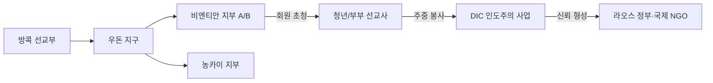

![[moroni_buries_plates.jpeg]]
## 🧭 개요
라오스의 수도 비엔티안과 국경 맞은편 태국 농카이에 자리한 예수 그리스도 후기 성도 교회는 세 가지 특징적인 축 위에 서 있다. 첫째, 정부의 종교 규제 환경을 우회하는 인도주의 중심의 저자세 확장 전략. 둘째, 회원이 직접 전도의 주체가 되어 가족과 친구를 초청하는 회원 주도(member-missionary) 방식. 셋째, 태국 방콕 선교부의 원격 관할 아래 태국 우돈 지구에 소속된 행정 구조다.

비엔티안 지부는 2003년 공식 조직 이후 2015년 두 지부로 분리되었으며, 농카이는 2000년대 초 라오스 개종자들이 침례를 받고 교리를 배우던 주요 거점이었다. 두 지역은 제1 태국–라오스 우정의 다리를 통해 약 1시간 남짓이면 오갈 수 있다. 외국인 공개 전도 금지, 사전 허가제 등 라오스 특유의 규제 속에서 선교는 주일 예배당 내부로만 제한되며, 디저렛 인터내셔널 자선회(DIC)가 주도하는 휠체어·식수·보건·교육 지원이 라오스 사회에서 교회의 신뢰 기반을 형성했다.
## 🏛 비엔티안 지부의 역사와 성장
### ⏳ 시작과 단절
1970년대 초 미군과 외국인 성도 중심으로 소규모 모임이 시작되었고, 1971년 포른니콤(Latda Phornnikhom) 자매가 라오스인 최초로 입교했다. 그러나 1975년 공산정권 수립과 함께 외국인 회원 전원이 철수하고, 같은 해 교회 인가 신청도 정권 변화로 무산되면서 활동은 장기간 중단되었다.
### 🔄 재접속과 재건
1994년 가뭄 피해 구호로 쌀 40톤과 의류 수백 벌을 지원했고, 1995년 말부터 인도주의 선교사 부부가 파견되어 영어 교육과 정부 협력 기반을 다졌다. 2000년대 초에는 해외에서 개종한 라오스 성도들이 귀국하며 공동체가 재형성되었고, 2003년 6월 비엔티안 지부가 공식 조직되었다. 2006년 2월 23일 제프리 R. 홀런드 장로(십이사도 정원회)가 라오스 땅을 복음 전파를 위해 헌납하는 기도를 드렸으며, 이는 사도가 라오스를 직접 방문한 첫 사례였다. 헌납 직후 라오스 청년 두 명이 태국 방콕 선교부 선교사로 부름받아 봉사했다.

![[christ_blessing_nephite_children.jpeg]]
### 📈 성장과 토착 지도력
2010년경 회원은 약 200명, 주일 예배에는 100명 이상이 참석했다. 2012년 몰몬경 라오어 번역본이 발간돼 라오스뿐 아니라 태국·미국 등 4,500여 명의 라오어 사용 성도에게 보급됐다. 2013년 청년 선교사 4명이 처음 배치되어 주중에는 봉사, 주일에는 전도와 교육을 담당했다. 2018년 회원 수는 약 270명, 활동률은 약 3분의 2, 개종자 1년 후 정착률은 80~89%로 보고됐다. 2006년경에는 지부장단 전체가 라오스 출신 성도로 구성돼 빠른 토착화가 이루어졌다.
### 🧱 모임과 장소
2015년 지부 분할 후 두 지부가 동일한 예배당을 공유한다. 표준 2시간 프로그램(오전 9시 성찬식 시작) 형식을 따르며, 예배당은 공식 소유 건물이 아닌 임대 시설이다. 초대 지부장 캄피 케오수폼 형제가 정원 딸린 저택을 제공해 현재까지 집회소로 사용한다. 외곽 성도들은 승합차나 카풀로 1시간 넘게 이동하며, 디아스포라 라오족·몽족 성도들의 귀국이 재활성화에 기여했다.

![[two_thousand_stripling_warriors.jpeg]]
## 🌉 태국 농카이 지부
### 🧭 역사적 연결
농카이는 비엔티안과 메콩강을 사이에 두고 마주하며, 라오스 내 전도가 불가능했던 시기 침례와 교리 교육의 중심지였다. 1996년 라오스 출신 투억타 송위라이 자매가 이곳에서 침례를 받았고, 2000년대 초까지 많은 개종자들이 이곳에서 교리를 배웠다. 2004년경 선교 지역이 신설되고 선교사 배치 후 정식 지부로 발전했다.
### 🗺 위치와 시설
주소는 303/11-14 Nong Khai-Pohn Phisai Road, T. Phochai, A. Mueang, Nong Khai 43000이며, 주일 오전 9시 성찬식과 2시간 프로그램을 진행한다. 예배실·반 교실·가족역사센터(이메일: TH_NongKhai@familyhistorymail.org)를 갖추고 있다. 건물은 임대 상가 형태이며, 공식 사진은 공개되지 않았지만 Meetinghouse Locator를 통해 위치와 모임 시간 확인이 가능하다. 주로 태국어로 모임을 진행하며, 과거에는 라오스 성도들이 자주 왕래했으나 현재는 빈도가 줄었다.
## ⚖️ 라오스의 법적 환경과 운영 전략
### 🧩 제도 틀
라오스는 공산당 단일체제로 헌법상 종교의 자유를 보장하지만 정부 승인 종교만 공식 활동이 가능하다. 불교·기독교(LEC 단일 교단)·이슬람·바하이교만 인정되며, 후기성도 교회는 독자 인가를 받지 못했다. 1990년대 중반 DIC를 NGO로 등록해 우물 개발, 휠체어 보급, 의료·교육 지원 등 인도주의 사업을 전개하며 종교 활동을 병행하고 있다.
### 🚫 전도·집회 규제
외국인 전도는 엄격히 금지되며, 1992년 총리령 92호와 2016년 개정 종교관리 법령에 따라 모든 종교 집회·예배당 건축·서적 반입은 사전 허가 대상이다. 일부 지방에서는 기독교 소수파에 대한 압박 사례도 보고됐다. 교회는 간판 비표시·장소 비공개 원칙을 유지하며, 주일 예배당 내부에서만 신앙 교육과 교리 토의를 한다. 최근 비엔티안 등 일부 도시에서는 조용한 예배가 암묵적으로 허용되고 있으나 법적 자유 단계에는 이르지 못했다.
## 🚏 비엔티안–농카이 연결과 국경 절차
### 🌉 인프라
두 도시는 약 25km 거리로, 1994년 개통된 제1 태국–라오스 우정의 다리가 연결한다. 왕복 2차선 도로·인도·단선 철로를 갖추고 있으며, 방콕발 기차가 농카이역에서 타날렝역까지 운행한다.
### 🛂 출입 절차와 비자
국경은 오전 6시부터 밤 10시까지 개방되며, 도보로는 통과할 수 없어 반드시 셔틀버스(30THB)를 이용해야 한다. 라오스와 태국 국민은 상호 30일간 무비자 입국이 가능하며, 한국 여권 소지자 역시 라오스에 30일간 무비자 입국이 허용된다. 대부분의 외국인은 도착비자(Visa on Arrival, 국적별 30~45달러, 대다수 40달러)를 발급받아 입국할 수 있다. 코로나19로 인해 한때 국경이 폐쇄되었으나 2022년 이후 재개방되었다.

![[prison_fire_book_mormon_thompson.jpeg]]
## 🌏 관할 선교부와 선교사 활동
### 🗓 관할 변천
라오스는 초기 방콕 선교부 관할이었으나 1997년 프놈펜 선교부로 이관되었다가 2004년 방콕으로 복귀했다. 현재 비엔티안 지부는 태국 우돈 지구 소속이다.
### 🧑‍🤝‍🧑 파견 방식과 범위
젊은 전임 선교사는 공개 전도가 금지돼 인도주의 봉사 신분으로 파견된다. 1990년대 후반부터 부부 선교사가 주를 이루었으며, 한때 8~14명이 상주했다. 2006년 미국 청년 선교사 시범 파견 후 철수, 2013년 2월 청년 선교사 4명 재배치가 이뤄졌다. 평일엔 봉사·교육, 주일엔 교회 내 사역만 수행하며, 이름표·정장 착용은 제한된다.
### 🔁 회원–선교사 협력 모델
member-missionary 방식으로, 현지 회원이 초청한 가족·친구를 예배에 데려오면 교회 내에서 복음 토의와 침례 준비가 진행된다. 2013~~2014년 사이 30~~39명이 새로 입교했고 대부분이 활발히 활동 중이다. 라오스 청년 선교사들은 태국 등에서 봉사 후 귀국해 교회를 강화하고, 일부는 농카이 지부에서 라오스어로 사역한다.
## 💧 인도주의 및 개발 사업
### ♿ 이동권 향상
라오스 보건부 요청에 따라 매년 400~500대 휠체어를 맞춤 제작·보급해 누적 수천 대가 전달됐다.
### 🚰 식수·위생
2010년까지 200여 개 우물과 물탱크를 설치했고, 학교 화장실 신설과 노후 지붕 교체·도장 등 교육 환경 개선을 병행했다.
### 🏥 보건·교육
영아 보건, 의약품·장비 지원, 영어 교육, 시력 회복 장비 지원 및 현지 기술자 훈련. UNICEF와 협력한 신생아 소생술 훈련, WFP와 협력한 학교 급식 지원 등이 대표적이다.
### 🦠 팬데믹 대응
2021년 팬데믹 동안 6개 주 52개 병원에 체온계·PPE 등 수만 점의 의료물자를 전달해 약 1만 명이 혜택을 받았다. HAL 물류 무상 지원과 지방 보건국 협력으로 봉쇄 속에서도 신속 분배가 가능했다.
### 🤝 협력과 신뢰
LFNC 종교국은 교회의 성실한 봉사활동을 인정해 선교사 비자 연장 등 행정 편의를 제공한다. 타 개신교 단체와도 영역을 존중하며 공존한다.
## 📊 비엔티안·농카이 지부 비교

| 항목   | 비엔티안 지부         | 농카이 지부                  |
| ---- | --------------- | ----------------------- |
| 설립   | 2003년 공식 조직     | 2004년 선교 지역 신설, 후 지부 조직 |
| 회원 수 | 2018년 약 270명    | 소규모, 국경 성도 포함           |
| 장소   | 임대 저택           | 임대 상가 건물                |
| 언어   | 라오어             | 태국어, 라오어 병행             |
| 특성   | 라오스 유일 지부 → 2지부 | 라오스 전도 불가 시 대안 거점       |
## 🔗 관계 흐름도

## 📅 연대표 하이라이트
1971 라오스 첫 입교자 → 1975 활동 중단·인가 시도 무산 → 1994 구호 재개 → 1995 선교사 부부 파견 → 2003 지부 조직 → 2006 헌납 기도 → 2012 라오어 경전 보급 → 2013 청년 선교사 배치 → 2015 두 지부 체제 → 2021 팬데믹 지원.
## 🚦 실무용 체크리스트
- 라오스 내 공개 전도 금지·사전허가 준수, 주일 예배당 내부 활동 원칙.
    
- DIC 봉사 프로젝트와 연계해 지역 신뢰 확보, 선교사 신분 노출 최소화.
    
- 국경 이동 시 운영시간(06:00–22:00), 셔틀버스 이용 의무, 비자 요건 확인.
    
- 농카이 지부 주소·예배 시간·가족역사센터 정보는 Locator로 최신 확인.

> [!summary] created by
> 이름: 최광모 (Choi Kwang-mo)
> 소속: 예수 그리스도 후기 성도 교회 태백 지부 (The Church of Jesus Christ of Latter-day Saints, Taebaek Branch, Republic of Korea)

![[lehi_people_arrive_promised_land.jpeg]]