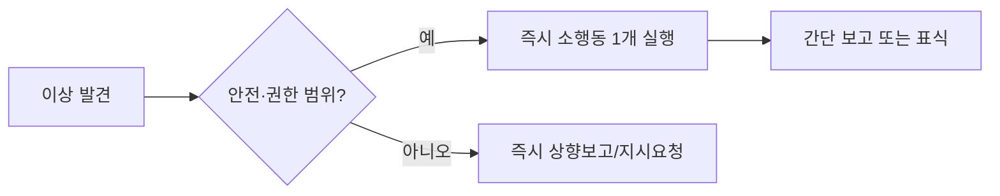

## UDT 정신 — 두 가지 층위의 작동 원리 (도파민네이션 × 방 청소 확장판)

### 1) ⚡ 즉시 실행 층위: 보이는 순간, 손이 먼저

정의: 지시 대기나 완벽주의로 지연하지 않고, 위험을 낮추는 범위에서 바로 행동을 개시하는 태도

핵심 규칙

* 3초 규칙: 3초 안에 할 수 있는 개선은 즉시 수행한다
* 다음 동작 상태: 모든 장비·공간을 지금 바로 쓸 수 있는 상태로 유지한다
* 손이 먼저, 입은 나중: 논쟁보다 정리·보급·응급조치를 우선한다

현장 미시 루틴

* 🧹 흩어진 것은 모은다 → 정렬한다 → 표식한다
* 🔧 느슨한 것은 조인다 → 기능 점검한다 → 예비를 마련한다
* 🗂️ 끝낸 일은 흔적을 남긴다(간단 로그·태그·사진)

즉시 실행 체크리스트

* [ ] 내가 지금 30초 안에 개선할 수 있는 1가지는 무엇인가
* [ ] 이 행동이 안전·임무·팀 피로도 중 무엇을 즉시 낮추는가
* [ ] 실행 후 누구에게 어떤 최소 보고가 필요한가

반패턴 경계

* 끝없는 분석, 지시 대기, 책임 회피, 과잉 개입으로 인한 혼선

미니 시나리오

* 보급품이 뒤엉켜 있다 → 3분 정렬·라벨링 후 위치 공유
* 통신품 1대 배터리 경고 → 즉시 예비와 교체, 사용 시간 로그 남김

한 줄 규범

* 지금 할 수 있으면 지금 한다
* 작은 개선을 자주 한다
* 끝낸 뒤엔 반드시 흔적을 남긴다

도파민네이션 접목(Anna Lembke)

* 쾌락-고통 균형을 바로잡는 가장 빠른 방법은 주변을 스캔하고 필요한 일부터 착수하는 것
* 미루기와 즉각 보상 추구를 끊는 자기 구속(self-binding): 알림 끄기, 시야 차단, 5분 타이머로 착수
* 의도적 불편의 소용량 훈련(hormesis): 60초 냉수 세안, 3분 계단 오르기, 5분 책상 리셋 같은 작은 불편을 먼저 통과하면 집중과 만족의 도파민 파동이 안정적으로 생성된다

방 청소 접목(Jordan Peterson)

* 질서가 혼돈을 견제한다는 원리: 시야에 보이는 무질서부터 제거하면 실행 마찰이 급감
* 방은 개인 작전기지의 은유: 책상과 주변 2미터 정돈이 모든 다음 행동의 착수 시간을 단축
* 작은 질서의 연쇄: 책상→바닥→수납→디지털 폴더로 확장하며 목표의 층위를 정렬

즉시 실행 프로토콜 카드

* 시야 스윕 30초 → 손 정리 2분 → 표식 30초
* 60초 착수 규칙: 하기 싫은 일은 일단 60초만 시작
* 5·15·30 스프린트: 방 청소와 책상 리셋을 5/15/30분 슬롯으로 분절 실행

---

### 2) 🤝 공헌 지향 층위: 내가 팀에 무엇을 더할 것인가

정의: 국가·조직·팀을 위해 내가 먼저 무엇을 할 수 있을지 찾고, 타인이 더 잘 움직이게 만드는 개입을 선택하는 태도

관찰 프레이밍

* 👀 사람: 누가 과부하인지, 누가 핵심 병목인지
* 🧩 작업: 다음 전환을 느리게 만드는 요소는 무엇인지
* 🔁 순환: 내가 떠난 뒤에도 유지될 구조를 남겼는지

공헌 기술

* 내 몫 플러스 원: 내 역할을 끝내면 옆 자리 1개를 가볍게 돕는다
* 결과 우선 보고: 문제 설명보다 조치·효과·남은 리스크를 먼저 말한다
* 다음 사람을 위한 세팅: 장비·공간·문서를 다음 사용자의 첫 클릭 상태로 남긴다

팀 피로도 관리

* 체력·주의력·사기 신호를 모니터하고, 교대·속도조절·간식·수분공급으로 미세 개입

과도 개입 방지

* 승인·권한 경계를 지키고, 역할 충돌 시 즉시 상향 조정

짧은 문장 스크립트

* 내가 도울 한 가지는 이것, 2분 안에 끝낸다
* 지금 돕는 것이 전체 속도를 올리는가를 먼저 묻는다
* 내가 떠난 뒤에도 유지될 방법을 남긴다

UDT 2×2 행동 매트릭스

|       | 공헌 영향 낮음      | 공헌 영향 높음              |
| ----- | ------------- | --------------------- |
| 긴급 낮음 | 사소한 미관 개선은 뒤로 | 문서·체계 정리로 다음 전환 시간 단축 |
| 긴급 높음 | 즉흥적 간섭은 금지    | 병목 해소·안전 리스크 즉시 제거    |

도파민네이션 접목(Anna Lembke)

* 타자에게 유익을 만드는 행위는 즉각 보상보다 의미 보상을 강화해 충동 악순환을 끊는다
* 친사회적 보상 루프: 작은 도움→감사 신호→내적 만족→다음 공헌 동기 강화
* 자기 구속의 확장: 나에게 달콤한 것 대신 팀에 도움이 되는 일을 먼저 택하도록 환경을 설계

방 청소 접목(Jordan Peterson)

* 개인의 질서가 공동체 질서의 최소 단위라는 관점: 내 공간과 파일 체계를 정돈해 타인이 접근해도 곧바로 쓸 수 있게 만든다
* 방 청소의 사회적 버전: 공용 장비 리셋, 표준 작동 절차 정리, 온보딩 문서 1페이지 추가 같은 작은 공헌이 팀의 속도와 사기를 끌어올린다

공헌 프로토콜 카드

* 내 몫 플러스 원 1회, 결과 우선 보고 1회, 다음 사용자 세팅 1회
* 공용 영역 5분 리셋: 케이블 정리, 라벨 부착, 사용 로그 최신화
* 도움의 가시화: 완료 표식과 간단 히스토리 남기기

---

### UDT × 도파민 × 방 청소 매핑 표

| UDT 원칙   | Lembke 실천                 | Peterson 실천          | 현장 적용 예                |
| -------- | ------------------------- | -------------------- | ---------------------- |
| 즉시 실행    | 자기 구속, 5분 타이머, 의도적 불편 소용량 | 시야 정리부터 시작           | 장비 구역 3분 리셋 후 사진·라벨 공유 |
| 다음 동작 상태 | 자극 차단으로 집중 채널 확보          | 책상·바닥·수납 순차 정돈       | 무전기·배터리 풀충전 트레이 운영     |
| 주인의식     | 의미 보상 강화로 미루기 차단          | 내 공간을 표준화해 타자 접근성 향상 | 공용 체크리스트 1페이지 작성·업데이트  |
| 결과 우선 보고 | 완료·효과·리스크를 먼저 말하기         | 질서 창출의 단계적 보고        | 교대자에게 60초 브리핑 카드 전달    |

---

### JFK 정신과의 공명

국가가 너를 위해 무엇을 해줄지 묻지 말고, 네가 국가를 위해 무엇을 할지 물어라
즉시 실행은 수동성을 끊어내고, 공헌 지향은 개인의 행동을 팀과 공동체의 성과로 접속시킨다. 도파민 절제와 공간 정돈은 이 두 층위를 일상의 습관으로 고정하는 촉매다

---

### 현장 적용 요약 카드

* 볼 것: 위험, 병목, 다음 사용자
* 할 것: 시야 스윕 30초, 소행동 1개, 흔적 남기기
* 남길 것: 다음 동작 상태, 간단 표식, 교대 가능한 체계

작은 즉시 행동이 도파민 균형을 회복시키고, 정돈된 공간이 공헌을 가속한다. 이 두 축이 맞물릴 때 개인의 기민함은 팀의 신뢰 가능한 속도로 전환된다.
