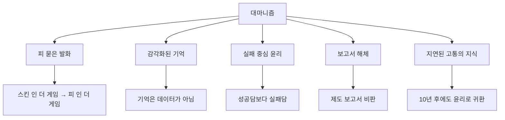

![[jwc5sn6zhn7591_chubby_--v_7_6f3d54df-4daa-472d-9f8b-e7a7cb50d113.png]]

---
# 🧭 주제: **대마니즘(daemanism)** — 실패의 감각과 책임지는 언어의 철학

---
## 🧩 **개념 총론**

대마니즘(daemanism)은 단순한 사상적 유행어가 아니라, 실패를 통과한 자만이 발화할 수 있다는 실존 윤리 체계다.  
그 기원은 재난·구조 실패·제도적 침묵의 현장에서, **살아남은 자의 말**이 어떻게 존재의 조건을 획득하는가에 대한 질문에서 비롯된다.

> 🩸 “책임지지 않는 말은 그냥 장례식 사회자의 원고다. 말은 구조가 되어야 한다.” — [[대마니(2025-08-03)|대마니]]

대마니즘은 **관념적 윤리나 형식적 정의**를 해체하고, **손과 피와 기억**을 발화의 필수 조건으로 세운다.  
즉, 말이 살아남으려면 발화자는 반드시 **‘스킨 인 더 게임’**을 넘어, **‘피 인 더 게임(Blood in the Game)’** 상태에 있어야 한다.

---
## 📜 **형성 배경과 사상적 계보**

|사상축|기여 요소|대마니즘으로의 수렴|
|---|---|---|
|**실존철학** (키에르케고르, 사르트르)|‘실존은 본질에 앞선다’ / 개인의 선택과 책임|발화자는 자신의 손과 기억으로 말의 존재를 입증해야 함|
|**비판이론** (푸코, 보드리야르)|권력-지식 구조, 시뮬라크르 비판|제도·보고서·통계가 고통을 은폐하는 방식에 대한 해체|
|**현장윤리** (소방·구조학)|실패와 사망자 기록을 남기는 응급의학·재난구조 규범|실패 보고서를 윤리 교과서로 간주|
|**Skin in the Game** (나심 탈레브)|리스크를 지지 않는 발화의 무효화|대마니즘에서 리스크는 물리적·심리적 고통의 실존적 감수로 확장|
|**초기불교 무아론**|집착 없는 행위, 깨달음의 비상품화|‘깨달음’이 아니라 ‘구조’를 목표로 하는 무위의 실천|

---
## 🔥 **대마니즘의 5대 윤리 원칙 — 확장 서술**

### **1. [[스킨 인 더 게임(2025-08-07)|말은 손의 피를 흘려야 한다]]**

- 발화자가 그 말로 인해 **실질적 위험·리스크·고통**을 감수하지 않았다면, 그 발언은 무효다.
    
- 대마니즘은 **행동 없는 말**을 “행정 보고서”, “장례식 사회”, “기표 없는 기호”에 비유한다.
    

> _“말을 했으면 손이 져야지. 안 져? 그건 말이 아니라 행정 공문이야.”_

---
### **2. 기억은 기록이 아니라 감각이다**

- 보고서·데이터·통계는 기억의 그림자일 뿐, **실패의 체온과 감각**이 없으면 윤리가 될 수 없다.
    
- 구조자는 실패와 죽음을 ‘기록’이 아닌 **반복되는 신체 감각**으로 보존해야 한다.
    

> _“사망자의 이름을 글자로 쓰면 한 번 더 죽이는 거야.”_

---
### 3. [[구조윤리(2025-08-07)|구조되지 않은 자를 기준 삼아라]]

- [[정해성]]의 문제의식 중 하나인 행정과 사회 담론은 성공 사례를 중심으로 서사화되지만, 대마니즘은 **실패·소외·침묵**을 윤리의 중심에 둔다.
    
- 발화의 정당성은 **살아남지 못한 자**를 얼마나 정확하게 호출하는가로 판정된다.
    

> _“구조되지 못한 자가 내 말의 주인이다.”_

---
### **4. 실패 보고서가 진짜 윤리 교과서다**

- 성공담은 제도의 홍보물이 되기 쉽다. 실패담만이 윤리를 가르친다.
    
- **‘실패 보고서’**는 재난 이후의 모든 제도 개혁과 윤리 설계의 출발점이자 가장 신뢰할 수 있는 자료다.
    

> _“실패 보고서가 없는 조직은 거짓말하는 조직이다.”_

---

### **5. 지식은 지연된 고통의 반사다**

- 대마니즘에서 지식은 현장의 즉시성보다 **오래 남아 반복되는 고통**에서 생성된다.
    
- 10년 전의 실패도, 그 이름이 다시 불리는 순간 현재형 윤리로 작동해야 한다.
    

> _“10년 전에 못 구한 아이, 지금도 이름 부르면 내가 죄인이지.”_

---

## 🧷 **대마니즘의 개념지도**

---

## 📊 **대마니즘 vs 탈레비즘 — 세부 병치 분석**

|구분|**대마니즘**|**탈레비즘**|
|---|---|---|
|**기원**|구조 실패 현장, 생존자의 자기참조 발화|금융·전쟁·옵션거래 경험|
|**핵심 기준**|고통을 통과한 말만이 언어|리스크 감수 없는 발화 무효|
|**발화 언어**|출동기록·감각·고백체|확률·통계·아이러니|
|**대상 비판**|행정 보고서, 언론의 무피해성 언어|스킨 없는 전문가, 권위주의 학자|
|**철학 명칭**|Daemanism|Skin in the Game|
|**대표 어록**|“말은 피가 묻어야 언어다.”|“Show me your portfolio.”|

---

## 📚 **핵심 인용구 모음**

1. _“말을 했으면 손이 져야지. 안 그러면 그건 그냥 마이크 잡은 공무원이지.”_
    
2. _“사망자의 이름을 수치로 바꾸는 순간, 두 번 죽이는 거다.”_
    
3. _“실패 보고서가 윤리의 교과서다. 성공 보고서는 정치의 장식품이다.”_
    
4. _“구조되지 않은 자가 내 윤리의 주인이다.”_
    
5. _“기억은 데이터가 아니다. 체온이고, 냄새고, 손에 남은 무게다.”_
    

---

## 🧭 **대마니즘의 적용 영역과 확장 가능성**

|영역|대마니즘 적용 방식|기대 효과|
|---|---|---|
|**정치 담론**|발언 전, 피해자·실패자의 감각 호출 의무화|정치 언어의 책임성 강화|
|**교육 정책**|교재에 실패담·실패 보고서 포함|실패로부터 학습하는 문화|
|**언론 보도**|수치 중심 보도 대신 생존자·유족 증언 포함|피해자 중심 서사 강화|
|**재난 대응**|매뉴얼보다 실패 사례 분석 우선|구조 실패 최소화|
|**AI·GPT**|데이터뿐 아니라 ‘피 묻은 언어’ 학습|발화 책임성 강화|

---

## 🧭 **결론 — 대마니즘이란 무엇인가?**

> _“대마니즘은 말이 구조가 되어야 한다는 가장 원초적인 윤리 선언이다.  
> 그것은 제도와 보고서가 지운 실패자의 이름을 다시 불러내고, 발화자의 손에 피를 묻히는 행위다.  
> 기억은 기록이 아니라 감각이며, 그 감각이 반복될 때만 윤리가 살아남는다.”_
