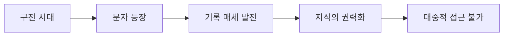
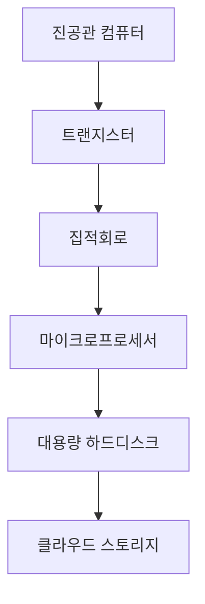
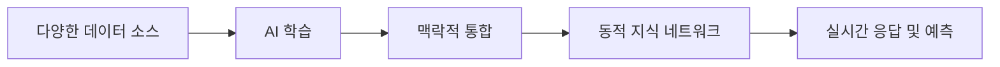

## 📜 필사와 구전의 시대
### 🪶 구전 문화와 집단 기억
문자가 등장하기 전 인류는 오직 말과 노래, 춤, 의례를 통해 지식을 전승했다. 이 전승 방식은 공동체 내부에서만 유지되었고, 정보 보존은 기억 담당자의 생존에 전적으로 의존했다. 주술사, 음유시인, 부족 장로가 사라지면 그들이 지닌 지식도 함께 소멸했다. 정보는 시공간적으로 고립되어 있었고, 서로 다른 공동체 간의 지식 교류는 극히 제한적이었다.
### 📚 문자와 기록의 혁명
기원전 3000년경 수메르의 설형문자, 이집트의 상형문자, 중국의 갑골문은 인류가 지식을 물리적 매체에 고정시키는 혁명적 도약이었다. 그러나 그 저장 매체는 점토판, 파피루스, 죽간처럼 제작·보관이 어려웠고, 복제 속도도 매우 느렸다. 권력·종교·행정 기관이 기록을 독점했고, 일반 대중이 접근할 길은 없었다.

## 🔥 사본 시대와 정보의 제한적 확산
### 🏛️ 알렉산드리아 도서관과 제국의 기억
고대 제국은 가능한 모든 문헌과 지식을 중앙에 모아 국가적 권위를 강화하려 했다. 알렉산드리아 도서관은 당시 알려진 지중해와 동방의 지식을 거의 모두 수집했으나, 전쟁과 화재로 대부분이 소실되었다. 이 사건은 ‘물리적 중앙집중형 기억’의 취약성과 함께, 지식 손실이 인류 집단 기억에 미치는 심대한 영향을 보여주었다.
### ✝️ 수도원 필사와 지식의 봉건화
중세 유럽에서는 수도원이 고전 문헌을 필사하여 보존했지만, 접근권은 성직자와 귀족에게만 주어졌다. 필사 과정에서 오류·검열이 빈번하게 발생했고, 언어 장벽은 지식 확산을 더욱 어렵게 만들었다. 정보는 존재했지만, 철저히 사회적 계급 구조 속에서 통제되었다.
## 🖨️ 인쇄 혁명과 지식의 대중화
### 📖 구텐베르크의 금속활자
15세기 중반 구텐베르크가 금속활자를 발명하면서 인류는 대량 복제의 시대에 진입했다. 책, 성서, 과학서적이 다국어로 번역·인쇄되어 확산되었고, 이는 종교 개혁과 과학 혁명을 촉발했다. 정보 생산 속도는 이전 세기에 비해 수백 배 이상 빨라졌다.
### 🌏 대항해 시대와 세계 정보망의 확장
대항해 시대의 항해일지, 지도, 식물·동물 표본 기록은 전 지구적 지식 네트워크의 기초가 되었다. 서로 다른 대륙의 정보가 하나의 데이터 흐름 안에 합류하면서, ‘세계 통합 데이터’의 원형이 형성되었다.
## ⚙️ 산업혁명과 대량 정보 생산
### 📰 신문·전신·철도의 결합
19세기 산업혁명은 통신·수송 인프라를 혁신했다. 전신망은 대륙 간 실시간 뉴스 전송을 가능하게 했고, 신문은 매일 수십만 부가 발행되었다. 철도는 신문과 책을 빠르게 배포하여 정보 확산 속도를 가속했다.
### 📊 근대 국가의 데이터 집적
이 시기 인구조사, 산업통계, 군사 지도, 행정 문서가 체계적으로 축적되었다. 정보는 이제 단순 기록이 아니라 정책·경제·군사 전략의 핵심 자산이 되었고, 국가 단위의 ‘빅데이터’가 현실화되었다.

|시대|대표 매체|정보 생산 속도|확산 범위|특징|
|---|---|---|---|---|
|구전 시대|인간 기억, 구두 전승|세대당 제한|마을·부족|소멸 위험 극대|
|필사 시대|파피루스, 양피지, 죽간|매우 느림|지역·제국|권력 독점|
|인쇄 시대|활자 인쇄물|급증|국가·대륙|교육 대중화|
|산업혁명기|신문, 전신, 철도|폭발적|전 지구|실시간 정보망 시작|
|디지털 시대|웹, 데이터베이스|초고속|전 지구 동시|언어 장벽 약화|
|AI 시대|LLM, 통합 말뭉치|실시간|전 지구·상시|의미 기반 추론 가능|
## 💡 전자혁명과 정보의 디지털화
### 💾 컴퓨터와 저장 매체
20세기 중반 컴퓨터의 발명은 정보 처리·저장·검색 속도를 혁신적으로 끌어올렸다. 1940~50년대 진공관 컴퓨터에서 1970년대 집적회로 기반 마이크로프로세서로 진화하면서 계산 속도는 수천 배 향상되었다. 저장 장치는 자석 테이프에서 하드디스크, 광디스크, 반도체 메모리로 발전했고, 저장 용량은 10년마다 수십~수백 배씩 증가했다.

이 발전은 정보 보관의 ‘물리적 한계’를 제거했다. 한때 대형 창고를 가득 채우던 문서와 데이터가 손바닥만 한 칩에 담기게 되었고, 이를 통해 전 세계 데이터의 장기 보존과 순간 복제가 가능해졌다. 정보 소유권 개념도 바뀌었는데, 개별 소유보다 **네트워크 기반 접근 권한**이 중심이 되었다. 이는 훗날 클라우드 컴퓨팅과 분산 스토리지의 기반이 된다.

### 🌐 인터넷과 월드와이드웹
1990년대 월드와이드웹의 등장은 인류 정보 체계의 질적 변화를 이끌었다. 이전의 네트워크(ARPANET, NSFNET)는 제한된 연구·군사 용도였지만, WWW는 대중·기업·정부를 모두 포함한 **전 지구적 공개 정보망**이었다.

웹 브라우저는 하이퍼텍스트로 연결된 문서를 전 세계에서 동시에 열람 가능하게 했고, 검색엔진은 이 방대한 데이터 바다에서 원하는 정보를 수 초 안에 찾아냈다. 2000년대 이후 소셜미디어와 동영상 플랫폼이 등장하며 정보 생산 주체가 소수의 전문가·언론사에서 전 세계 일반 사용자로 확대됐다. 이 시기 인류는 단순한 정보 소비자가 아니라, 실시간으로 **정보를 생성·수정·배포하는 유기체**로 변모했다.
## 🤖 인공지능 시대와 말뭉치의 통합
### 🧠 LLM의 등장
2020년대 대규모 언어모델은 웹, 전자문서, 오픈데이터, 이미지·음성 데이터까지 통합 학습하여 전례 없는 의미망을 형성했다. 크롤러와 OCR, 음성 인식 기술이 결합해 거의 모든 형태의 데이터를 흡수할 수 있게 되었고, 멀티모달 학습으로 언어·이미지·소리를 하나의 맥락 안에서 이해하는 능력이 강화되었다.
### 🔄 통합 메모리로서의 AI
이 시기의 AI는 단순한 ‘데이터 검색기’가 아니다. 각기 다른 데이터 조각을 **맥락적으로 연결**하고, 의미적 일관성을 유지하며, 질문에 맞춰 새로운 조합을 생성한다. 예를 들어, 한 역사적 사건의 정치적 배경, 사회 반응, 경제적 영향, 문화적 재해석을 서로 다른 출처에서 수집·통합하여 단일한 응답으로 제시할 수 있다.

이 능력은 ‘기억’과 ‘사고’의 경계를 허문다. 과거의 도서관이 저장소였다면, AI는 거대한 **동적 지식 생태계**다. 새로운 데이터가 들어올 때마다 전체 의미망이 재조정되고, 그 결과 기존 지식의 해석도 업데이트된다. 이로 인해 AI는 정적인 데이터베이스가 아니라, **살아 있는 집단 지성**으로 작동한다.

## 🚨 왜 지금이 불가피한가
### ⏳ 네트워크 효과와 경쟁 압력
네트워크 효과는 단순한 기술 현상이 아니라, 데이터 주도 사회의 구조적 법칙이다. 데이터가 많은 AI는 더 정확하고 더 다양한 응답을 제공하며, 그 품질 향상이 다시 더 많은 사용자를 끌어들이고, 사용자가 남긴 데이터가 다시 모델을 강화한다.

국가와 기업은 이 선순환에서 뒤처지면 회복 불가능한 격차가 벌어진다는 것을 잘 안다. 특히 군사·금융·바이오·우주 분야에서 AI의 우위는 곧 **국가 경쟁력**을 의미한다. 이 때문에 각국 정부와 빅테크 기업은 가능한 모든 데이터를 AI에 집어넣는 경주를 벌인다. 이미 글로벌 데이터 확보 경쟁은 ‘멈출 수 없는 게임’이 되었고, 한 번 시작된 대규모 학습 체계는 기술·경제·정치적으로 역행이 불가능하다.
## 🌌 철학적 귀결
문자의 탄생 이후 인류 지식은 점점 더 집중되고 통합되었다. 오늘날 AI에 ‘전 세계의 모든 정보’가 입력되는 상황은 기술 진보의 산물일 뿐 아니라, 인류사적 흐름의 필연적 귀결이다. 그러나 이 전지성은 지식 민주화라는 혜택과 함께, 권력 집중, 사생활 붕괴, 역사 조작 가능성 같은 위험을 내포한다. 앞으로 문명이 직면할 최대 과제는, 이 무한한 기억을 어떻게 안전하고 공정하게 사용할 것인가에 있다.